## 笔记规范

- 要求易懂且简洁
- 标题：一级用##，二级用黑点，三级用数字+英文点，四级用数字+中文反括号，五级用二级黑点
- 可选参数用英文中括号（[]）括起来，必要参数用大括号（{}）括起来。如果括号是真正需要显示的，则在里面再加一个`{}`，在该大括号中添加描述性语言。如: `[{外面的中括号意义是可选的}]`
- 在一大段论述或者一个一级标题内容结束后有个回车
- 同一行内容间隔4空格
- 有疑问的地方用todo标记


## 常用规范

- 在linux体系机器，临时文件放/test_for_all，里边分3个文件夹：1-3once，3代表最不重要；提示文件放~/README

- 模糊命名

  - 对于官方文档，一般命名会有：手册、文档、官方、wiki等

- 代码注释

  - 新增需求备注为  //demand {id}

  - debug打印用  //debug start和//debug end  如果只有1行，可以就用//debug  在commit时记得酌情是否注释或删除里边内容

  - 临时打印记得删除用  //tmp debug start和//tmp debug end  如果只有1行，可以就用//tmp debug

  - python函数注释

    ```python
    def func(input):
        """
        @brief：这是例子函数，用于展示函数的注释写法
        @param {type} input:示例函数的输入参数
        @return {type}:示例函数的返回
        """
    ```
    
  - cpp注释

    ```cpp
    /**
     * @function threadpool_add
     * @brief add a new task in the queue of a thread pool
     * @param pool     Thread pool to which add the task.
     * @param function Pointer to the function that will perform the task.
     * @param argument Argument to be passed to the function.
     * @param flags    Unused parameter.
     * @return 0 if all goes well, negative values in case of error (@see
     * threadpool_error_t for codes).
     */
    ```

- 日志打印
  - 遇到错误  get error或者get fail
  - 阶段性处理的日志打印用  step {XXX}
  
- 代码习惯
  
  - 文件变量命名末尾为_file结尾
  - 文件夹变量命名末尾为_dir结尾
  - 配置化config有2类，常量config和环境变化config，环境变化config一般有3个，online、test、dev
  
- <a name=protobuf命名规范约定>protobuf命名规范约定</a>
  
  - message类型用大驼峰命名法，成员名用下划线命名法
  - 对repeated后的命名，末尾加上_repeated，如果1个message里仅1个repeated成员，则该message命名为该成员类型末尾加s
  
- 代码模块划分规范
  
  - python模块划分示例
  
    ```python
    ./
    ├── config
    │   ├── const.py
    │   └── env
    │       ├── config_dev.py
    │       ├── config_online.py
    │       └── config_test.py
    ├── http_server
    ├── log
    ├── __main__.py
    ├── module
    ├── proto_py_release
    ├── script
    ├── tests
    └── utils
    ```
  
    
  


## <a name=项目相关锚点>项目相关</a>

- 重点关注：

  1）指标设计与建设；

  2）未来规划方向；

- 接手老项目需把握重点/交接：

  1）设计文档；
  
  2）输入输出（输入即外部依赖和外部输入，如兄弟模块的数据接口），他们的数据、文件所在位置；
  
  3）内部逻辑；（大多需要自己看，先要把控整体逻辑，如文件结构，设计思想等）
  
  4）日志位置；
  
  5）有几个环境；
  
  6）部署上线方法；
  
  7）端口，资源（包括单机占用资源、所有线上可用资源等）占用情况；
  
  8）指标建设与统计方法；
  
- 项目小知识

  1. 在上线新策略前，一定要做好新老策略的指标指定和指标统计，才能确定新策略所带来的收益

## 更新部署相关/变更相关

**什么是变更？**

变更（Release）指软件发布到最终上线的过程。

变更很重要：据统计

- Google 70%的生产事故由 变更/部署 触发
- 百度云 2017年112个S1+故障，其中直接由 变更/操作 触发的占比40%

变更的目标：

- 可用性：尽早拦截变更触发的故障
- 效率：在保障SLO指标的前提下，最大化迭代速度
- 自动化：变更应该是全自动、全封闭的，避免人工参与

**持续集成**：持续集成强调开发人员提交了新代码之后，立刻进行构建、（单元）测试。根据测试结果，我们可以确定新代码和原有代码能否正确地集成在一起。

**持续交付**：持续交付在持续集成的基础上，将集成后的代码部署到运行环境。我理解每次合入代码后的变更，连续起来就是持续交付

## 流程图相关/流程图绘制相关

- 梳理程序处理流程

  竖向表示各同级操作，横向表示对指定函数的内部操作


## typora相关

- 页内跳转
  1. 如果想调到指定标题名去，可用[任意内容]\(#标题名，注意带左边的#号\)
  2. 如果想跳到任意文本处：1）要先在该文本处加上”锚点“，\<a name=锚点名注意锚点名不能有空格>指定文本（也可以空白）\</a>    2）[任意内容]\(#锚点名，注意带左边的#号\)
  
- <a name=关闭首字母大写>关闭首字母大写</a>

  选择“编辑”-“拼写和语法检查”-“自动纠正拼写”
  
- <a name=设置typora图片存储位置>设置typora图片存储位置</a>：

  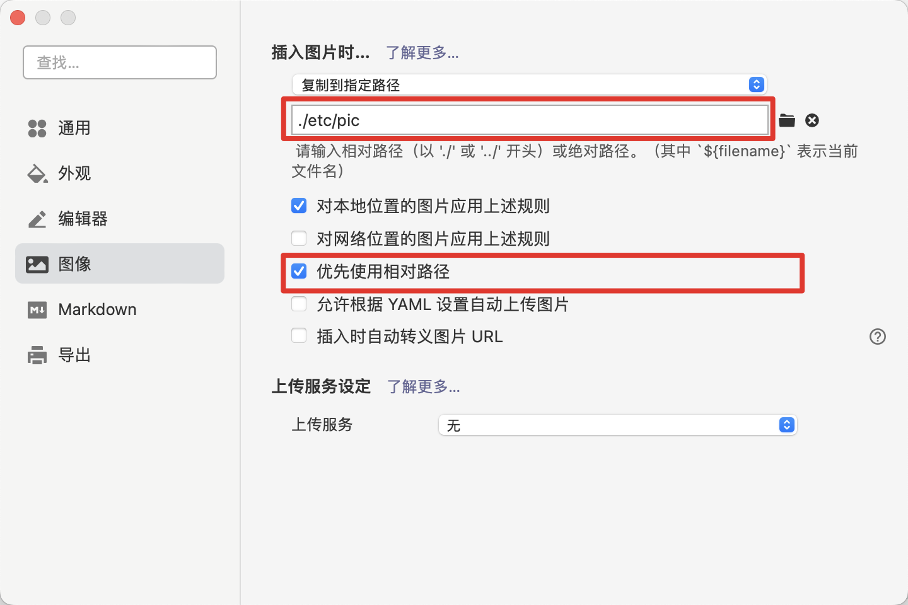

**typora初始化相关**：

1. [关闭首字母大写](#关闭首字母大写)
2. [设置typora图片存储位置](#设置typora图片存储位置)

##  git相关及github相关

**概念**

注意所有的版本控制系统，只能跟踪文本文件的改动

首先用`git init `来在当前文件夹创建git的数据库，记录版本相关的东西

将整个git分为4个仓库，在数据同步后可以理解为四个相同的文件夹：

- 工作区：主机上看见的文件夹

- 暂存区：提交一个版本是个严肃的事，先放暂存区，确认了再提交到更上层

- git本地仓库：也就是打游戏的各个存档
- git远程仓库：远程版``git本地仓库``，为了方便联网和多人操作

而多一个分支，表明多了一份`git本地仓库`，不会影响工作区和暂存区。举个例子：在当前分支工作区有未到暂存区的文件a，暂存区有未到git本地仓库的文件b，新建分支并切换到新分支，用`git status`查看与在老分支结果一样


一些初始操作：

``` shell
git init    //在当前文件夹建设git数据库，之后对当前文件夹及其子文件夹提交到比工作区更上层的仓库后，再变化工作区相关文件，就能够知道其变化
//添加远程仓库有以下两种方式，添加后，远程库的名字就是origin，这是Git默认的叫法，也可以改成别的，但是origin这个名字一看就知道是远程库
git remote add orinin https://github.com/wanggaolang/test.git		//https方式添加远程仓库
git remote add orinin git@{server_name,如“github.com”}:wanggaolang/test.git  //ssh方式添加远程仓库
git remote set-url orinin {以上两种方式的远程仓库}    //以覆盖的放式添加远程仓库orinin，也就是说若orinin有则被覆盖
git remote rm origin    //删掉远程仓库

git push -u origin master    //在远程仓库创建master分支，并将当前分支git本地仓库上传上去
git push -f    //强制让远程关联分支的git远程仓库被本地覆盖
ssh -T git@github.com    //测试与github联通性
```


**各个仓库的常规流动**

- 查看前三个仓库间的未提交状况:`git status`

- pull操作

1. 将远程指定分支拉取到本地指定分支上    `git pull origin {远程分支名}[:{本地分支名}，如果不要就是拉取到本地当前分支]`

2. 将与本地当前分支同名的远程分支 拉取到 本地当前分支上(需先关联远程分支，方法见文章末尾)    `git pull`

3. git pull在初次拉取可能会让确认rsa秘钥的信任，如果要写入shell脚本里跳过手工确认，则需要如此写：

   GIT_SSH_COMMAND="ssh -o UserKnownHostsFile=/dev/null -o StrictHostKeyChecking=no" git pull

- push操作
  1、将指定分支推送到远程指定分支    ``git push origin {本地分支名}:{远程分支名}``

  2、将指定本地分支推送到同名远程分支    ``git push origin {本地分支名}``

  3、将本地当前分支 推送到 与远程同名分支上(需先关联远程分支，方法见文章末尾)    ``git push``

同样的，推荐使用第2种方式，git push origin <远程同名分支名>

``cat .git/config``看到本地与远程分支的关联关系

---

**仓库间之间和仓库内部版本的回滚**

- 将`git本地仓库`的某次提交（commit）做回滚：git reset

  1. 仅将该改动回滚到`git本地仓库`（保留工作区和暂存区）：git reset --soft {commit id}
  2. 将该改动回滚到git本地仓库和暂存区（保留工作区）：git reset {commit id}

     git reset {commit id}  {file_name} 将指定版本的指定文件回滚到暂存区（保留工作区和本地仓库）
  3. 将该改动回滚到git本地仓库、暂存区、工作区：git reset --hard {commit id}

  在回退后再查看git log发现退回来后的已看不到先进版本，好比从21世纪坐时光机来到了19世纪，想再回去已经回不去了

  `git reflog`能够解决这个问题，显示所有的版本

- 将`暂存区`回滚/覆盖到工作区:    `git checkout -- {文件名，用.表示所有。注意文件名前有空格} `

- 清除当前目录下所有没add的修改：git clean -df [文件]   如果不加路径，则是所有未add文件都被清除

- git放弃修改，强制覆盖本地代码

  1）git fetch --all

  2）git reset --hard origin/master

  3）git pull

- git clean去除未追踪的文件

  1）git clean -nxdf（查看要删除的文件及目录，确认无误后再使用下面的命令进行删除）

  2）git clean -xdf

  可以配合git checkout .清除所有改动

- 回滚云端仓库/git revert相关

  撤销某次commit：git revert {参数，详见下方}  思想是新增一个commit，改动是源commit的反向改动

  ```shell
  *   commit bc678175e7171ad2e6620d044dcbd0697ed433ff
  |\  Merge: 277c902 27fc683
  | | Author: wanggaolang <hongshansong@qq.com>
  | | Date:   Thu May 22 01:06:22 2025 +0800
  | |
  | |     Merge branch 'main_new'
  | |
  | * commit 27fc683e438e52d77d998d47ad97f39aa11e2967
  | | Author: wanggaolang <hongshansong@qq.com>
  | | Date:   Thu May 22 01:05:08 2025 +0800
  | |
  | |     333
  | |
  | * commit fa72e719e603e0ff322c79455c6ffe4498b84c4d
  | | Author: wanggaolang <hongshansong@qq.com>
  | | Date:   Thu May 22 01:04:55 2025 +0800
  | |
  | |     222
  | |
  * | commit 277c902e8bed9e49957ced479c2ddf594fae2617
  |/  Author: wanggaolang <hongshansong@qq.com>
  |   Date:   Thu May 22 01:05:48 2025 +0800
  |
  |       111
  |
  * commit 372fcb70a441bf540ad609865a95c0cd726fb951
    Author: wanggaolang <hongshansong@qq.com>
    Date:   Thu May 22 01:04:29 2025 +0800
  
        000
  $ cat a
  111
  333
  222
  000
  
  
  ###############
  revert针对两类commit分开讨论：普通commit和merge commit
  
  普通commit的撤销：git revert {commitId} [-m 1]
    如git revert 277c902e8bed9e49957ced479c2ddf594fae2617    其实就是相对向下的commitId（372fcb70a441bf540ad609865a95c0cd726fb951），撤销了其改动。对这里来说就是删掉了111这行字符
    
  merge commit的撤销：git revert {commitId} -m {1或2}
    撤销相对下方的commitID的改变，但是merge commit有两个"下方commitID"，注意revert是相对来说的，如+1这个commit是由+0这个commit所进行的改变，那么revert +1就会翻转+0到+1的所有变更。那么问题来了：当我的+1 commit是由 +0_left 和 +0_right共同产生（如分支合并），我要回滚+1是要翻转谁到谁之间的变更呢？这就是-m参数的意义：-m 1表示要从+1回到+0_left 的状态，【换句话说就是回滚右侧的所有改动】，-m 2表示要从+1回到 +0_right的状态，【换句话说就是回滚左侧的所有改动】。示例：
  git revert bc678175e7171ad2e6620d044dcbd0697ed433ff -m 1 就把新增的“222” “333”字符都回滚掉了。cat a的结果是：
  111
  000
  
  所以，其实对于普通commit（线性commit），我们的git revert {commitId}是等效于git revert {commitId} -m 1的，因为他就是要从+1回到+0状态，而由于是线性commit，只有一条选择线，那就是-m 1
  另外，要注意终端的git log --graph（见下方），右分支的公共commit是aaa而不是bbb
  
  *   commit ddd
  |\
  | * commit ccc
  | |
  * | commit bbb
  |/
  |
  * commit aaa
    
  #对于连续多个commit的 revert
  git revert -n OLDER_COMMIT^..NEWER_COMMIT  # -n会把改变仅放到工作和暂存区，这样就能只生成一个commit
  ```
  
  

---

- git rm XXX 删掉暂存区中的文件，如果本地（工作区）文件未删除也会一并被删掉

- 如何查看`git status`的提示

『Changes to be committed』change需要提交的，也就是改变记录存在暂存区中的

『Changes not staged for commit』更改没有步入（staged）提交（准备）的，也就是改变记录存在工作区的stage形容了从工作区步入暂存区

- git clone git@server-name:path/repo-name.git克隆到本地，会将所有文件保存在仓库名文件夹中，也就是不用自己创建一个文件夹再clon，在主目录clone就行了。这种clone会把git数据库克隆过来，所以会让本地有所有远程分支

git fetch todo

- 在使用git提交代码的时，`git commit -m "内容"` 

  如果内容编写错误：使用`git commit --amend` 对上次提交的内容进行修改
  
  如果需要用编辑器进行多行编辑commit message：git commit -a
  
- **git rebase相关**

  写在前面：git rebase的本质是操作commit，如更改commit的顺序、合并多个commit等
  
  - 合并多个commit：
  
    1. git rebase -i {commitid}
    2. 将其中要融合的commit从pick改为s
    3. 保存退出，更改commit信息；
  
    注意第2步只会包含第1步commitid之后(即更未来)的所有commit，不包含这个commitid本身的commit。即如果提交线如下：
  
    ```bash
    a -> b -> c -> d -> e
    ```
  
    则 get rebase -i a 得到的内容是：
  
    ```bash
    # 与git log相反的是，最上方是最旧的提交，可以理解这里类似shell脚本，从上到下依次执行
    # 如果想包含git仓库最开始的commitid，则需要用git rebase -i --root
    pick b
    pick c
    pick d
    pick e
    ```
  
    此时对需要合并的commit，在起前面将pick改为s，再保存退出。其工作原理是类似shell脚本依次执行，遇到pick的就是正常cherry-pick，遇到s的，会将其合并到更早（更上方）的最近pick commit上，示例如下
  
    ```bash
    pick b    
    s c # c会和b合并为1个commit
    pick d
    s e # e会和d合并为1个commit
    ```
  
  - 我现在本地有a -> b -> c 3个commit。但现在我发现有个a相关改动想继续合入到a，类似git commit --amend，有什么方法吗?
  
    1. 打开终端，切换到你的项目目录。
  
    2. 运行以下命令，使用交互式 rebase 来编辑提交历史：
  
       ```
       git rebase -i a^
       ```
  
       这里的 `a^` 是 commit `a` 的父提交。你将看到一个文本编辑器打开，显示了提交历史。
  
    3. 在编辑器中找到你想要添加到 commit `a` 的新改动的那一行，将其前面的 `pick` 改为 `edit`。保存并关闭编辑器。
  
    4. Git 会在达到该提交时停止。在这个时候，你可以进行你的修改。
  
       ```shell
       # 进行你的修改，然后添加到暂存区
       git add <your files>
       
       # 提交修改
       git commit --amend
       ```
  
    5. 如果有冲突，解决冲突后，使用以下命令继续 rebase：
  
       ```shell
       git rebase --continue
       ```
  
    6. 重复步骤 4 直到你完成所有的修改。
  
    7. 当所有修改都完成时，运行以下命令完成 rebase：
  
       ```shell
       git rebase --continue
       ```
  
       或者，如果你想取消 rebase，可以运行：
  
       ```shell
       git rebase --abort
       ```
  
    请注意，这个过程会改写提交历史，因此如果你的这些提交已经被推送到远程仓库，你可能需要使用 `git push --force` 强制推送。但请谨慎使用 `--force` 选项，因为它会覆盖远程仓库的提交历史。如果你不确定，最好先备份你的仓库。
    
  - 我现在有本地分支main和feature 2个，其中feature是基于main新增了n个commit，现在remote的main分支新增了一个重要feature我想合入到feature分支用于本地调试，我该如何做
  
    1. 拉取远程内容到本地：
  
       ```bash
       git fetch origin/main
       ```
  
    2. 切换到feature分支，并用rebase将远端改动放到自己commit前面（更过去）
  
       ```bash
       git checkout feature && git rebase origin/main
       ```
  
    3. 如果有冲突则解决冲突，再git add 和git rebase --continue

**分支相关**

分支的作用：1）多人同时操作同一仓库，为了防止混乱，要让每个人有自己的`git本地仓库`，而多一个分支就多一个`git本地仓库`。    2）当有一个新需求需要更改代码，而更改过程中可能要回到没改变之前的样子用于调试修复其他功能模块。这时候可以将新功能commit到新分支，再切换回来修复其他功能模块。当新需求完成后在master分支merge该分支，处理冲突并commit就行了。这时在master分支只会多出一个merge的log版本。

如果在XXX分支中进行了改变并commit，切回主分支，不做任何改动就merge，虽然两者内容冲突，但时间线上XXX更新，所以会将XXX的改变改过来，也就是master指针指向XXX

如果在XXX改了后切到master分支又改东西，即使两者都是添加新东西，在merge时，也会产生冲突，因为产生了两个时间线


- 创建分支``git branch {新分支名}``    新分支复刻当前分支，并且HEAD指针，也就是当前工作区指向的分支仍为原来分支

- 切换分支``git checkout {分支名}``

- 创建并切入新分支``git checkout -b {分支名}``

- 创建分支并与远程分支关联``git checkout -b {新建分支} origin/{远程分支}``    这时新建分支内容就是关联分支内容

​	新建分支并与当前分支某个commit关联`git checkout -b {新分支名} {commit_id}`

- 已创建分支关联远程分支：git branch --set-upstream-to=origin/{分支名} {分支名}

- 删除分支``git branch -d {要删分支}``
- 查看所以分支``git branch -a``    不加``- a``为显示本地分支
- 添加远程分支：git push origin {本地分支}:{远程分支}
- 删除远程分支：git push origin {空格}:{远程分支}		or		 git push origin --delete {远程分支}
- 在当前分支合并（并入）指定分支：git merge {指定分支名}   如果有冲突需要解决冲突再add，commit。若无冲突会自动commit
- 将另一分支某次提交合并到本分支：git cherry-pick {commitHash}，注意这只会合并这次提交的相关改变，如某个值和本分支不一样，但是并非这次提交才不一样，合并不会让本分支冲突。
- 可以用``git log --graph``看到分支合并图
- 跨分支拷贝合并指定文件
  - 复制目标支合文件到当前分支：git checkout {文件所在分支} -- {文件名}
  - 合并目标支合文件到当前分支：git checkout --patch {目标分支} {文件名}

---

**杂项**

- `git diff [多个参数]`    git diff相关

  ​	概念：git diff a b意味着以a为基准，相较于a来说，b增加了啥，减少了啥

  ​	git diff b等效于git diff b {当前状态}

  ​	只显示不同文件名：--name-only

  ​	比较工作区与暂存区区别:git diff

  ​	比较本暂存区和本地仓库区别：git diff --cached

  ​	比较俩commit区别:`git diff {第1个commit的sha值} {第2个commit的sha值}`

  ​	比较本地git仓库和远端区别:`git diff origin`
  
  ​	解决`git diff`中文文件名乱码问题：

```shell
$ git config --global core.quotepath false          # 显示 status 编码
$ git config --global gui.encoding utf-8            # 图形界面编码
$ git config --global i18n.commit.encoding utf-8    # 提交信息编码
$ git config --global i18n.logoutputencoding utf-8  # 输出 log 编码

-----其他-----
git config --add core.filemode false    #忽略文件权限的改变
git config --global core.editor vim    #git默认编辑器更改为vim

git config --global  --unset https.https://github.com.proxy #设置git代理
git config --global  --unset http.https://github.com.proxy 
```

- 暂存git stash

  - 常规：git stash push -m "my_stash"

  - 将包括未追踪文件一同暂存进栈：git stash push -u

  - To apply a stash and remove it from the stash stack, type:git stash pop stash@{n}

  - To apply a stash and keep it in the stash stack, type：git stash apply stash@{n}

  - 删除：git stash drop stash@{1}

  - 如果git stash push后不小心drop掉了，恢复方法：
    1. git fsck --unreachable    尽量看commit的sha
    2. git show sha    看哪个是被删的那个
    3. git stash apply sha
  - 查看某次push的文件/具体内容：git stash show [-p，显示内容] stash@{0}

- 经典操作

  - 正在新分支写feature发现主线有bug：

    1）git stash push保存；2）切换到主线并新建分支；3）修复bug并commit；4）在主线和新分支分别git cherry-pick {commit}，如果没有冲突自动commit了；5）git stash apply恢复写到一半的feature；6）删除bug分支

  - push后发现需要修改另外的一个文件a：

    1）废弃掉这次push；2）修改文件a；3）git add a；4）git commit ----amend；（如果遇到编辑器是nano，则git config --global core.editor "vim"）

- git .gitignore相关

  - 对于在.gitignore文件中新增项，分为2类：1）对于之前从未trace的文件，直接修改.gitignore，就会生效，然后add .gitignore文件并提交；2）对于已经trace的文件（即已经git add的文件），需要1）修改.gitignore文件；2）git rm -rf --cached .  3）git add .  4）git commit   之后该文件的更改忽略才会生效

  - 忽略当前git仓库下某些文件夹：在git仓库根目录的`.gitignore`文件写入这些文件夹名字，注意是以git仓库当前.gitignore目录作为基础目录的相对路径，最好不要带./，如当前文件夹下tmp_file就直接写入.gitignore中为tmp_file；注意.gitignore类似后缀匹配的，即如果直接在git仓库当前.gitignore加入file_a，则所有*/file_a的都会被忽略，如：path_a/file_a、path_b/file_a

- 修改当前仓库用户和邮箱：

  vim .git/config    修改为形如：

```
[user]
    name = wanggaolang
    email = wanggaolang@xx.com
```

git commit --amend --reset-author

- 解决工作区相对暂存区有更改情况下git stash apply失败问题：

  1）git add -u .    2）git stash apply s    3)git reset
  
- 更改本地分支名：git branch -m oldName newName

- 更改某次提交的message：1） git rebase -i {该次提交之前的一次提交} 2)在该提交前改pick为r并保存退出 3）自动跳到另一个vim，更改message并保存退出

- 融合几次相连commit：1） git rebase -i {其中最旧提交之前的一次提交} 2）在最旧前改pick为r，其他都改pick为s，保存退出 3）自动跳到另一个vim，更改message并保存退出

- 将不关联且有提交的远程代码库关联本地代码库并做合并&push

  1）关联远程代码库：git remote set-url --add origin ssh:XXX   检查是否添加成功：cat .git/config，查看[remote "origin"]项

  2）拉取远程代码库：git pull --allow-unrelated-histories  对于冲突部分做合并&commit

  3）git push
  
- 将本地代码库关联远端新建代码库

  ```shell
  git remote -v
  git remote rm origin
  git remote add origin ssh:XXX
  git push -u origin --all
  git push -u origin --tags
  ```
  
  

## 内存操作的小技巧 

*(int *)ptr的意思是从ptr这个地址开始向上（因为是小端存储）取四个字节出来看成int，注意编译器优化会使两个相邻变量上下字节间发生变化，可以加上```volatile```。大部分机器都是小端存储，变量的首地址是最低的一个字节的地址，取变量时向上取，存储时向低地址存（因为是栈）。


## 重载<<运算符示例

 ```c++
   ostream & operator<<( ostream & os,const Vector2D & c) //二维向量
   {
       os << "x: "<<c.x <<" y: "<<c.y;
       return os;
   }
 ```

## 电脑装机/电脑硬件相关

1. 一般台式电脑都有集显和核显接口，在装机、进bios操作时，尽量将显示器接口插入核显，防止缺少或者不匹配显卡驱动

2. ubuntu开机黑屏最初应弄清问题：尝试按键 ctrl + alt + F1-F6  一般F1为GUI界面，剩下都是CUI界面，看能否进入

3. 各品牌台式机进入bios方法

   ```shell
   #dell
   在出现标识界面后，按F2或者F12。以防万一可以一直点按按钮
   ```

   

## new和malloc的区别

   1. new可以自动计算所需要大小；malloc则必须要由我们计算字节数。

   2. new操作符内存分配成功时，返回的是对象类型的指针；malloc内存分配成功则是返回void * ，需要通过强制类型转换将void*指针转换成我们需要的类型。

   3. new内存分配失败时，会抛出bac_alloc异常；malloc分配内存失败时返回NULL。

   4. malloc与free是C++/C语言的标准库函数，new/delete是C++的运算符。

   5. 使用new操作符来分配对象内存时会经历三个步骤：

      - 第一步：调用operator new 函数（对于数组是operator new[]）分配一块足够大的，原始的，未命名的内存空间以便存储特定类型的对象。
      - 第二步：编译器运行相应的构造函数以构造对象，并为其传入初值。
      - 第三部：对象构造完成后，返回一个指向该对象的指针。

      使用delete操作符来释放对象内存时会经历两个步骤：

      - 第一步：调用对象的析构函数。
      - 第二步：编译器调用operator delete(或operator delete[])函数释放内存空间。

      总之来说，new/delete会调用对象的构造函数/析构函数以完成对象的构造/析构；而malloc 只管分配内存，并不能对所得的内存进行初始化

      6.使用malloc分配的内存后，如果在使用过程中发现内存不足，可以使用realloc函数进行内存重新分配实现内存的扩充。

      ```c
      void *realloc(void *ptr, size_t size)
          realloc先判断当前的指针所指内存是否有足够的连续空间，如果有，原地扩大可分配的内存地址，并且返回原来的地址指针；如果空间不够，先按照新指定的大小分配空间，将原有数据从头到尾拷贝到新分配的内存区域，而后释放原来的内存区域。
          --ptr   指针指向一个要重新分配内存的内存块，该内存块之前是通过调用 malloc、calloc 或 realloc 进行分配内存的。如果为空指针，则会分配一个新的内存块，且函数返回一个指向它的指针。
      	--size  内存块的新的大小，以字节为单位。如果大小为 0，且 ptr 指向一个已存在的内存块，则 ptr 所指向的内存块会被释放，并返回一个空指针。
      	void *calloc(size_t nitems, size_t size)
          也是申请内存，nitems为元素个数，size为元素大小。与malloc的区别是这个会初始化为0。
      ```


## 常见c语言函数

```c
	void *memcpy(void *dest, const void *src, size_t n)
从 src 的0下标复制 n 个字符到以0下标开始的 dest，不会先清空dest。
	void *memset(void *str, int c, size_t n)
复制字符 c（一个无符号字符）到参数 str 所指向的字符串的前 n 个字符。
	char *strcat(char *dest, const char *src)
把 src 所指向的字符串追加到 dest 所指向的字符串的结尾。
	char *strcpy(char *dest, const char *src)
把 src 所指向的字符串复制到 dest，会先清空dest。
	
	取绝对值：abs(obj)和fabs(obj),前者是整数，后者是浮点数。都需要导入<math.h>
    a的b次方：pow(a, b)
```


## 红黑树和AVL树

红黑树不追求"完全平衡"，即不像AVL那样要求节点的 `|balFact| <= 1`，它只要求部分达到平衡，但是提出了为节点增加颜色，红黑是用非严格的平衡来换取增删节点时候旋转次数的降低，任何不平衡都会在三次旋转之内解决，而AVL是严格平衡树，因此在增加或者删除节点的时候，根据不同情况，旋转的次数比红黑树要多。

就插入节点导致树失衡的情况，RB-Tree最多两次树旋转来实现复衡rebalance，旋转的量级是O(1)
 ，而AVL的插入和删除节点导致失衡，AVL需要维护从被删除/插入节点到根节点root这条路径上所有节点的平衡，旋转的量级为O(logN)，而RB-Tree最多只需要旋转3次实现复衡，只需O(1)，所以说RB-Tree删除节点的rebalance的效率更高，开销更小！在查找时候AVL更快，但快的有限。


## 同步异步套接字


使用套接字进行数据处理有两种基本模式：同步和异步。　　

**同步模式**：同步模式的特点是在通过Socket进行连接、接收、发送数据时，客户机和服务器在接收到对方响应前会出于阻塞状态，即一直等到收到对方请求进才继续执行下面的语句。可见，同步模式只适用于数据处理不太多的场合。当程序执行的任务很多时，长时间的等待可能会让用户无法忍受。
　　

**异步模式**：异步模式的特点是在通过Socket进行连接、接收、发送操作时，客户机或服务器不会处于阻塞方式，而是利用callback机制进行连接、接收、发送处理，这样就可以在调用发送或接收的方法后直接返回，并继续执行下面的程序。可见，异步套接字特别适用于进行大量数据处理的场合。
　　

使用同步套接字进行编程比较简单，而异步套接字编程则比较复杂


## 同步异步相关

如何理解


## 音频剪辑相关

mac：logic pro

##  GMP库

用于大数运算的c/c++库，在linux下完美支持，windows需要用mingw和msys进行编译，或者用gmp的windows版本mpir，原生支持vs上编译


## clion快捷键设置

Setting	--	Keymap

光标到上一个光标：搜索back 

光标到下一个光标：搜索forward	

## vscode相关

**快捷键/vscode快捷键**

快捷键设置：`ctrl+k+s`

- 常用系统自带快捷键
  - 查找next和last
    - 全局查找的next和last：「F4」  「shift + F4」
    - 当前文件查找的next和last：「F3」  「shift + F3」

  - 多行同时编辑
    
    option+shift+光标选中

  - 更改快捷键
  
    注意，在etc/vscode_conf文件夹中有*keybindings.json文件，将其替换到对应的keybindings.json位置即可
  
    - 切换最近打开文件：cmd + e（原本键为ctrl + tab）改建位时下方两个都要改
      

    View: Quick Open Previous Recently Used Editor

    workbench.action.quickOpenNavigateNextInEditorPicker                **when:** inEditorsPicker && inQuickOpen

    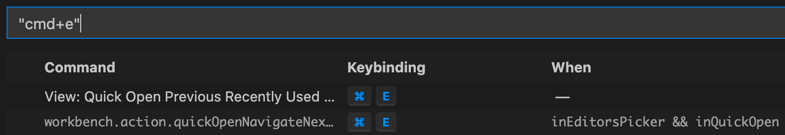

    - 复制当前文件名  cmd + 1

    

    - 复制当前文件相对路径  cmd + 2

    

    - 复制当前文件绝对路径  cmd + 3

    

    - 更改文本的语言模式  cmd + m

    
  
    - 快速切换当前文件与其git changes对比  需更改keybindings.json  快捷键使用 cmd + g
  
      ```json
      {
              "key": "cmd+g",
              "command": "git.openFile",
              "when": "editorFocus && isInDiffEditor"
          },
          {
              "key": "cmd+g",
              "command": "git.openChange",
              "when": "editorFocus && !isInDiffEditor"
          }
      ```
  
      
  
- 常用（未改变）快捷键

  ```
  - 查找文件名：command + p
  - vscode相关命令：cmd + shift + p
  - 跳转到指定行：Ctrl + G
  - 回到上一个光标：mac：`command + -`    windows：`alt + ←`
  - 打开终端:    `control + ~`    或者 查看-终端
  - 删除光标行：`ctrl+shift+k`
  - 到大括号的尾端/首部:    `Ctrl + Shift+\`
  - 批量保存文件：（改了键位的）windows：`ctrl + alt + s`    mac：`command + option + s`
  ```
  
  - 折叠与展开代码库
  
    Here’s a consolidated list of shortcuts for collapsing/expanding code in VS Code:
  
    | **Action**                         | **Shortcut (Windows/Linux)**            | **Shortcut (macOS)**                    |
    | :--------------------------------- | :-------------------------------------- | :-------------------------------------- |
    | **Collapse current region**        | `Ctrl + K, Ctrl + [`                    | `Cmd + K, Cmd + [`                      |
    | **Expand current region**          | `Ctrl + K, Ctrl + ]`                    | `Cmd + K, Cmd + ]`                      |
    | **Collapse all regions**           | `Ctrl + K, Ctrl + 0` (zero)             | `Cmd + K, Cmd + 0` (zero)               |
    | **Expand all regions**             | `Ctrl + K, Ctrl + J`                    | `Cmd + K, Cmd + J`                      |
    | **Collapse all top-level regions** | `Ctrl + K, Ctrl + 1`                    | `Cmd + K, Cmd + 1`                      |
    | **Collapse all nested regions**    | `Ctrl + K, Ctrl + 2` (or higher)        | `Cmd + K, Cmd + 2` (or higher)          |
    | **Toggle collapse/expand**         | `Ctrl + Shift + [` / `Ctrl + Shift + ]` | `Cmd + Option + [` / `Cmd + Option + ]` |
    
    额外可设置选中代码块的快捷键：
    
    ```json
    {
            "key": "alt+cmd+\\",
            "command": "editor.action.selectToBracket"
        }
    ```
    
    
  
- 3个配置文件：见etc/vscode_conf

- 设置单词选中分隔符：

  wordSeparators

  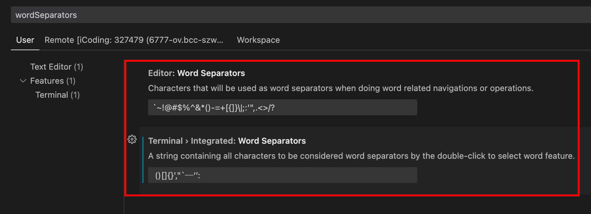

- 编译：mac快捷键 command + shift + b

- 代码配色：.vscode/settings.json    >>    "workbench.colorTheme": "Default Dark+"

- C/C++代码跳转：1）安装c/c++插件（详见下方c++的插件）；2）在.vscode/c_cpp_properties.json中的includePath里加入查找路径，形如：

```json
"includePath": [
                "${workspaceFolder}/**",
                "/home/"
            ],
```

- 代码增加80和120字基准线：settings.json--增加一行："editor.rulers": [80,120]

- vscode插件相关/vsocde插件(需配和上方快捷键一起设置)

  ```shell
  #能够编译运行单个文件：
  	1. 安装Code Runner
  	2. 设置-> code-runner:Run in Terminal
  	3. 重启后编译运行，press F1 and then select/type Run Code    在mac为control + option + n
  	注意事项：
  		1.对于python，如果文件开头有类似#!/usr/bin/python2指定解释器路径的，可能导致运行失败，因为实际路径与其不符，需要将该行注释掉
  	
  #复制文件名：
  	Copy file name    设置快捷键：cmd + k + s -> 搜索copy file name: with extensions并安装 -> 查找上方"复制当前文件名  "的更改操作 -> cmd + 1
  	
  #c++的插件
  选择C/C++（微软的版本）和C++ Intellisense的版本安装两个扩展.
  
  #git的插件
  1)git history
  2)GitLens
  
  #SQL插件
  SQLTools
  SQL formatter
  
  #绘制流程图
  Draw.io Integration  （需要创建XXX.drawio文件，文件模式为draw.io）
  
  #文件图标
  vscode-icons
  
  ##python相关的插件
  #python自动跳转
  Pylance #这个应该是自动安装，如不生效，更改设置中「python.languageServer」指定为Pylance
  #python自动注释
  Python Docstring Generator
  Black formatter # 代码格式化
  
  #protobuf
  jumpprotobuf #protobuf自动跳转
  vscode-proto3 # 配合jumpprotobuf使用
  ---
  vscode插件小知识
  1. 手动安装插件
    1）下载插件：进入vscode插件市场（https://marketplace.visualstudio.com/），搜索并选择插件-Download Extension
    2）进入vsocde - 点击左侧插件时长 - 点击三个点的菜单 - Install from VSIX - 选择刚才下载的路径
  ```

- 解决include出错报错问题：设置-搜索includePath-在setting_json中配置，加入C_Cpp.default.includePath路径

- vscode-python相关

  - vscode选择python2

    1. enter cmd+shft+p

    2. > `Python: Select Interpreter`

    3. Enter your version

  - vscode配置python debug环境

    1. 在代码总目录下创建.vscode 文件夹
    2. touch .vscode/launch.json
    3. 详见 etc/vscode_conf/launch.json 的"name": "Python:XXX"部分

**vscode小知识**

1. 解决ubuntu中vscode字体间距过大问题：安装适配`firacode`字体
   1. 更新可用软件包列表: `sudo apt update`;
   2. 通过安装/升级软件来更新系统: `sudo apt upgrade`;
   3. 安装字体管理器: `sudo apt install font-manage`;
   4. 安装`firacode`字体: `sudo apt install fonts-firacode`;
   5. 在首选项-设置-字体中将`Fira Code`放最前边，重启vscode;
   
2. 解决 \#ifdef 的地方可能变灰问题：文件-首选项-设置-搜索dimInactiveRegions    取消勾选

3. 解决 VSCode 编写 C++11 代码报红问题，settings.json增加以下内容

   ```json
   "C_Cpp.default.compilerArgs": [
           "-g",
           "${file}",
           "-std=c++11",
           "-o",
           "${fileDirname}/${fileBasenameNoExtension}"
       ]
   ```


**vscode server相关**

1. 配置ssh config

   ```
   Host 1.2.3.4
     HostName 1.2.3.4
     Port 22
     User root
   
   Host *
   ControlMaster auto
   ControlPath ~/.ssh/master-%r@%h:%p
   ControlPersist yes
   ServerAliveInterval 60
   HostkeyAlgorithms +ssh-rsa
   PubkeyAcceptedAlgorithms +ssh-rsa
   ```

   

## 进程，线程，协程

进程：计算机程序运行的实体。每个进程都有自己的独立内存空间，上下文切换开销比较大（栈，寄存器，虚拟内存，文件句柄等），相对稳定安全

线程：进程的一个实体，是cpu调度和分派的基本单位。线程只拥有一点在运行中必不可少的资源(如程序计数器,一组寄存器和栈),但是它可与同属一个进程的其他的线程共享进程所拥有的全部资源。线程间通信主要通过共享内存，上下文切换很快，资源开销较少，但相比进程不够稳定容易丢失数据。

协程：


## 手机相关

- 小米手机安装或更新chrome失败/更新webview失败
  1. 清空Google Play数据
  1. 重启手机
  1. 更新webview
  1. 更新chrome

## c++相关/cpp相关

**c++类相关**

1. c++构造函数

   1. 构造函数没有返回值，也没有void

      ```cpp
      class Test{
      public:
          int val;
          Test() { this->val = 1; };
      };
      ```

2. cpp里可以在类里放类

   ```cpp
   class Test{
   public:
       class SubTest{
       public:
           int val;
           SubTest():
           val(-1){}
       };
       SubTest sub_test;
   };
   ```

**c++容器相关**

1. c++ map相关

   1. 基础知识

      | 特性         | unordered_map          | map                  |
      | ------------ | ---------------------- | -------------------- |
      | 实现方式     | 哈希表                 | 平衡二叉树（红黑树） |
      | 元素存储顺序 | 无序                   | 有序（按键值排序）   |
      | 查找复杂度   | O(1) 平均，O(n) 最坏   | O(log n)             |
      | 插入复杂度   | O(1) 平均，O(n) 最坏   | O(log n)             |
      | 删除复杂度   | O(1) 平均，O(n) 最坏   | O(log n)             |
      | 遍历顺序     | 无序                   | 有序                 |
      | 内存使用     | 较高（哈希表额外空间） | 较低                 |
      | 适用场景     | 快速查找，键值无序     | 有序访问，范围查询   |

      - 使用 **`unordered_map`** 时：键值顺序无关紧要，追求快速查找和插入性能。

      - 使用 **`map`** 时：需要键值按顺序存储或频繁进行范围查询。

**c++小知识**

1. 在有派生类时各构造函数和析构函数调用顺序

   构造函数顺序：基类构造函数、对象成员构造函数、派生类本身的构造函数 

   析构函数顺序：派生类本身的析构函数、对象成员析构函数、基类析构函数（与构造顺序正好相反）

2. lambda表达式

   - [{捕获列表}]\({参数列表})->{返回值}{{函数体}}    举例: `auto add_1 = [](int a)->int {return a+1;};`

   - 该表达式一般定义在函数内部，也就是函数中定义函数
   - 捕获列表用于传入lambda所在函数的非static变量，对于除上述以外变量或者函数，只要lambda所在函数能调用它便能使用。捕获列表默认为const值传递而非地址传递。如[v_1, v_2]在内部改变他们值并不会改变lambda所在函数里他们的值。地址传递需要在其前面加上&，如[&v_1, &v_2]。如果传入值很多可以隐式传递，编译器会根据函数体内部的调用情况推断传入了哪些值。[=]为值传递，[&]为地址传递，如果两者皆有，则第一个参数必须为&或=，表示默认传递方式，在其后面跟上另外的参数，如[=, &v_2, &v_3]

   - 可以省略掉参数列表和返回值，如: `auto get_1 = []{return 1;};`

3. 打印格式化：

   ```cpp
   #include <iomanip>
   std::fixed << std::setprecision(8) << _double    #前者表示以非科学计数法打印，后者表示显示８位小数。
   永久作用：    std::cout.unsetf(std::ios::scientific);std::cout.precision(8);
   ```

4. 模板函数

   ```cpp
   template <class T> void debug(T& t_obj) {
       std::cout << t_obj.gender();
   }
   ```

5. 类模板的成员函数在类外定义以及类模板的函数特例化

   ```c++
   //类模板，但是在类外定义成员函数的时候，需要使用函数模板 
   #include <iostream>  
   using namespace std ;  
   template <class T>  
   class Base  
   {  
   public :
       T a ;
       Base(T b)    {  a = b ;    }
       T getA(){ return a ;} //类内定义
       void setA(T c);
   };
   
   template <class T>   void  Base<T>::setA(T c)//模板成员函数在类外的定义
   {
       a = c ;
   }
   
   template<> void Base<int>::setA(int value)//模板成员函数的特例化
   {
       a = value*2;
   }
   ```

6. vector产生二维数组： vector<vector<int> > newOne(r, vector<int>(c, 0));

7. 常用cpp/c的函数：

   ```c++
   map::lower_bound(key):返回map中第一个大于或等于key的迭代器指针
   
   map::upper_bound(key):返回map中第一个大于key的迭代器指针
   
   所以，理解这两个函数请不要按照字面意义思考太复杂，因为仅仅是不小于（lower_bound）和大于（upper_bound）这么简单。
   例子：
     auto iterator = test_map.lower_bound(0);
       if (iterator == test_map.begin()) {
           cout << "all key >= 0";
       }
   ```

8. 关于枚举类型

   ```cpp
   #include<iostream>
   using namespace std;
   namespace test{
       enum ENU{
           x = 1,
           y = 2,
           z = 3
       };
   }
   
   int main() {
       test::ENU obj = test::x;  //枚举内成员可以理解为声明了和枚举名所在空间的成员，如x就是test空间的成员
       obj = static_cast<test::ENU>(5);
       cout << obj;
   }
   ```

9. map相关

   - lower_bound与upper_bound

     lower_bound返回第一个大于等于输入对象的迭代器，upper_bound返回第一个大于输入对象的迭代器

     记忆方式为在顺序排列的key中，要在key_n周围插入一个值，那么会分为在key_n的左边和右边插入，即分别对应了lower_bound和upper_bound的位置

10. 类外定义成员函数不能加上默认参数，如：``Test fun(int a = 1)``会报错，同样static声明的成员在外部定义时候，必须省去static。同时，static成员变量只有跟了const才可以在类里面的初始化列表中进行初始化，其余的都要在类的外部初始化

    

11. string.find()和map.find()以及set.find()如果找不到目标，则结果为x.end()

12. volatile关键词影响编译器编译的结果，用volatile声明的变量表示该变量随时可能发生变化，与该变量有关的运算，不再编译优化，以免出错

13. 在linux中，默认c++的include位置为`/usr/include`

**cpp小轮子/c++小轮子**

1. 计算耗时

   ```cpp
   auto start_time = std::chrono::system_clock::now();
   //do sth
   cout << "do sth cost:" << std::chrono::duration_cast<std::chrono::milliseconds>(std::chrono::system_clock::now() - start_time).count() << " ms";
   ```

1. 用类成员自动增加num的demo

   ```cpp
   //test.cpp
   #include <unistd.h>
   #include <iostream>
   #include <mutex>
   #include <thread>
   #include <csignal>
   
   class AutoIncreaseNum {
       public:
           AutoIncreaseNum();
           int get_num();
           void auto_increase_per_second_by_thread();
           void wait_increase_num_thread();
       private:
           std::mutex _num_mutex;
           std::shared_ptr<std::thread> increase_num_thread_ptr;
           int num;
           void auto_increase_per_second_base();
   };
   
   AutoIncreaseNum::AutoIncreaseNum():increase_num_thread_ptr(nullptr), num(0) {}
   
   int AutoIncreaseNum::get_num() {
       const std::lock_guard<std::mutex> lock(_num_mutex);
       return num;
   }
   
   void AutoIncreaseNum::auto_increase_per_second_base() {
       while (true)
       {
           // Sleep for 1 second
           std::this_thread::sleep_for(std::chrono::seconds(1));
   
           const std::lock_guard<std::mutex> lock(_num_mutex);
           num++;
       }
   }
   
   void AutoIncreaseNum::wait_increase_num_thread() {
       if(increase_num_thread_ptr) {
           increase_num_thread_ptr->join();
       }
   }
   
   void AutoIncreaseNum::auto_increase_per_second_by_thread() {
       increase_num_thread_ptr = std::make_shared<std::thread>(&AutoIncreaseNum::auto_increase_per_second_base, this);
   }
   
   int main() {
       AutoIncreaseNum obj;
       obj.auto_increase_per_second_by_thread();
       while(true) {
           std::this_thread::sleep_for(std::chrono::seconds(1));
           std::cout << "num is: " << obj.get_num() << std::endl;
      }
       obj.wait_increase_num_thread();
       return 0;
   }
   ```
   
   Makefile:
   
   ```makefile
   test:test.cpp
   	g++ -std=c++11 -pthread test.cpp
   ```
   
3. double设置not a number

   ```cpp
   #include<iostream>
   #include<cmath>
   #include<limits>
   int main() {
       double d_obj = std::numeric_limits<double>::quiet_NaN();
       std::cout << std::isnan(d_obj) << std::endl; //1
       std::cout << "value: " << d_obj << std::endl; //nan
   }
   ```

   

## 设计模式

1. 观察者模式

   ​	场景为有一个通知者和多个观察者，在通知者发生或发现某种变化时，挨个通知每个观察者。实现上说白了就是在通知者内部保存一个可调用对象的list，设置一个通知函数来依次调用每个可调用对象，该list可以动态增加减少。当然在通知者内部也可以是一个对象队列，通知函数为调用每个对象的update函数。反正核心就是有可调用对象的队列在通知者里面。由于计算机语言的限制，大部分语言实现上该可调用对象list的每一个都是有同样的参数列表和返回值，不然无法将一堆不同的可调用对象放在同一个list里面。

   ​	注意在多线程中如果一个线程往list添加可调用对象，一个线程负责在发生事件调用通知函数（也许这个事件只发生一次，所以希望在调用通知程序前所有可调用对象已加入），就可能涉及竞争问题。好的做法是把增加操作和调用通知程序放在同一个线程中
   
   观察者模式cpp实现例子：
   
   ```cpp
   #include<iostream>
   #include<vector>
   
   //观察者基类，实际观察者可以是其子类
   class BaseObserver {
       public:
           void trigger() {
               std::cout << "i'm trigger,name: " << base_observer_name << std::endl;
           }
           BaseObserver(std::string str):base_observer_name(str) {}
       private:
           std::string base_observer_name;
   };
   
   //被观察者
   class Observered {
       public:
           void add_observer(BaseObserver& new_observer) {
               _observers.emplace_back(new_observer);
           }
           void notify() {
               for(auto& obj : _observers) {
                   obj.trigger();
               }
           }
       private:
           std::vector<BaseObserver> _observers;
   };
   
   int main() {
       Observered observered = Observered();
       BaseObserver base_observer1 = BaseObserver("111");
       BaseObserver base_observer2 = BaseObserver("222");
       observered.add_observer(base_observer1);
       observered.add_observer(base_observer2);
       observered.notify();
       return 0;
   }
   ```


## 总小小知识（一）

2. `LD_LIBRARY_PATH`是Linux环境变量名，该环境变量主要用于指定查找共享库（动态链接库）时除了默认路径之外的其他路径

   一般的用法为`export LD_LIBRARY_PATH={新添加地址}:$LD_LIBRARY_PATH`，放冒号左边表示先搜索。这是临时性的，退出shell再进就没了

   动态链接库默认导入路径在linux中查看配置`/etc/ld.so.conf`，可以将路径写入配置，再用`ldconfig`载入，永久生效。

3. scp 从本地复制到远程    `scp [-r] {本地文件/夹} {remote_username@remote_ip:文件/夹} `

   指定端口示例：scp -P 8866 ./example.file root@1.2.3.4:/remote/path

4. 查看linux发行版本：`cat /etc/issue`

5. linux命令行`2>&1`    标准错误重定向到标准输出 

6. 罗技鼠标驱动软件：官网－下载－Logitech G HUB

7. 查看当前目录下，每个文件夹大小：du -h --max-depth=1   mac下：du -hd1

8. 用md5sum计算文件的消息摘要

9. 求余和求模运算区别：

   对于正数与正数之间的两种运算，没区别。对于含有负数的运算，区别在于：对于整型数a，b来说，取模运算或者求余运算的方法都是：
   求整数商： c = a/b;
   计算模或者余数： r = a - c*b
   但是求模运算和求余运算在第一步不同，取余运算在取c的值时，向0 方向舍入，而取模（记为魔，堕向负无穷）运算在计算c的值时，向负无穷方向舍入。

   > 计算-7 Mod 4
   > 那么：a = -7；b = 4；
   > 第一步：求整数商c，c应该是-1.75，如进行求模运算c = -2（向负无穷方向舍入），求余运算则c = -1（向0方向舍入）；
   > 第二步：计算模和余数的公式相同，但因c的值不同，求模时r = 1，求余时r = -3。

   结论：根据例子及推理。得出如下总结：

   1. 当a和b符号一致时，求模运算和求余运算所得的c的值一致，因此结果一致。
   2. 当符号不一致时，结果不一样。求模运算结果的符号和b一致，求余运算结果的符号和a一致。

   经过测试，在C/C++, C#, JAVA, PHP这几门主流语言中，%运算符都是做取余运算，而在python中的%是做取模运算。

   ​	说下我对求余的理解：求余即相对被除数的剩余，如果被除数是负数，负号理解为另一个世界的标志，值还是越大表明越富有。比如-5/3的余数，商-2已经没有那个世界的剩余值了，只有商-1，还留下-2。所以求余的值的正负号应该牢跟被除数的正负号（价值观）。

10. 对于浮点数，比较时不要直接用等于号：

    ```c++
    if (double_a == double_b) 错误用法
    
    应该用：
    const double EPSILON = 1e-10; // 比如说，接受1e-10以内的误差
    if(fabs(double_a - double_b) < EPSILON)
      
    if (double_a != double_b) 错误用法
    应该用：
    const double EPSILON = 1e-10; // 比如说，接受1e-10以内的误差
    if(fabs(double_a - double_b) > EPSILON)
      
    拓展：对于两个二维坐标系的角度计算(y-y0)/(x-x0)，要预防两点是同一个点，否则可能导致很大的误差
    if (fabs(y - y0) < 1e-8 && fabs(x - x0) < 1e-8)
      continue;
    ```

11. 代码共享网页：https://paste.ubuntu.com/

12. 查看具体进程的内存使用量：cat /proc/{pid}/status  VmRSS项

13. linux查找目录下的所有文件中是否含有某个字符串：grep -rn "temp_a" ./

    -n为显示行号

14. 

## ssh相关

- 多terminal共享单次输入的密码

  ```shell
  $ cat ~/.ssh/config
  Host *
  ControlMaster auto
  ControlPath ~/.ssh/master-%r@%h:%p
  ControlPersist yes
  ServerAliveInterval 60
  ```

- ssh执行命令

  - ssh -o StrictHostKeyChecking=no work@{机器名} "{命令}"
  - 指定端口：ssh -p ${port} root@${ip} 'echo hello'

**ssh小知识**

1. 在开发机遇到执行ls/su等命令报错：failed to execute /bin/bash: Resource temporarily unavailable

   原因为配置的限制资源不够用了，解决办法：

   ```shell
   vim /etc/security/limits.d/20-nproc.conf
   * soft nproc 50000 #将默认值1024改为50000
   root soft nproc unlimited
   再次ssh登录账户，ok，回复正常。
   
   注：单独修改/etc/security/limits.conf 未可用！
   ```

   

## chrome相关

- chrome插件相关：

  1. 书签搜索插件：

     - Neater Bookmarks 速度更快，不过不维护了【当前我使用的】
     - Holmes 中庸
     - bookmarkie 更新

  2. 广告过滤插件：adblock

  3. 下载管理器插件：Chrono下载管理器

  4. 快速切换2tab之间：Toggle Tabs 注意貌似为俄罗斯的，被谷歌禁用了，需要git clone[其github地址](https://github.com/dakiesse/toggle-tabs-chrome-extension)进行安装

     需设置快捷键为cmd + e

  5. toby for chrome  一次打开多个书签

  6. Easy URL Editor 优化展示/编辑url 

  7. 允许页面复制和右键：Absolute Enable Right Click & Copy

  8. 保存网页

     - ArchiveWeb.page
     - Save Page WE
     - SingleFile

  

- chrome快捷键

  1. 历史记录    `command + y`
  2. 撤销关闭页面的快捷键    Crtl+Shift+T
  
- 清除指定网站cookie

  

## c++ string的实习

```c++
#include <cstddef>
#include <iosfwd>
#include <iostream>
#include <string.h>
using namespace std;
class String {
private:
    /* data */
    char *data;    //字符串
    size_t length; //长度

public:
    String(const char *str = nullptr); //默认构造函数
    String(const String &str);         //拷贝构造函数
    friend istream &operator>>(istream &is, String &str);
    friend ostream &operator<<(ostream &os, String &str);

    String operator+(const String &str) const; //重载+
    String &operator=(const String &str);      //重载=
    String &operator+=(const String &str);     //重载+=
    bool operator==(const String &str) const;  //重载==
    char &operator[](int n) const;             //重载[]

    size_t size() const;       //获取长度
    const char *c_str() const; //获取C字符串

    ~String();
};

String::String(const char *str) { //通用构造函数
    if (!str) {
        length = 0;
        data = new char[1];
        *data = '\0';
    } else {
        length = strlen(str);
        data = new char[length + 1];
        strcpy(data, str);
    }
}
String::String(const String &str) { //拷贝构造函数
    length = str.size();
    data = new char[length + 1];
    const char *temp = str.c_str();
    strcpy(data, temp);
}

String::~String() {
    delete[] data;
    length = 0;
}

String String::operator+(const String &str) const //重载+
{
    String newString;
    newString.length = length + str.size();
    newString.data = new char[newString.length + 1];
    strcpy(newString.data, data);
    strcat(newString.data, str.data);
    return newString;
}

String &String::operator=(const String &str) //重载+
{
    if (this == &str) {
        return *this;
    }
    delete[] data;
    length = str.size();
    data = new char[length];
    strcpy(data, str.c_str());
    return *this;
}

String &String::operator+=(const String &str) //重载+
{
    length += str.size();
    char *newData = new char[length + 1];
    strcpy(newData, data);
    strcat(newData, str.c_str());
    delete[] data;
    data = newData;
    return *this;
}
inline bool String::operator==(const String &str) const //重载==
{
    if (length != str.size())
        return false;
    return strcmp(data, str.data) ? false : true;
}

inline char &String::operator[](int n) const //重载[]
{
    if (n >= length) {
        return data[length - 1]; //错误处理
    }
    return data[n];
}

inline size_t String::size() const //获取长度
{
    return length;
}
inline auto String::c_str( ) const ->const char * //获取C字符串
{
    return data;
}

istream &operator>>(istream &is, String &str) //输入
{
    char tem[1000]; //简单的申请一块内存
    is >> tem;
    str.length = strlen(tem);
    str.data = new char[str.length + 1];
    strcpy(str.data, tem);
    return is;
}

ostream &operator<<(ostream &os, String &str) //输出
{
    os << str.data;
    return os;
}
int main()
{
    String test("abc");
    cout<<test<<endl;
}
```

## 面向对象三大特性：封装、继承和多态


## socket

假如b进程是异常终止的，发送FIN包是OS代劳的，b进程已经不复存在，**当机器再次收到该socket的消息时，会回应RST（因为拥有该socket的进程已经终止）**。a进程对收到RST的socket调用write时，操作系统会给a进程发送SIGPIPE，默认处理动作是终止进程。即：

> It is okay to write to a socket that has received a FIN, but it is an error to write to a socket that has received an RST

## 浮点数大小	//todo

float：32位	1位符号位，8位指数位，23位尾数

double：64位	1位符号位，11位指数位，52位尾数


## TCP长连接

长连接：client向server发起连接，server接受client连接，双方建立连接。Client与server完成一次读写之后，它们之间的连接并不会主动关闭，后续的读写操作会继续使用这个连接。

首先说一下TCP/IP详解上讲到的TCP保活功能，保活功能主要为服务器应用提供，服务器应用希望知道客户主机是否崩溃，从而可以代表客户使用资源。如果客户已经消失，使得服务器上保留一个半开放的连接，而服务器又在等待来自客户端的数据，则服务器将应远等待客户端的数据，保活功能就是试图在服务器端检测到这种半开放的连接。

如果一个给定的连接在**两小时**内没有任何的动作，则服务器就向客户发一个探测报文段，客户主机必须处于以下4个状态之一：

1. 客户主机依然正常运行，并从服务器可达。客户的TCP响应正常，而服务器也知道对方是正常的，服务器在两小时后将保活定时器复位。
2. 客户主机已经崩溃，并且关闭或者正在重新启动。在任何一种情况下，客户的TCP都没有响应。服务端将不能收到对探测的响应，并在**75秒**后超时。服务器总共发送**10个**这样的探测 ，每个间隔**75秒**。如果服务器没有收到一个响应，它就认为客户主机已经关闭并终止连接。
3. 客户主机崩溃并已经重新启动。服务器将收到一个对其保活探测的响应，这个响应是一个复位，使得服务器终止这个连接。
4. 客户机正常运行，但是服务器不可达，这种情况与2类似，TCP能发现的就是没有收到探查的响应。

从上面可以看出，TCP保活功能主要为探测长连接的存活状况，不过这里存在一个问题，存活功能的探测周期太长，还有就是它只是探测TCP连接的存活，属于比较斯文的做法，遇到恶意的连接时，保活功能就不够使了。

在长连接的应用场景下，client端一般不会主动关闭它们之间的连接，Client与server之间的连接如果一直不关闭的话，会存在一个问题，随着客户端连接越来越多，server早晚有扛不住的时候，这时候server端需要采取一些策略，如关闭一些长时间没有读写事件发生的连接，这样可以避免一些恶意连接导致server端服务受损；如果条件再允许就可以以客户端机器为颗粒度，限制每个客户端的最大长连接数，这样可以完全避免某个蛋疼的客户端连累后端服务。

在应用层则可以用**心跳包**来进行保持长连接


**1、在函数内定义一个字符数组，用**gets**函数输入字符串的时候，如果输入越界，为什么程序会崩溃？**

答：因为gets无法截断数组越界部分，会将所有输入都写入内存，这样越界部分就可能覆盖其他内容，造成程序崩溃。

 

**2、C++中引用与指针的区别**

答：联系：引用是变量的别名，可以将引用看做操作受限的指针；

区别：

1） 指针是一个实体，而引用仅是个别名；

2）引用只能在定义时必须初始化，指针可以不初始化为空；

3）引用初始化之后其地址就不可改变（即始终作该变量的别名直至销毁，即从一而终。注意：并不表示引用的值不可变，因为只要所指向的变量值改变。引用的值也就改变了），但指针所指地址是不可变的；如下：

int m=23,n=13;

int& a=m;

a=12; //合法，相当于修改m=12

a=n;//合法，相当于修改m=13

**3、C/C++程序的内存分区**

答：其实C和C++的内存分区还是有一定区别的，但此处不作区分：

1）、栈区（stack）— 由编译器自动分配释放 ，存放函数的参数值，局部变量的值等。其 
 操作方式类似于数据结构中的栈。 
 2）、堆区（heap） — 一般由程序员分配释放， 若程序员不释放，程序结束时可能由OS回 
 收 。注意它与数据结构中的堆是两回事，分配方式倒是类似于链表。 
 3）、全局区（静态区）（static）—，全局变量和静态变量的存储是放在一块的，初始化的 
 全局变量和静态变量在一块区域， 未初始化的全局变量和未初始化的静态变量在相邻的另 
 一块区域。 - 程序结束后由系统释放。 
 4）、文字常量区 —常量字符串就是放在这里的。 程序结束后由系统释放 
 5）、程序代码区—存放函数体的二进制代码。 

**栈区与堆区的区别：**

1）堆和栈中的存储内容：栈存局部变量、函数参数等。堆存储使用new、malloc申请的变量等；

2）申请方式：栈内存由系统分配，堆内存由自己申请；

3）申请后系统的响应：栈——只要栈的剩余空间大于所申请空间，系统将为程序提供内存，否则将报异常提示栈溢出。
 堆——首先应该知道操作系统有一个记录空闲内存地址的链表，当系统收到程序的申请时，会遍历该链表，寻找第一个空间大于所申请空间的堆结点，然后将该结点从空闲结点链表 中删除，并将该结点的空间分配给程序；

4）申请大小的限制：Windows下栈的大小一般是2M，堆的容量较大；

5）申请效率的比较：栈由系统自动分配，速度较快。堆使用new、malloc等分配，较慢；

总结：栈区优势在处理效率，堆区优势在于灵活；

**内存模型：自由区、静态区、动态区；**

根据c/c++对象生命周期不同，c/c++的内存模型有三种不同的内存区域，即：自由存储区，动态区、静态区。

自由存储区：局部非静态变量的存储区域，即平常所说的栈；

动态区： 用new ，malloc分配的内存，即平常所说的堆；

静态区：全局变量，静态变量，字符串常量存在的位置；

注：代码虽然占内存，但不属于c/c++内存模型的一部分；


## 虚拟机相关

### 虚拟机网络模式

**NAT**：母机作为一个路由器进行转发，一般可DHCP自动分配IP，注意母机的IP和宿主机可处于不同网段

**桥接模式**：虚拟机的IP与母机同级，相当于让母机产生一个兄弟机


## 网络编程

### 主机字节序和网络字节序的转换问题

**IP的转换**

```
#include <arpa/inet.h>
in_addr_t inet_addr(const char *string);

#include <netdb.h>
#include <sys/socket.h>
hostent *gethostbyname (const char *__name);

inet_ntoa()
inet_
```

## 显示当前时间

```c
void show_now_time()
{
    char nowtime[20];
    time_t rawtime;
    struct tm* ltime;
    time(&rawtime);
    ltime = localtime(&rawtime);
    strftime(nowtime, 20, "%Y-%m-%d %H:%M:%S", ltime);
    cout<<"["<<nowtime<<"] ";
    return;
}
```

## readn和read的区别

read会立即返回，而readn如果当前读取数据非0且小于目标数量，则会继续读取，有可能产生**阻塞**

## wordpress备案信息登记

更详细内容见知乎的技术收藏夹

外观-->主题编辑器-->fotter.php-->末尾加上:

```php
<a href="http://www.beian.miit.gov.cn">渝ICP备18016041号-1 </a>
```


## linux相关/终端相关/terminal相关

- Ubuntu启动终端：`Ctrl + Alt + T`

- 终端和shell的区别：类似编辑器和编译器，编辑器展示给程序员看，编译器用来真正的编译

- 配置终端  

  **terminator**

  1. sudo apt-get install terminator
  
  2. 启动terminator，在里边`vim .config/terminator/config`
  
     ```shell
     [global_config]
       title_font = Ubuntu Mono 11[keybindings]
     [keybindings]
       split_horiz = <Shift><Alt>d
       split_vert = <Alt>d
       close_term = <Alt>w
       paste = <Primary>v
     [profiles]
       [[default]]
         background_color = "#002b36"
         background_darkness = 0.91
         background_type = transparent
         cursor_color = "#e0f0f1"
         font = Ubuntu Mono 11
         foreground_color = "#e0f0f1"
         show_titlebar = False
         use_system_font = False
         copy_on_selection = True
     [layouts]
       [[default]]
         [[[child1]]]
           parent = window0
           type = Terminal
         [[[window0]]]
           parent = ""
           type = Window
     [plugins]
     ```
3. 通过dconfig-editor将terminator设置为默认终端（自己搜）
4. 修改`.bashrc`：https://blog.csdn.net/zhangkzz/article/details/90524066


- 快捷键

  新建终端		在当前窗口为终端情况下：ctrl + shift + n 

  回到桌面		ctrl + win + d
  
- 权限&用户

  chmod只是改变文件的读写、执行权限，更底层的属性控制是由chattr来改变的todo lsattr

  让文件不可删除`chattr +i {file/folder}`  

  查看用户&用户组：groups {用户名}

  改变指定用户的用户组：usermod {用户名} -G {用户组1,用户组2}

- 命令别名

  将一个长命令起一个别名，变为短命令    `alias {新命令}="{老命令}"`

  查看有哪些起了别名的命令    `alias`

- 一些疑难问题

  1. Ubuntu下`alt + tab`出现两个窗口

     原因：系统启动了两个不同的程序切换程序

     办法：安装Compiz，然后关掉“应用程序切换条”

     ```shell
     sudo apt-get install compiz-plugins
     sudo apt-get install compizconfig-settings-manager
     ```

- 定时任务：crontab命令，详见https://blog.csdn.net/rf_wu/article/details/1215094

  ​	注意每隔6小时执行某个命令的时间应该这么写：1 */6 * * *   第一个不能用*，不然意味着每隔6小时的每分钟干一次

​	查看/启动crtontab服务：service crond status/start    （有的是service cron status/start）

- 对cp命令的细节探讨

  假设现在有个/tmp和/other文件夹，我们在/tmp内部，则cp ./ /other复制的是当前文件夹内部所有内容，不包括/tmp文件夹。

  如果cp的第二个参数是文件夹，则就是放到该文件夹内部。如果是文件或者是某个路径且最后一个/后的名字不存在，就是对第一个参数的复制并重命名

- 防止Linux连接终端超时自动断开连接

  ```
  # 用以下命令判断是否是否设置了该参数
  echo $TMOUT
  # 如果输出空或0表示不超时，大于0的数字n表示n秒没有收入则超时
  # 修改方法
  vi /etc/profile
  # ----------------------------
  export TMOUT=900
  # ----------------------------
  # 将以上900修改为0就是设置不超时
  source /etc/profile
  # 让配置立即生效
  ```

- 安装deb文件：sudo dpkg -i xxx.deb

### centos相关

- yum相关

  ```shell
  #安装rpm格式软件
  ## 通过url安装
  rpm -Uvh http://dev.mysql.com/get/mysql-community-release-el7-5.noarch.rpm
  ## 通过文件安装
  rpm -ivh MySQL-server-5.6.34-1.el7.x86_64.rpm
  
  #卸载软件
  
  ```

  


## mac相关

**Homebrew**：是Mac OS 不可或缺的套件管理器。可以通过它安装软件，比如wget

   进入其目录    `cd "$(brew --repo)"`

   换源（最好自己搜Homebrew换源，清华的不错）:

  ```shell
     //设置homebrew本身源：
     cd "$(brew --repo)" && git remote set-url origin git://mirrors.ustc.edu.cn/brew.git
     
     //设置并更新formula源
     cd "$(brew --repo)/Library/Taps/homebrew/homebrew-core" && git remote set-url origin git://mirrors.ustc.edu.cn/homebrew-core.git
  
     //使用中科大的bottles源：
     echo 'export HOMEBREW_BOTTLE_DOMAIN=https://mirrors.ustc.edu.cn/homebrew-bottles' >> ~/.bash_profile
  ```

- homebrew小知识

  1. homebrew会将下载的软件统一安装在/usr/local/Cellar目录中

  2. 解决brew install xxx失败报错：No such file or directory @ rb_sysopen 

     ```shell
     #使用国内镜像而该镜像未完全同步问题。临时去除镜像即可。
     export HOMEBREW_BOTTLE_DOMAIN=''
     ```

  3. 


**Iterm2相关 **

- 安装iterm2：brew install iterm2    卸载：brew uninstall iterm2

- iterm2初始化相关

  1. 安装常用工具

     1. 安装md5sum、realpath等小工具：brew install coreutils

     

- 需要配置的东西：

  ```
  1.Iterm2 + oh-my-zsh + Meslo 字体
  2.配置iterm2的配色为Solarized Dark Higher Contrast，在./etc下有一个版本可以用，最好在https://iterm2colorschemes.com/弄最新的
  3.通过历史记录自动补全：pip install powerline-status
    但是注意可能自动补全显示历史命令，起作用的应该是下方的zsh-autosuggestions
  4.插件配置（位于~/.zshrc）：`plugins=(git zsh-autosuggestions extract zsh-syntax-highlighting z)`
  ```

  - vim ~/.zshrc

    ```bash
    #让 ctrl + u 和bash打平
    bindkey \^U backward-kill-line
    
    #粘贴加快速度
    # This speeds up pasting w/ autosuggest
    # https://github.com/zsh-users/zsh-autosuggestions/issues/238
    pasteinit() {
      OLD_SELF_INSERT=${${(s.:.)widgets[self-insert]}[2,3]}
      zle -N self-insert url-quote-magic # I wonder if you'd need `.url-quote-magic`?
    }
    
    pastefinish() {
      zle -N self-insert $OLD_SELF_INSERT
    }
    zstyle :bracketed-paste-magic paste-init pasteinit
    zstyle :bracketed-paste-magic paste-finish pastefinish
    
    #关闭粘贴url时的转移斜杠，注意需要退出item2再打开生效
    DISABLE_MAGIC_FUNCTIONS=true
    ```
    
    

- 为了让多用户都使用同样的配置，要将`~/.zshrc`复制到每个用户下

- 设置iterm2快捷键

  

- Iterm2快捷键：

  ```bash
  command + shift + h 查看剪贴板历史
  command + ，设置
  command + enter 进入与返回全屏模式
  command + t 新建标签
  command + w 关闭标签
  command + 数字    command + 左右方向键    切换标签
  command + f 查找
  command + d 水平分屏
  command + shift + d 垂直分屏
  command + option + 方向键 command + [ 或 command + ]    切换屏幕
  command + ; 查看历史命令
  ctrl + u    清除当前行
  ctrl + l    清屏
  ctrl + a    到行首
  ctrl + e    到行尾
  ctrl + f/b  前进后退
  ctrl + p    上一条命令
  ctrl + r    搜索命令历史
  最大化Tab中的pane，隐藏本Tab中的其他pane：⌘+ shift +enter , 再次还原
  ```
  
- 设置iterm2保留行数：设置(command+,)--Profiles--terminal--Scrollback Buffer

- 设置vim中光标能上下滑动：
  iTerm2 > Preferences > Advanced
  Mouse > Scroll wheel sends arrow keys in alternate screen mode.
  
  注意这可能导致一个问题：偶现在terminal triggers the command history。解决办法为vim某个东西再退出
  
- 撤销关闭某个tab：command + z

- 设置光标在shell逐word移动：设置-Profiles-Keys-修改option+←和option+→的映射，选择Action为“Send Escape Sequence”，然后输入“b”和“f”即可

- 在同一个tab（即一个页面的多个输入框）里同时输入：Shell-broadcast input-Broadcast ..in current tab


iterm2小知识

1. 解决secure keyboard entry disable paste

   ```
   1）关闭Secure Keyboard Entry
   	iTerm2 - Secure Keyboard Entry
   2）打开下方开关
   	setting - 搜索 save to paste history when secure keyboard - 改为yes
   ```

   

**mac软件相关**

- 访达相关/finder相关

  在finder（访达）根目录中`command + shift + .`(即cmd + shift + .)显示隐藏文件
  隐藏文件/文件夹: chflags hidden {file_name/dir_name}  如果没有权限, 可能需要给当前shell(如iterm2)在设置 - 隐私 - 完全磁盘访问权限加上权限

  显示路径：显示-显示路径栏

  在左边创建快捷访问：拖动文件到左侧即可

- 录屏：QuickTime player

- 截图工具：

  - iShot 完整版会收费

  - [熊猫OCR](https://github.com/miaomiaosoft/PandaOCR)，据说很好用

- 日历工具：itsycal

- 菜单栏图标整理工具：bartender4 收费

- Markdown编辑工具：typora

- 性能监控工具：status

- 粘贴板：PasteNow 收费

- 合盖自动关闭蓝牙：bluesnooze

- 键盘映射[skhd](https://github.com/koekeishiya/skhd?tab=readme-ov-file)

  示例配置：

  ```
  alt - a : skhd -k "ctrl + shift - a"
  ctrl - b: open /opt/homebrew/Cellar/skhd/0.3.9/bin/
  ```


- 视频播放: 详见[视频相关/播放器相关/视频播放器相关](#视频相关/播放器相关/视频播放器相关)


**mac小知识**

- Option键可以理解为"开发者模式"，如

  - Option+点击wifi图标，显示更复杂内容
  
  - Option+点击苹果图表，显示更复杂内容
  
- mac设置文件默认打开方式

  ```shell
  只改变指定文件的默认打开方式:
  	1.在Finder中右键点击要改变的文件，调出菜单
  	2.按住”Option”键，你会发现菜单中”打开方式”(Open With)选项变成了”总是以此方式打开”
  	3.点其中的”其他”(Other)选项，这时你可以从所有应用程序里选择你要找的默认程序，记得要把界面上的”总是以此方式打开”(Always Open With)选项钩上
  
  改变某一类型文件的默认打开方式
  	1.在Finder中右键点击一个该类型的文件，调出菜单
  	2.在菜单中选择”显示简介”(Get Info)选项
  	3.在弹出的对话框中，展开”打开方式”(Open With)选项
  	4.选择你要改变的默认打开程序，并点击下方的”全部更改…“(Change All)
  ```

- exchange邮箱根据规则过滤至不同邮箱

  1）邮箱->新建邮箱->新建“示例邮箱”

  2）邮件->偏好设置->规则->添加规则->根据一定规则将邮件导入到"示例邮箱"


## word技巧

  ```
1.一行装英文+网址装不下，会将网址放下一行，英文稀疏占满一行，将网址分开
选中-->段落-->中文版式-->允许西文在单词中换行
  ```

## excel技巧/excel相关

- excel小知识
  1. excel中打回车 alet + 回车
- 回车分隔的多行x、y，单行以空格分隔，粘贴进excel并绘制散点图
  1. 粘贴-使用文本导入向导-一直点下一步到结束，即完成粘贴到两列
  2. 选中两列所有数据，插入-散点图，即完成

 ## 命名空间

  ::a表示全局变量a，用于区分局部变量a


## 函数相关

access函数

测试文件是否存在以及文件权限

  

## 操作系统相关

- 程序内存分布

  | 内存分区                 | 说明                                                         |
  | ------------------------ | ------------------------------------------------------------ |
  | 内核空间                 |                                                              |
  | 栈区 (stack)             | 存放函数的参数值、局部变量的值等，其操作方式类似于数据结构中的栈。 |
  | 动态链接库               | 用于在程序运行期间加载和卸载动态链接库。                     |
  | 堆区 (heap)              | 一般由程序员分配和释放，若程序员不释放，程序运行结束时由操作系统回收。[malloc()](http://c.biancheng.net/cpp/html/137.html)、[calloc()](http://c.biancheng.net/cpp/html/134.html)、[free()](http://c.biancheng.net/cpp/html/135.html) 等函数操作的就是这块内存，这也是本章要讲解的重点。  注意：这里所说的堆区与数据结构中的堆不是一个概念，堆区的分配方式倒是类似于链表。 |
  | 全局数据区 (global data) | 存放全局变量、静态变量等。这块内存有读写权限，因此它们的值在程序运行期间可以任意改变。 |
  | 常量区 (constant)        | 存放一般的常量、字符串常量等。这块内存只有读取权限，没有写入权限，因此它们的值在程序运行期间不能改变。如：char *a = "abc"； |
  | 程序代码区 (code)        | 存放函数体的二进制代码。一个C语言程序由多个函数构成，C语言程序的执行就是函数之间的相互调用。 |


## 对于map

find函数通过查找key返回迭代器，没有查找value返回迭代器的函数，因为可能有多个key对应一个value。


## bind和function

bind里面的\_1、\_2、等\_n指的是合成的新函数的第一、第二、第n个参数放入原函数中的位置

```C++
auto g = bind(f, a, b, _2, c, _1);//意味着新函数的第一个参数放最右边上，第二个参数放_2那儿
g(X, Y);	//等价于f(a, b, Y, c, X);


std::bind绑定一个成员函数
struct Foo {
    void print_sum(int n1, int n2)
    {
        std::cout << n1+n2 << '\n';
    }
    int data = 10;
};
int main() 
{
    Foo foo;
    auto f = std::bind(&Foo::print_sum, &foo, 95, std::placeholders::_1);
    f(5); // 100
}
bind绑定类成员函数时，第一个参数表示对象的成员函数的指针，第二个参数表示对象的地址。
必须显示的指定&Foo::print_sum，因为编译器不会将对象的成员函数隐式转换成函数指针，所以必须在Foo::print_sum前添加&；
使用对象成员函数的指针时，必须要知道该指针属于哪个对象，因此第二个参数为对象的地址 &foo；
```

function在没有auto时可以声明一种类型，或者是一个模板类型

```c++
#include<functional>
function <T> f;  //T是一个可调用对象，可以是函数指针，函数对象或者lambda

作用
在auto不在时，可以和bind联合使用：
int add_3_num(int a, int b, int c){return a + b + c;}
function<int(int, int> add_2_num = bind(add_3_num, _1, _2, 0);
             
也可以做一些有意思的东西，如下面这个TODO c++ primer p512
```


## 终端terminal相关

ctrl + u 剪切一行命令，放入”命令行剪切板“

ctrl + y 粘贴”命令行剪切板“

查看当前文件夹文件数量（子文件夹算1文件）    `ls | wc -w`

查看文件大小：du -ah [--max-depth=n，默认深度为1]

`| xargs`    将多行合并到一行，以空格分割  具体见[这](https://www.runoob.com/linux/linux-comm-xargs.html)

使用例子(linux)：find ./proto -name "*.proto" | xargs -i cp {} ./proto_tmp  将所有proto文件放入proto_tmp

​	在mac上等价为：find ./proto -name "*.proto" | xargs -I NAME cp "NAME" ./proto_tmp

查看某个端口的tcp状态：`netstat -antop | grep {portID}`

改变当前用户默认shell：`chsh`

shell配色：PS1

\[\e[F;Bm\] （F表示字体颜色，B表示背景颜色，具体如下）

| 字体代码 |       背景代码 |       颜色/作用        |
| -------- | -------------: | :--------------------: |
| 30       |             40 |          黑色          |
| 31       |             41 |          红色          |
| 32       |             42 |          绿色          |
| 33       |             43 |          黄色          |
| 34       |             44 |          蓝色          |
| 35       |             45 |         紫红色         |
| 36       |             46 |         青蓝色         |
| 37       |             47 |          白色          |
|          |              1 |          高亮          |
|          |              2 |          低亮          |
|          |              3 |          斜体          |
|          |              4 |         下划线         |
|          |              5 |          闪烁          |
|          |              7 | 和字体颜色一样的背景色 |
|          | 与字体代码相同 |       默认背景？       |

注意最后要用\[\e[0m\\]结尾，如这种：

```
PS1="\[\e[32;32m\][\[\e[33;33m\]cp_3_05\[\e[32;32m\]:\w]\$ \[\e[0m\]"
```


[初始化必备/初始化准备]自动补全相关：

1. 忽略大小写：在~/.inputrc文件键入 set completion-ignore-case on    重新打开终端生效

2. 键入命令首部分字符之后，用方向键Up，Down来搜索以该串字符开头的历史命令，需在~/.bashrc中输入以下两行：

   ```shell
   if [[ "$-" = *i* ]]
   then
       bind '"\e[A": history-search-backward'
       bind '"\e[B": history-search-forward'
   fi
   ```

3. 在bashrc：

   ```
   PS1="\[\e[32;32m\][\[\e[33;33m\]cp_3_05\[\e[32;32m\]:\w]\$ \[\e[0m\]"
   ```

例如我想求当前目录下以-开头的普通文件，而且该文件后缀为.a   可以用这种写法：`ls -l | grep '^-.*a$'`

^-表示以-开头

.表示任意字符

.*表示任意多个字符

a$表示以a结尾

**注意不能写成**    **ls -l | grep '^-\*a$'**

**这样写表示**    **-与a之间有多个-字符**

**例如\**：'ac\*d' 匹配a后接零个或多个前面的字符，将匹配：ad, acd, accd, acccd …等\****

- 特殊变量列表

  | 变量 | 含义                                                         |
  | ---- | ------------------------------------------------------------ |
  | $0   | 当前脚本的文件名                                             |
  | $n   | 传递给脚本或函数的参数。n 是一个数字，表示第几个参数。例如，第一个参数是$1，第二个参数是$2。 |
  | $#   | 传递给脚本或函数的参数个数。                                 |
  | $*   | 传递给脚本或函数的所有参数。                                 |
  | $@   | 传递给脚本或函数的所有参数。被双引号(" ")包含时，与 $* 稍有不同，下面将会讲到。 |
  | $?   | 上个命令的退出状态，或函数的返回值。                         |
  | $$   | 当前Shell进程ID。对于 Shell 脚本，就是这些脚本所在的进程ID。 |


## shell编程相关/shell脚本相关/bash脚本编程/bash相关

1. $0 是shell脚本本身名字，$1是shell脚本/函数第一个参数，以此类推。注意c语言的int main(int argc, char *argv[])与此类似，argv[0]是程序本身名字，然后就是参数，argc是包含程序本身名的参数数量(>=1)，但是$#不包含程序本身名的参数个数

   
   
   ```
   $*和$@区别：当 $* 和 $@ 不被双引号" "包围时无区别，当附带双引号时：
   - "$*"会将所有的参数从整体上看做一份数据，而不是把每个参数都看做一份数据。
   - "$@"仍然将每个参数都看作一份数据，彼此之间是独立的。
   ```

**shell语法**

```shell
#shell变量
variable=value
variable='value'
variable="value"
##等号左右不能空格，变量在shell都是字符串，建议写法是内容是数字，那么可以不加引号；除非要特殊原样输出用单引号，否则都用双引号
##单双引号区别
  name=abc
  echo 'name ${name} path: `pwd`' #内容中有变量和命令（命令需要反引起来）被忽略，原样输出
  echo "name ${name}, path: `pwd`" #双引号会执行变量和命令
##变量内容的裁剪/字符串裁剪
  str=aabb
  echo ${str#*a}  #abb #为删除左边部分字符串，小匹配删除，即从左到右遇到第一个匹配就删除完毕返回
  echo ${str##*a}  #bb ##为大匹配删除，从左到右一直删除到最后匹配项再返回
  echo ${str%b*}  #aab %为删除右边部分字符串，小匹配删除，即从右到左遇到第一个匹配就删除完毕返回
  echo ${str%%b*} #aa %%为大匹配删除，从右到左一直删除到最后匹配项再返回
  
  str=0123456789
  echo ${str:0:3} #012 格式为 ${str: index : len} 即从左往右数，以index开始（最左边index为0），向右截取len个字符
  echo ${str:0-3:2} #78 格式为 {str: 0-index : len} 即从右往左数，以index开始（最右边index为1），向右截取len个字符


readonly variable #只读变量
unset variable_name #删除变量，unset 命令不能删除只读变量
${#string_name} #获取字符串长度
##给变量设置兜底值/默认值
  The syntax is ${var:-$DEFAULT}. It means if the variable is not set or is null, use the default value.
  echo "${foo:-1}" #1
  foo=2
  echo "${foo:-3}" #2
  foo=
  echo "${foo:-4}"#4
  echo "${1:-"abc"}"#函数入参兜底值

#shell执行命令
`command`
$(command)
##2种写法无区别，推荐第2种，第1种容易和单引号混淆

#shell 函数
function name() {
    statements
    [return value]
}
##Shell 函数在定义时不能指明参数，但是在调用时却可以传递参数，并且给它传递什么参数它就接收什么参数
##对于函数的返回值，return仅表明函数的退出状态：返回值为 0 表示函数执行成功了，返回值为非 0 表示函数执行失败
##真正结果应用echo输出，或者用全局变量承担

#bash for循环
for(([exp1]; [exp2]; [exp3]))#c语言风格,注意是双括号
do
    statements
done

for variable in value_list #python风格
do
    statements
done

##示例
for i in {0..10}
do
    echo $i
done

#bash case in语法示例
#!/bin/bash

echo -e "Input a char"
read -n 1 char
case $char in
    ?)
        echo -e "\ninput is \"?\""
        ;;
    [a-zA-Z])
        echo -e "\nletter"
        ;;
    [0-9])
        echo -e "\nnunber"
        ;;
    [,.])
        echo -e "\npunctuation"
        ;;
    *)
        echo -e "\nother"
esac

#bash while示例
#!/bin/bash
sum=0
echo "请输入您要计算的数字，按 Ctrl+D 组合键结束读取"
while read n
do
    ((sum += n))
done
echo "The sum is: $sum"

#bash select in示例
#!/bin/bash

select input in "A" "B" "C"
do
    case $input in
        "A")
            echo "select is A"
            ;;
        "B")
            echo "select is B"
            ;;
        "C")
            echo "select is C"
            ;;
        *)
            echo "input error value"
    esac
done
```

- shell小知识/bash小知识/shell相关/shell命令行相关

  1. shell命令行操作小技巧

     ```bash
     ctrl + a 光标移动至命令行头
     ctrl + e 光标移动至命令行尾
     esc + b 光标向左移动一个word
     esc + f 光标向右移动一个word
     
     ctrl + k 删除光标后字符
     ctrl + u 删除光标前字符
     ctrl + w 删除光标前一个word
     alt + d 删除光标后一个word  注意在mac item里可以用这里替换：https://stackoverflow.com/questions/18923765/bash-keyboard-shortcuts-in-iterm-like-altd-and-altf
     ctrl + d 删除光标后一个字符
     ctrl + y 撤销/粘贴刚才的删除操作
     
     
     ```

  2. top解决程序名被截断问题：top -c

  3. wc可以计算文件的Byte数(-c)、字数(-w)、或是列数(-l)

  4. 处理多行多列字符串适合awk

     ```shell
     1）在后边跟两个单引号，里边是筛选条件
     2）| awk '{print $1}'    #（注意是单引号）将每一行中以空格为分割符的第一个字段打印出来，$0表示整个行
     3）操作内容要包含在大括号里，可以理解大括号类似c++的作用域。示例：
     	awk 'BEGIN {FS=":"} $3 < 50 {print $1 "\t " $3}'
     	BEGIN会提前设置FS，否则第一行仍然以空格分割字段，没有括号的部分是条件筛选
     	awk 'NR>=2 {total=$1 + $2 + $3
     	printf "%10d%10d%10d%10.2f\n" $1,$2,$3,total}'
     	大括号有多个语句时，用回车或分号间隔，功能：对于第二行之后（NR最小为1），显示每行累加
     ```

  5. grep相关

     ```
     查找时排除多个文件：grep -r "abcde"  --exclude-dir="log" --exclude-dir="log2" --exclude-dir="logs"
     排查或：grep -E "(aa bb|cc dd)" /file/path
     ```

  6. find相关

     ```shell
     #对当前文件夹下，仅保留release_dir，删除其余所有
     find ./ -maxdepth 1 ! \( -wholename ./ -or -name release_dir \) -exec rm -rv {} +
     注意其中-wholename为全匹配；-name为常规匹配（类似grep），可以加正则
     
     #查找最近2分钟内有改动项的文件
     find ./ -mmin -2 -type f
     
     #与grep配合查找文件内字符串
     find {文件夹，如果是当前文件夹可以省略} -type f -name "*.c" | xargs grep {查找的关键字}
     ```

     

  7. 光标

    隐藏光标 ：  echo -e "\033[?25l"  

    显示光标 ：  echo -e "\033[?25h"

  8. ls -l的时间是修改时间，ls -ul时间是访问时间

  9. 给普通用户增加sudo权限(解决无法sudo su)

```shell
vim /etc/sudoers
#找到类似root    ALL=(ALL)       ALL
#新增一行{username} ALL=(ALL)       ALL
```

10. 注意：对于类似$1等可能带有空格的参数，作实参需要加上引号。错误示例：


11. 脚本中curl带变量：

To insert a variable in the middle of a single quoted text, you have to end the single quote, then concatenate with the double quoted variable, and re-open the single quote to continue the text: ‘foo bar’“$variable”‘more foo’.

例子：


12. 查询进程/线程/端口/主机状态相关

- 查看端口占用情况：lsof -i:{端口号}    需要root权限
- 查看某个执行命令对应的进程id：ps aux | grep {执行命令}

13. bash的环境变量和自定义变量

- 自定义变量：不能被子进程/子shell继承的变量，没有单独命令查看，通过$ set可以查看环境变量+自定义变量
- 环境变量：能够被子进程/子shell继承的变量，如$PATH 通过$ export可以查看所有的环境变量

通过$ export {变量名}可以将自定义变量变为环境变量；通过$ declare +x {变量名}可以将环境变量改为自定义变量

14. sed相关

- 解决替换时有空格问题：sed -i 's@abc def@aaa bbb@' {file_name}

- sed处理管道后数据示例：cat tmp_file | sed 's@abc def@\n@g'  #将所有abc def字符串改为回车

  等效于：cat tmp_file | sed 's/abc def/\n/g'
  
- 将回车替换为逗号+空格：cat xxx.file |sed 's@$@, @'

15. 重定向小知识
```shell
echo "C语言中文网" 10>log.txt >&10 10>&-  #输出到了log.txt
echo "C语言中文网" >&10 10>log.txt 10>&-  #还是输出到了屏幕
#上方这2条命令效果是不一样的，原因在于多个重定向操作时，可以看为多次操作的集合。
#在第1条中，文件描述符10指向了log.txt，之后标准输出（文件描述符1）重定向到10，即会重定向到log.txt
#在第2条中，先将文件描述符10的地址赋值给标准输出，这是10并没有指向，所以是无效赋值，之后10才重定向到了log.txt，因此未对标准输出生效
```

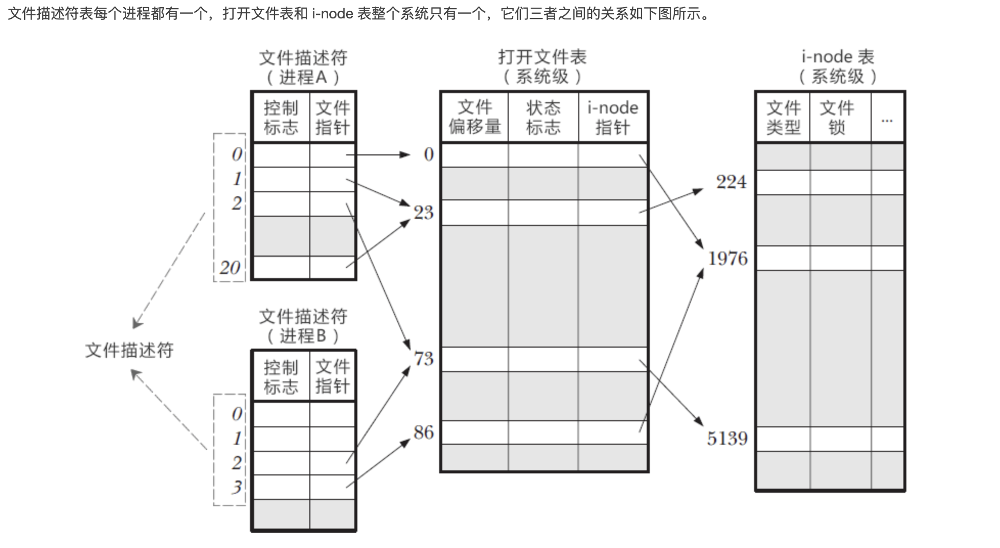

16. 解决字符串变执行语句的问题

    ```shell
    CMD="ls && echo abc"
    ${CMD}  # 报错！
    eval ${CMD} # 正确
    ```

    


**shell小轮子/shell脚本小轮子**

- 将多行，每行带有空格的转为数组：

   ```shell
   #!/bin/bash
   
   docker ps -a > docker_log
   mapfile < docker_log ARRAY
   array_index_set=(0 1 2)
   for i in ${array_index_set[@]}
   do
           echo ${ARRAY[${i}]} i: ${i}
   done
   ```

- 走入当前脚本所在文件夹的上层文件夹、当前文件路径

   ```shell
   # path of this file
   # 下方BASH_SOURCE也可以是$0，但是注意如果使用source命令执行，$0会是当前shell路径，而非当前文件路径。因为source是在当前shell执行的，类似把所有脚本内容一个个输入当前shell进行执行
   if [[ -L "$BASH_SOURCE" ]];then
       FILE=$(readlink -f "$BASH_SOURCE")
   else
       FILE=$BASH_SOURCE
   fi
    
   #获取当前shell所在文件夹
   BASE_DIR=$(cd $(dirname ${FILE}); pwd)
   
   #获取软连接绝对路径
   basepath=$(cd dirname $(readlink $BASH_SOURCE); pwd)
   ```

- shell获取当前时间：

   ```shell
   time=$(date "+%Y-%m-%d %H:%M:%S")  #2022-12-28 15:09:16
   time=$(date "+%m%d%H%M")  #12281510
   
   时间转换，拿到世界时间：date -d @{时间戳}
   
   拿到时间戳：date -d '20210901 00:00:00' +'%s.%N'
   ```

- 统计函数耗时

   ```shell
   measure_time() {
       local function_name="$1"
       start_time=$(date +%s.%N)
       "$function_name"  # Call the function
       end_time=$(date +%s.%N)
       execution_time=$(echo "$end_time - $start_time" | bc)
       echo "$function_name took $execution_time seconds"
   }
   
   function test() {
       sleep 2
   }
   #############main#############
   measure_time test
   ```

   

- 日志记录函数

   ```shell
   # 日志打印函数
   VERBOSELY=1
   LOG_FILE=/home/work/run_log/shell_log
   function logging() {
       local timestamp=$(date)
       if [[ ${VERBOSELY} -eq 1 ]];then
           # output to the standard error
           echo "[${timestamp}]$@" >&2
       fi
       echo "[${timestamp}]$@" >> ${LOG_FILE}
   }
   #error 日志
   function error() {
       logging "ERROR: $@"
   }
   # warning 日志
   function warning() {
       logging "WARNING: $@"
   }
    # info 日志
   function info() {
       logging "INFO: $@"
   }
   #####main####
   info "enter main"
   ```

- 将多行文本转为数组：

   ```shell
   docker ps -a > docker_log
   mapfile < docker_log ARRAY
   for i in ${ARRAY[@]}
   do
       echo $i
   done
   ```

- 检查进程是否存在并kill

   ```shell
   function get_process_pids() {
       if [[ $# != 1 ]];then
           return
       fi
       local pids=$(ps aux |grep "$1" |grep -v "grep" |grep -v $0 |awk '{print $2}' |xargs)
       echo ${pids}
   }
   
   #正常返回0，异常返回1
   function kill_process() {
       local res=0
       if [[ $# != 1 ]];then
           warning "kill_process need 1 param"
           return 1
       fi
       local check_process_str="${1}"
       local pids=$(get_process_pids "${check_process_str}")
       if [[ -z $pids ]];then
           echo "no process need kill"
       else
           echo "begin kill process: $pids"
           kill -9 $pids
           sleep 5
           pids=$(get_process_pids "${check_process_str}")
           if [[ -z $pids ]];then
               echo "kill process success"
           else
               echo "kill process fail"
               res=1
           fi
       fi
       return $res
   }
   ```

- 获取当前机器总线程数

   ```shell
   #获取当前机器总线程数，失败直接退出，成功在标准输出打印线程数量
   function get_total_threads_num() {
       re='^[0-9]+$'
       total_threads_num=$(ps -efT | wc -l|sed 's/^[ \t]*//g')
       if ! [[ $total_threads_num =~ $re ]] ; then
           error "get threas num fail,res not num";exit 1
       fi
       echo $total_threads_num
   }
   ```

- 增加用户和用户组

   ```shell
   function add_work_user() {
       user=work
       group=work
       passwd='work_passwd'
   
       #create group if not exists
       egrep "^$group" /etc/group >& /dev/null
       if [ $? -ne 0 ]
       then
           groupadd -g 501 $group
       fi
   
       #create user if not exists
       egrep "^$user" /etc/passwd >& /dev/null
       if [ $? -ne 0 ]
       then
           useradd -u 500 -g $group $user
       fi
       echo $user:$passwd | chpasswd
   
   }
   ```
   
- 判断命令是否存在

   ```shell
   function program_exists() {
       local ret='0'
       if [[ -z $1 ]]; then
           echo "program_exists get empty process name"
           return 1
       fi
       command -v $1 >/dev/null 2>&1 || { local ret='1'; }
   
       # fail on non-zero return value
       if [ "$ret" -ne 0 ]; then
           return 1
       fi
   
       return 0
   }
   ```
   
- 符合archer3协议的启停脚本。即对外暴露start/stop/restart/status方法来进行服务的启停和检测，返回0为正常，非0异常

   ```shell
   #!/bin/bash
   
   ############################# base settings start#########################
   BASE_DIR="$(cd $(dirname $0)/../;pwd)"
   export PYENV_ROOT="${BASE_DIR}/pyenv/2.7.14"
   export PATH="$PYENV_ROOT/bin:$PATH"
   export PYTHONPATH=$PYENV_ROOT:$PYTHONPATH
   SLEEP_TIME=5 #等待时间设置为2s
   #使用关联数组，分别表示进程名，进程关键字（ps查询方法），启动命令
   declare -A PROCESS_INFOS_ARRAY=(
       [0,0]="example_process_1" [0,1]="python -m example_process_1" [0,2]="python -m example_process_1"
       [1,0]="example_process_2" [1,1]="python -m example_process_2" [1,2]="python -m example_process_2"
   )
   ARRAY_ROWS_SIZE=2 #进程数组行数
   ARRAY_COLS_SIZE=3 #进程数组列数
   
   # 是否打印日志到标准输出
   VERBOSELY=1
   DATE=$(date +%Y%m%d-%H:%M:%S)
   ROOT="$(cd $(dirname $0)/../;pwd)"
   # 创建日志目录
   [[ ! -d "${ROOT}/log" ]] && mkdir -p "${ROOT}/log"
   LOG_FILE="${ROOT}/control.log"
   ############################# base settings end#########################
   
   ############################### function ###########################
   # 日志打印函数
   logging() {
       local timestamp=$(date)
       if [[ ${VERBOSELY} -eq 1 ]];then
           echo "[${timestamp}]$@" >&2
       fi
       echo "[${timestamp}]$@" >> ${LOG_FILE}
   }
   # warning 日志
   warning() {
       logging "WARNING: $@"
   }
    # info 日志
   info() {
       logging "INFO: $@"
   }
   
   setup_env() {
       echo "set path start..."
       export PYENV_ROOT="${BASE_DIR}/pyenv/2.7.14"
       export PATH="$PYENV_ROOT/bin:$PATH"
   }
   
   #启动，正常返回0，异常返回1
   start() {
       setup_env
   
       for ((line_index=0; line_index<${ARRAY_ROWS_SIZE}; line_index++)); do
           local process_name=${PROCESS_INFOS_ARRAY[$line_index,0]}
           local check_process_str=${PROCESS_INFOS_ARRAY[$line_index,1]}
           local start_process_cmd=${PROCESS_INFOS_ARRAY[$line_index,2]}
           check_and_start_process "${process_name}" "${check_process_str}" "${start_process_cmd}"
           if [[ $? -ne 0 ]];then
               warning "check_and_start_process $process_name failed!"
               return 1
           fi
       done
       return 0
   }
   
   #启动进程，成功0，失败1
   #入参说明：$1为进程名，$2为检查进程存在关键字，$3为进程启动命令
   check_and_start_process() {
       if [[ $# != 3 ]];then
           warning "check_and_start_process need 3 param"
           return 1
       fi
       local process_name="${1}" 
       local check_process_str="${2}"
       local start_process_cmd="${3}"
       local pids=$(get_process_pids "${check_process_str}")
       if [[ -z $pids ]];then
           $start_process_cmd &
       else
           info "$process_name alredy exist, not need start. pid: $pids"
           return 0
       fi
   
       sleep ${SLEEP_TIME}
       pids=$(get_process_pids "${check_process_str}")
       if [[ -z $pids ]];then
           info "start $process_name fail"
           return 1
       else
           info "start $process_name success, pid: $pids"
           return 0
       fi
   
   }
   
   #获取进程pids
   #入参为需要检查的进程关键字
   #返回值为pids，形如：223 111 95
   get_process_pids() {
       if [[ $# != 1 ]];then
           return
       fi
       local pids=$(ps aux |grep "$1" |grep -v "grep" |grep -v $0 |awk '{print $2}' |xargs)
       echo ${pids}
   }
   
   #停止进程，成功0，失败1
   #入参说明：$1为进程名，$2为检查进程存在关键字
   check_and_stop_process() {
       if [[ $# != 2 ]];then
           warning "check_and_start_process need 3 param"
           return 1
       fi
       local process_name="${1}" 
       local check_process_str="${2}"
       local pids=$(get_process_pids "$check_process_str")
       if [[ -z $pids ]];then
           info "$process_name alredy not exist, not need stop"
           return 0
       else
           info "begin kill $process_name pids: $pids"
           kill -9 $pids
       fi
   
       sleep ${SLEEP_TIME}
       pids=$(get_process_pids "${check_process_str}")
       if [[ -z ${pids} ]];then
           info "stop $process_name success"
           return 0
       else
           info "stop $process_name failed! still exist pids: $pids"
           return 1
       fi
   }
   
   # 停止服务，执行成功返回0，失败返回1
   stop() {
       for ((line_index=0; line_index<${ARRAY_ROWS_SIZE}; line_index++)); do
           local process_name=${PROCESS_INFOS_ARRAY[$line_index,0]}
           local check_process_str=${PROCESS_INFOS_ARRAY[$line_index,1]}
           check_and_stop_process "${process_name}" "${check_process_str}"
           if [[ $? -ne 0 ]];then
               warning "check_and_stop_process $process_name failed!"
               return 1
           fi
       done
       return 0
   }
   
   # 重启
   restart() {
       stop
       if [[ $? -ne 0 ]];then
           warning "Call stop failed in restart!"
           return 1
       fi
       start
       if [[ $? -ne 0 ]];then
           warning "Call start failed in restart!"
           return 1
       fi
       return 0
   }
   
   # 运行状态，服务正常返回0，异常返回1
   status() {
       local res=0
       #遍历检查所有进程是否存在
       for ((line_index=0; line_index<${ARRAY_ROWS_SIZE}; line_index++)); do
           local pids=$(get_process_pids "${PROCESS_INFOS_ARRAY[$line_index,1]}")
           if [[ -z $pids ]];then
               warning "process: ${PROCESS_INFOS_ARRAY[$line_index,0]} not exist"
               res=1
           else
               info "get process: ${PROCESS_INFOS_ARRAY[$line_index,0]} pids: $pids"
           fi
       done
       return $res
   }
   
   # 帮助
   help() {
     echo "Usage: $0 <start|stop|status|restart>"
     exit 0
   }
   
   ################################## control #################################
   main() {
   
       ACTION=$1
       info "$0 start at ${DATE}, base_dir: ${ROOT}, action: ${ACTION}"
       cd ${ROOT}
   
       case "${ACTION}" in
           start)
               info "Starting ..."
               start
               ret_val=$?
               info "Started, ret_val=${ret_val}"
           ;;
           stop)
               info "Stoping..."
               stop
               ret_val=$?
               info "Stopped, ret_val=${ret_val}"
           ;;
           restart)
               info "Restarting..."
               restart
               ret_val=$?
               info "Restarted, ret_val=${ret_val}"
           ;;
           status)
               info "Getting status..."
               status
               ret_val=$?
               info "Finished getting status, ret_val=${ret_val}"
           ;;
           *)
               help
               exit 1
           ;;
       esac
       info "$0 exit with value: ${ret_val}"
       exit ${ret_val}
   }
   
   main $@
   ```
   


## XVIZ相关

- 在mac m1芯片下跑通xviz前后端：即本地浏览器访问本地服务，将整个可视化跑起来。后端为[xviz](https://github.com/aurora-opensource/xviz)，前端为[streetscape.gl](https://github.com/aurora-opensource/streetscape.gl/tree/master)

  ```shell
  一、后端xviz
  1. 安装xviz依赖vips
  $ brew install vips
  
  2. node使用16
  $ nvm use 16
  
  3. 下载xviz并编译
  # Clone XVIZ
  $ git clone https://github.com/uber/xviz.git
  $ cd xviz
  
  # Install dependencies
  $ CXXFLAGS="--std=c++17" npm install sharp
  $ yarn bootstrap
  
  4. 下载数据并转换
  # Download KITTI data
  $ ./scripts/download-kitti-data.sh
  
  #convert data
  $ `cd /code/xviz/examples/converters/kitti && \
  yarn start -d /code/xviz/data/kitti/2011_09_26/2011_09_26_drive_0005_sync -o /code/xviz/data/generated/kitti/2011_09_26/2011_09_26_drive_0005_sync
  
  5. 启动服务
  $ ./modules/server/bin/babel-xvizserver -d data/generated/kitti/2011_09_26/2011_09_26_drive_0005_sync --port 8081
  
  二、前端streetscape.gl
  # clone the repo
  $ git clone https://github.com/uber/streetscape.gl.git
  $ cd streetscape.gl/examples/get-started
  # install dependencies
  $ yarn
  # start the app
  $ yarn start-streaming
  ```

- 入参获取getopt

  ```shell
  while getopts ":i:o:" o; do
      case "${o}" in
          i)
              in_file=${OPTARG}
              ;;
          o)
              out_file=${OPTARG}
              ;;
          *)
              usage
              ;;
      esac
  done
  shift $((OPTIND-1))
  
  echo "in_file: $in_file, out_file: $out_file"
  ```

  

## vim相关

- vim的3种常用模式

  1. 正常(Normal)模式，也就是vim file进去时的模式
  
  2. 插入模式，可以输入文本到文件
  3. 命令行模式，输入【:/?=】，光标移动到最下面一行的模式
  
- 使用vim的出厂模式

  vim -u NONE -N
  
  -u NONE 标志让 Vim 不加载用户的vimrc，NONE也可以替换为指定文件。当用不加载 vimrc 文件的方式启动时，Vim 会切换到 vi 兼 容模式，这将导致很多有用的功能被禁用，而 -N 标志则会使能 ‘nocompatible’ 选 项，防止进入 vi 兼容模式。
  
- 命令行模式

  - 让缩进变为4个空格

    ➾:set shiftwidth=4 softtabstop=4 expandtab
  
- 正常(Normal)模式

  常规快捷键

  - 切换至插入模式的快捷键

    | 复合命令 | 等效的长命令 | 备注                     |
    | -------- | ------------ | ------------------------ |
    | C        | c$           |                          |
    | s        | cl           |                          |
    | S        | ^C           | 清除当前行并进入插入模式 |
    | I        | ^i           |                          |
    | A        | $a           |                          |
    | o        | C<CR>        | 当前光标下方插入一行     |
    | O        | ko           | 当前光标上方插入一行     |

  - 可重复的操作及如何回退

    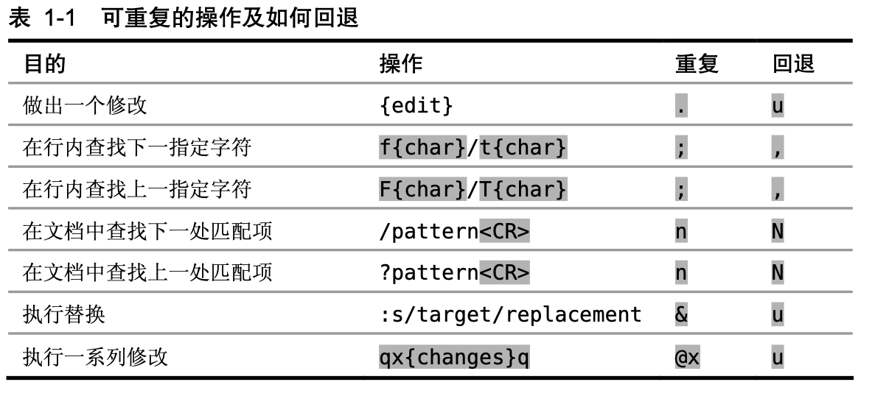
    
  - Vim 的操作符命令

    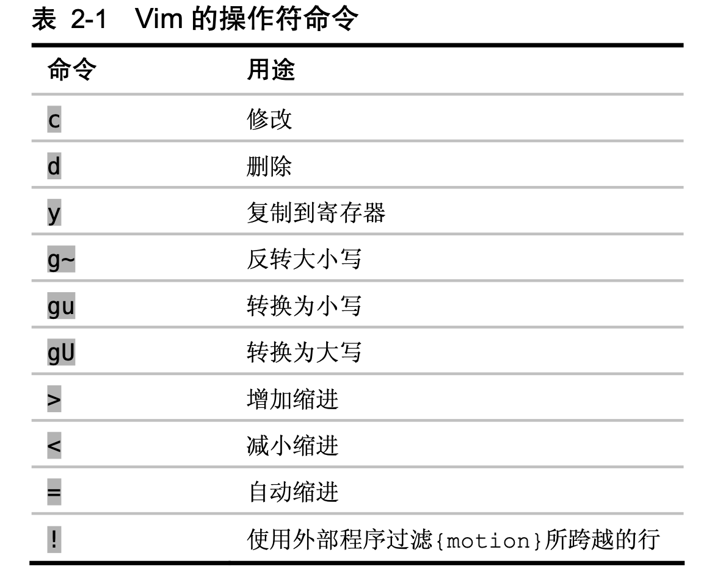

  

  - 全选:    `ggVG`    一行行选择`V`，一个个光标单位选择`v`

  - 将选择的复制`y`，粘贴`p`

  - 光标移动
    1. 到行尾:`$`    到下一行行尾:`2$`    到从当前行算起第n行行尾:`n$`
    
    2. 到行首:`0`
    
  - 撤销：命令模式下按u    撤销的撤销：ctrl + r

  - 查看关键字出现次数：%s/{关键字}//gn  

  - 插入列
    	插入操作的话知识稍有区别。例如我们在每一行前都插入"() "：
    	1.光标定位到要操作的地方。
    	2.CTRL+v 进入“可视 块”模式，选取这一列操作多少行。
    	3.SHIFT+i(I) 输入要插入的内容。
    	4.ESC 按两次，会在每行的选定的区域出现插入的内容。
    
  - 删除列
    
    在【插入列】替换第三步为输入x即可

- 翻页：向下：ctrl+f    向上：ctrl+b

- 设置鼠标能上下滑动：

  ```
  方法一：
  1. vi ~/.vimrc
  2. set mouse=a
  3. source  ~/.vimrc
  
  方法二（在mac iterm2中）
  iTerm2 > Preferences > Advanced
  Mouse > Scroll wheel sends arrow keys in alternate screen mode.
  注意这可能导致一个问题：偶现在terminal triggers the command history。解决办法为vim某个东西再退出
  ```

- vim退出后终端是否显示部分vim的文本：

  - User1使用TERM = **xterm**，在这种情况下，当您退出vim时，它将清除终端。

  - User2使用TERM = **vt100**，在这种情况下，退出vim不会清除终端。

- 展开所有折叠：一般命令行模式直接使用zi就可以展开和折叠了

- 分屏

  横向分屏：:sp    纵向分屏：:vsp

  光标移动：ctrl+w+【hjkl任一】但是ctrl+w经常会关闭窗口，所以一般做个快捷键映射，在vimrc中写入：

  ```shell
  nmap <C-h> <C-w>h
  nmap <C-j> <C-w>j
  nmap <C-k> <C-w>k
  nmap <C-l> <C-w>l
  ```

- vim插件

  ```
  git clone https://github.com/VundleVim/Vundle.vim.git ~/.vim/bundle/Vundle.vim  #插件管理工具
  
  ---对于vimrc常用的
  nmap <C-h> <C-w>h
  nmap <C-j> <C-w>j
  nmap <C-k> <C-w>k
  nmap <C-l> <C-w>l
  set incsearch                   " 查找时边输入边高亮匹配
  set hlsearch                    " 查找高亮显示 
  set wrap                        " 一行太长则分行显示
  set paste                       " 粘贴时防止乱缩进
  ```

- 常用快捷键

  1. 普通模式在当前行下插入一行并进入插入模式：用o或者O命令

- 可视模式相关

  1. 按字符串匹配筛选段并打印    :/{字符串}/,/{字符串}/p  例如：    :/abc/,/abc/p

**vim实战**

- 在多个符合匹配的字符串尾部进行操作

  ```shell
  #示例，对下方aaabbb.*的字符，末尾加上cccddd
  aaabbb
  xy
  xyaaabbb
  aaabbbxy
  
  #步骤
  - /aaabbb.*<CR> #向下搜索符合条件的字符
  - ea #e表示移动到末尾，a进行追加内容
  - cccddd #输入内容
  - n. n表示下一个查找，.表示遵循上次操作，一直进行n.则替换完毕
  ```

  


## ssh rsa key

生成rsa密钥对：ssh-keygen -t rsa

在Linux体系存储位置为`~/.ssh`

windows 一般在 /c/Users/{用户名}/.ssh


## markdown(md)一些用法

1. \`将正常的代码放这四个符号间会被凸显，以代码形式显示\`，左右两个这种引号也行

2. *\*在这中间的字会加粗\*\*

3. 在typora中数字+英文点+空格会让后续自动增加序号，如果要将两段序号（如123、12）合为一个（12345），进入typora编辑模式，将中间的空格之类的清除就行

4. []右边放()会产生隐藏链接，点击中括号内容便转到链接

5. 插入复选框: - [ ] 注意每一个符合后都有空格，如果是选中，则把中括号的空格变为x

6. 删除线

7. 页内跳转

   1）如果想调到指定标题名去，可用[任意内容]\(#标题名，注意带左边的#号\)

   2）如果想跳到任意文本处：1）要先在该文本处加上”锚点“，\<a name=锚点名>指定文本（也可以空白）\</a>    2）[任意内容]\(#锚点名，注意带左边的#号\)

## 锁相关

对锁的理解：宏观层面，锁不是锁具体一个文件，锁是规范化锁一段代码，也就是所有的线程、进程都必须排队走这个规范流程，而由于锁的是一段代码，代码理论上能干任何事，所以锁在宏观层面是锁任何事物。

1. cpp锁

   boost::recursive_mutex::scoped_lock guard_lock(_service_map_mutex);

2. 


## docker相关

相关文档：[K8S相关](#K8S相关)

 **docker概念**

镜像就是模板类；容器是对应模板的具象化（对象）


- 安装docker

  mac安装docker：brew install --cask --appdir=/Applications docker


- 查看镜像    ``docker image ls``或者`docker images`

- 启动某个容器    ``doeker start {containerID}``

- docker run相关/将镜像转为容器

  通过镜像起新容器：docker run --name {容器名} -itd --privileged=true --net=host --entrypoint /bin/bash {镜像名或id}

  - 挂起运行：-d

  - 注意 --entrypoint /bin/bash是一起的

  - 指定disk大小：--storage-opt size=30G

  - 指定网络类型

    ```shell
    可以在 docker run 的时候通过 --net 参数来指定容器的网络配置，有4个可选值：
    --net=bridge 这个是默认值，连接到默认的网桥。
    --net=host 告诉 Docker 不要将容器网络放到隔离的命名空间中，即不要容器化容器内的网络。此时容器使用本地主机的网络，它拥有完全的本地主机接口访问权限。容器进程可以跟主机其它 root 进程一样可以打开低范围的端口，可以访问本地网络服务比如 D-bus，还可以让容器做一些影响整个主机系统的事情，比如重启主机。因此使用这个选项的时候要非常小心。如果进一步的使用 --privileged=true，容器会被允许直接配置主机的网络堆栈。
    --net=container:NAME_or_ID 让 Docker 将新建容器的进程放到一个已存在容器的网络栈中，新容器进程有自己的文件系统、进程列表和资源限制，但会和已存在的容器共享 IP 地址和端口等网络资源，两者进程可以直接通过 lo 环回接口通信。
    --net=none 让 Docker 将新容器放到隔离的网络栈中，但是不进行网络配置。之后，用户可以自己进行配置。
    ```

  - 端口映射： -p {主机端口}:{容器端口}  需要注意，如果指定了--net=host，则容器内会直接使用并占用宿主机的端口

  - 文件夹映射：-v {主机文件夹}:{容器文件夹}

- 将容器转为镜像：docker commit {container_id} {image_name}

- docker exec

  用work用户进入某个容器中    ``docker exec -it --user work {containerID} /bin/bash``

  挂起执行命令：docker exec {container_id}  bash -c "{param}"

- 主机和容器间文件的拷贝

  主机拷贝文件到容器    `docker cp {主机路径} {容器hash，如96f7f14e99ab}:{容器路径，末尾有/}`
  
  将容器文件拷贝到主机，如:    `docker cp 96f7f14e99ab:/www /tmp/`
  
  注意，对于拷贝文件夹到容器中，末尾加/与不加是不同意义
  
  docker cp tmp_dir/ 96f7f14e99ab:/www  将形成/www/tmp_dir的文件夹
  
  docker cp tmp_dir 96f7f14e99ab:/www  将tmp_dir下内容拷贝到www中
  
- 删除容器：`docker rm {containerID}`

- 删除镜像： `docker rmi` 命令，或者`docker images rm`，后边跟镜像名/镜像id

- 复制容器（将容器或镜像转换为文件包）

  - 保存镜像：docker save {image_id} > xxx.tar

  - 导入镜像：docker load < xxx.tar

  - 保存容器：docker export ID >xxx.tar

  - 导入容器：docker import xxx.tar containr:v1（containr:v1应该就是这个容器的名字了）

    然后再docker run -it containr:v1 bash

- 让容器内支持中文输入：docker exec -it cdee10f86126 env LANG=en_US.utf8 /bin/bash

  如果该方法不生效，则尝试以下方法

  ```
  1.进入docker，执行 vim ~/.bashrc 打开profile文件
  2.将export LANG="C.UTF-8"命令添加在profile文件最后,保存退出
  3.执行source ~/.bashrc ，即可正常显示中文
  ```

- Docker 查看容器映射路径：docker inspect {容器名}  查看

- 查看镜像构建历史： docker history {image_id} --no-trunc=true

  - --no-trunc=true 取消精简显示

- docker push

  类似docker push abc.com/b/c:test_image

  如果镜像没有这个tag，则在push之前需要：docker tag {镜像} abc.com/b/c:test_image   然后再push

- nohup /usr/bin/dockerd -H unix:///var/run/docker.sock --data-root /home/work/docker --insecure-registry XXX.com &

- 更改docker存储位置（centos7）：

  查看存储位置：docker info | grep Root

  对于dockerd方式启动的docker，例如进程名为：/usr/bin/dockerd -H unix:///var/run/docker.sock...

  则核心为在其后增加--graph={path}(也可-g {path})或者--data-root={path}参数，区别是前者较老的命令，后者是新命令参数

  方法一：修改：vim /lib/systemd/system/docker.service    （或者是/usr/lib/systemd/system/docker.service，反正我改了前者后者也立刻自动同步了）

  

  方法二：修改  /etc/docker/daemon.json：

  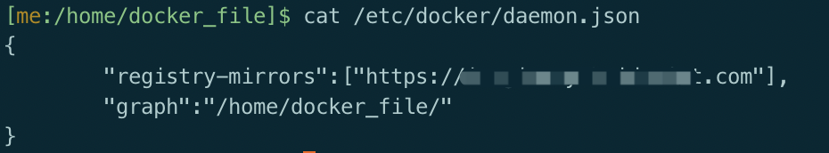

  方法三：修改/etc/default/docker：DOCKER_OPTS="--data-root=/home/docker_file"

  如果没有该文件或者改了重启没生效，则查看/lib/systemd/system/docker.service 或 /usr/lib/systemd/system/docker.service，在里面：1）加载的配置文件：EnvironmentFile=-/etc/default/docker  2）在ExecStart末尾增加 $DOCKER_OPTS

  重启docker：

  ​	systemctl daemon-reload

  ​	systemctl restart docker 

  然后查看是否启动成功，主要是后边参数是否增加了上述两者之一：

  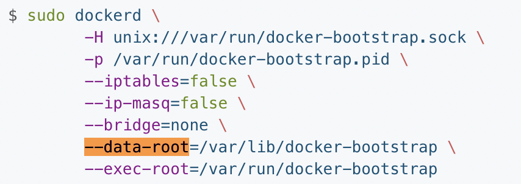

  

- 正常退出不关闭容器：Ctrl + p + q

**docker file/Dockerfile相关**

- 示例Dockerfile

  ```dockerfile
  FROM test.com/second_dir:test_image
  
  MAINTAINER author@mail.com
  
  USER work
  #工作目录
  WORKDIR /home/work
  #设置变量
  ARG dest_dir="/home"
  #使用bash
  SHELL ["/bin/bash", "-c"]
  
  COPY --chown=work:work test_dir /home/abc/test_dir
  
  RUN  mkdir -p /home/deploy_tmp_dir && \
  		 chown -R work:work $dest_dir
  ```

- 在有Dockerfile的文件夹运行docker build [-t {tag_name}] .

- 对于COPY命令：

  1）对于Dockerfile文件夹下的文件夹COPY，默认只复制里面的子文件（夹）到目的地址。所以若希望复制是带有文件夹本身，需在目的地址尾部写上该文件夹
  
  2）注意下方这种写法，如果没有/home/work目录，则最终效果是将test.tgz重命名为/home/work文件，解决方法是work后加/
  
  ​	COPY test.tgz /home/work
  
- 查看容器大小：

  - docker system df
  - docker ps -s
  


**docker小知识**

1. 解决普通用户执行docker命令报权限错误：.../var/run/docker.sock: connect: permission denied

   ```
   chmod a+x /usr/bin/docker
   chmod 666 /var/run/docker.sock
   ```

2. docker密码存储位置：~/.docker/config.json


## K8S相关

详见：[K8S学习](K8S学习.md#K8S相关)

## photoshop相关/PS相关

- ctrl+alt复制图片时总是卡住，解决办法：

  方法1：控制面板-键盘-速度-调到最低（不打管用）

  方法2：任务管理器--关闭ps进程下的一些怀疑对象，卡住画面恢复

- 图层相关

  - 合并多个图层：ctrl+鼠标左键选中多个图层，ctrl+e合并
  - 新建透明图层：ctrl+shift+N
  - 对图层加边框：1）对右下角的某个图层双击或者右键-混合选项；2）对弹出菜单，勾选描边，可对其中进行编辑
  - 复制图层样式到另一图层：1）对右下角的某个图层右键-拷贝图层样式；2）对目标图层右键-粘贴图层样式
  - 调整单张画布颜色：1）选中你当前图层；2）点击图层面板底部的👉 创建新的填充或调整图层（半黑半白圆）；3）选 纯色…；4）颜色选 白色（#FFFFFF）；5）把这个白色图层 拖到当前图层上方或下方
  - 调整单张画布大小：1）选中图层；2）图像-画布大小；3）勾选相对；4）按需调整宽度和高度；

- 图像相关

  - 复制单个图像：1）用框选工具框选；2）通过ctrl + alt + 鼠标左键拖动复制；
  - 调整单个图像的扭曲翻转：1）选中；2）ctrl +alt + 鼠标放置在边角进行拖动；

- 将背景改为透明：1）选中背景，再反向选择；2）编辑-剪切；3）新建透明图层（ctrl+shift+N）；4）编辑-粘贴；5）删除原始图层；6）保存为png格式

## iptables相关

```shell
# 规则  注意每次新增的规则优先级更低，是向末尾增加的
iptables -A INPUT -p tcp --dport 8866 -s 172.24.225.60/16 -j ACCEPT # 172.24.*.*支持进来
iptables -A INPUT -p tcp --dport 8866 -j DROP

# 显示规则
iptables -L --line-numbers

# 删除规则
iptables -D INPUT 1
```


## protobuf相关/pb相关

- 编译protoc

  1. 下载源码产出，如protobuf-all-21.9.tar.gz：https://github.com/protocolbuffers/protobuf/releases

     注意，适合python2的最新产出为：[protobuf-all-3.17.3.tar.gz](https://github.com/protocolbuffers/protobuf/releases/download/v3.17.3/protobuf-all-3.17.3.tar.gz)

  2. 编译安装

     ```shell
     cd protobuf-21.9
     ./configure //默认安装到/usr/local
     make
     sudo make install
     ```

  3. 测试安装是否成功

     1. protoc --version //查看是否安装成功 libprotoc 3.21.9

     2. 编写测试代码：main.cpp和[people.proto](#people)

        ```cpp
        #main.cpp
        #include<iostream>
        #include "people.pb.h"
        int main() {
            auto obj_people = world::animal::People();
            obj_people.set_gender(world::animal::People_Gender_FEMALE);
            std::cout << obj_people.DebugString();
        }
        ```

     3. 获取people.proto对应cpp文件：`protoc -I=./ --cpp_out=./ ./people.proto`

     4. 编译  g++ ./main.cpp people.pb.cc -std=c++11 $(pkg-config --cflags --libs protobuf)

     5. 执行./a.out  结果应该为：gender: FEMALE

- [protobuf命名规范约定](#protobuf命名规范约定)

- 限定修饰符包含 required\optional\repeated 

  - Required: 表示是一个必须字段，必须相对于发送方，在发送消息之前必须设置该字段的值，对于接收方，必须能够识别该字段的意思。发送之前没有设置required字段或者无法识别required字段都会引发编解码异常，导致消息被丢弃。

  - Optional：表示是一个可选字段，可选对于发送方，在发送消息时，可以有选择性的设置或者不设置该字段的值。对于接收方，如果能够识别可选字段就进行相应的处理，如果无法识别，则忽略该字段，消息中的其它字段正常处理。---因为optional字段的特性，很多接口在升级版本中都把后来添加的字段都统一的设置为optional字段，这样老的版本无需升级程序也可以正常的与新的软件进行通信，只不过新的字段无法识别而已，因为并不是每个节点都需要新的功能，因此可以做到按需升级和平滑过渡。

  - Repeated：表示该字段可以包含0~N个元素。其特性和optional一样，但是每一次可以包含多个值。可以看作是在传递一个数组的值。N 表示打包的字节并不是固定。而是根据数据的大小或者长度。对于结构体的repeated字段，会生成``{结构体对象名}.{repeated对象名}_size()``，函数返回int。如果想取出某个index对应的单位:   `{结构体对象名}.{repeated对象名}({index})`

    添加新成员：add_{成员名}()  repeated后边分为2类，基础数据结构和后生成数据结构（也就是自定义的message），对于基础数据结构，其add方法为：void add_XXX(value);  对于后生成数据结构，其add方法为：{定义结构}* add_XXX();
    
    - <a name=python与protobuf_repeated结构> python与protobuf repeated结构 </a>
      1. 注意对于repeated中单个数据成员的拷贝，需要使用CopyFrom，而非=号，这是浅拷贝与深拷贝相关导致；
      2. 如果要实现repeated与repeated的直接拷贝，可以直接使用extend；

- 可以将message理解为一个结构体，每个结构体有一定的 required\optional\repeated，对于某结构体的可选字段（Optional），会生成`{结构体对象名}.has_{Optional成员名字}`，函数返回bool；

  对于Required和Optional成员，如果存在，可以通过{message，对象承接的名字}.{成员名字}()来获取

  而对于Repeated成员，需要通过{message，对象承接的名字}.{成员名字}(index，int类型)获取
  
- protobuf相关语法/通用常识

  1. 输出到文件：SerializeToOstream    输出到终端：
  
  2. 赋值：a=b;    或者下方的CopyFrom函数
  
  3. 对于enum元素，会从第0个开始设置，默认也是0，同时该数据也不会有实际数据量，如在网络传输时不会进行传输，应在解析端没有数据时认为值为第0个；
  
     ```protobuf
     enum LogLevel {
             UNKNOWN = 0; // enum类型必须从0开始设置，同时其也为默认值
             DEBUG = 1;
             INFO = 2;
             WARN = 3;
             ERROR = 4;
             FATAL = 5;
     }
     ```
  
  4. enum元素与cpp
  
     <a name=people>people.proto</a>
  
     ```protobuf
     syntax = "proto2";
     package world.animal;
     message People {
         enum Gender {
             MALE = 1;  //对应cpp元素为 world::animal::People_Gender_MALE,python为people_pb2.People.MALE
             FEMALE = 2;  //对应cpp元素为 world::animal::People_Gender_FEMALE
             OTHER = 3;  //对应cpp元素为 world::animal::People_Gender_OTHER
         };
         optional Gender gender = 1;
     }
     //同时会生成world::animal::People_Gender_Name和world::animal::People.Gender_Name，用于输入枚举值，返回string
     //对于python，会生成people_pb2.People.Gender.Name，用于输入int，返回string
     ```
  
  5. oneof、repeated、map元素与python
  
     - <a name=people>boss.proto</a>
  
       ```protobuf
       syntax = "proto3";
       message Hydra {
           repeated string names = 1; // 九头蛇九个头的名字
       }
       message Godzilla {
           string name = 1; // 哥斯拉名字
       }
       message Boss {
           oneof boss_name {
               Godzilla godzilla_name = 1; // 哥斯拉名字
               Hydra hydra_name = 2; // 九头蛇名字
           }
       }
       message BossMap {
           map<string, Boss> boss_map = 1; // boss的名字和Boss message的映射
       }
       ```
  
     - 编译方法
  
       ```shell
       mkdir -p release_py_dir && rm -rf release_py_dir/* && touch release_py_dir/__init__.py && protoc -I=./ --python_out=release_py_dir ./*.proto
       ```
  
     - 示例代码/使用方法
  
       ```python
       # -*- coding: utf-8 -*-
       import release_py_dir.boss_pb2 as boss_pb2
       
       if __name__ == '__main__':
           godzilla_obj = boss_pb2.Godzilla(name='mao dan') # 对message赋值
           print("godzilla_obj: {}".format(godzilla_obj))
       
           hydra_obj = boss_pb2.Hydra(names=['1', '2', '3', '4', '5', '6', '7', '8', '9']) #对repeated赋值
           print('hydra_name: {}'.format(hydra_obj))
       
           boss = boss_pb2.Boss(hydra_name=hydra_obj) # 对oneof赋值
           print("boss is: {}".format(boss))
       
           boss_map_obj = boss_pb2.BossMap()
           boss_map_obj.boss_map['hydra_name'].CopyFrom(boss) # 对map赋值
           print('boss_map_obj: {}'.format(boss_map_obj))
       ```


- Standard Message Methods

  Each message class also contains a number of other methods that let you check or manipulate the entire message, including:

  - `bool IsInitialized() const;`: checks if all the required fields have been set.
  - `string DebugString() const;`: returns a human-readable representation of the message, particularly useful for debugging.
  -  `void PrintDebugString() const;`: Convenience function useful in GDB.  Prints DebugString() to stdout.
  - `void CopyFrom(const Person& from);`: overwrites the message with the given message's values.
  - `void Clear();`: clears all the elements back to the empty state.

- Parsing and Serialization

  1. `bool SerializeToString(string* output) const;`: serializes the message and stores the bytes in the given string. Note that the bytes are binary, not text; we only use the `string` class as a convenient container.

  2. `bool ParseFromString(const string& data);`: parses a message from the given string.

  3. `bool SerializeToOstream(ostream* output) const;`: writes the message to the given C++ `ostream`.

  4. `bool ParseFromIstream(istream* input);`: parses a message from the given C++ `istream`.
  
- pb对象的可视化和json接入-cpp

  一般用DebugString或PrintDebugString查看，不过输出不是严格意义的json。如果要合法数据，有以下方式

  ```c++
  //转严格合法json字符串
  #include <google/protobuf/text_format.h>
  if (std::string s; google::protobuf::TextFormat::PrintToString(msg, &s)) {
    std::cout << "Your message: " << s;
  } else {
    std::cerr << "Message not valid (partial content: "
              << msg.ShortDebugString() << ")\n";
  }
  
  //第二种方法
  #include <google/protobuf/util/json_util.h>
  static std::string ProtoToJson(const google::protobuf::Message& proto)
  {
    std::string json;
    //主要就是下方这行函数
    google::protobuf::util::MessageToJsonString(proto, &json);
    return json;
  }
  ```

- [pb对象与json相互转换-python](#pb对象与json相互转换)

- [pb对象与文件相互转换](#pb对象与文件相互转换)

- protoc相关

  编译pb为python文件：protoc -I=./ --python_out=./ ./people.proto

  编译pb为cpp文件：protoc --proto_path=./ --cpp_out=./ test.pb
  
  编译命令示例：
  
  ```shell
  g++ ./main.cp test.pb.pb.cc -I/opt/homebrew/Cellar/protobuf/3.19.4/include/ -std=c++11 -L/opt/homebrew/Cellar/protobuf/3.19.4/lib/ -lpro
  tobuf
  ```
  
- 安装protobuf cpp的include路径

  - mac为：/opt/homebrew/Cellar/protobuf/3.19.4/include/

## tar相关/压缩/解压文件

```shell
tar
-c: 建立压缩档案
-x：解压
-t：查看内容
-r：向压缩归档文件末尾追加文件
-u：更新原压缩包中的文件


这五个是独立的命令，压缩解压都要用到其中一个，可以和别的命令连用但只能用其中一个。下面的参数是根据需要在压缩或解压档案时可选的。

-z：有gzip属性的
-j：有bz2属性的
-Z：有compress属性的
-v：显示所有过程
-O：将文件解开到标准输出

下面的参数-f是必须的

-f: 使用档案名字，切记，这个参数是最后一个参数，后面只能接档案名。

# tar -cf all.tar *.jpg
这条命令是将所有.jpg的文件打成一个名为all.tar的包。-c是表示产生新的包，-f指定包的文件名。

# tar -rf all.tar *.gif
这条命令是将所有.gif的文件增加到all.tar的包里面去。-r是表示增加文件的意思。

# tar -uf all.tar logo.gif
这条命令是更新原来tar包all.tar中logo.gif文件，-u是表示更新文件的意思。

# tar -tf all.tar
这条命令是列出all.tar包中所有文件，-t是列出文件的意思

# tar -xf all.tar
这条命令是解出all.tar包中所有文件，-x是解开的意思

压缩
tar –cvf jpg.tar *.jpg //将目录里所有jpg文件打包成tar.jpg
tar zcf jpg.tar.gz *.jpg   //将所有jpg后缀文件压缩为一个gz压缩包
tar zcf cg.tgz ./*    //将所有文件压缩为tgz文件（参数可以记为“政策房”，将零散的村落打包压缩在一起）
tar –cjf jpg.tar.bz2 *.jpg //将目录里所有jpg文件打包成jpg.tar后，并且将其用bzip2压缩，生成一个bzip2压缩过的包，命名为jpg.tar.bz2
tar –cZf jpg.tar.Z *.jpg   //将目录里所有jpg文件打包成jpg.tar后，并且将其用compress压缩，生成一个umcompress压缩过的包，命名为jpg.tar.Z
rar a jpg.rar *.jpg //rar格式的压缩，需要先下载rar for linux
zip jpg.zip *.jpg //zip格式的压缩，需要先下载zip for linux
//让压缩后的文件不带有相对路径，如正常压缩：tar zcvf test.tgz home/work/file 在解压后是附带有home/work/路径的
tar zcvf all.tgz -C ~/test_for_all/20once/2_dir 2_file -C ~/test_for_all/20once/1_dir 1_file

解压
tar –xvf file.tar //解压 tar包
tar -xzvf file.tar.gz -C ~/test_for_all //将tar.gz或者tar.tgz解压到指定目录
tar -xjvf file.tar.bz2   //解压 tar.bz2
tar –xZvf file.tar.Z   //解压tar.Z
tar -xf file.tar.xz    //解压tar.xz
unrar e file.rar //解压rar
unzip file.zip //解压zip

总结
加压解压都可以加v参数看中间过程
1、*.tar 用 tar –xvf 解压
2、*.gz 用 gzip -d或者gunzip 解压
3、*.tar.gz和*.tgz 用 tar –xzf 解压（参数记为“香樟房”，散开的叶子这么多，也就是解压缩）
4、*.bz2 用 bzip2 -d或者用bunzip2 解压
5、*.tar.bz2用tar –xjf 解压
6、*.Z 用 uncompress 解压
7、*.tar.Z 用tar –xZf 解压
8、*.rar 用 unrar e解压
9、*.zip 用 unzip 解压

tar经典示例
10、tar --exclude=a_dir --exclude=b_file -zcf all.tgz ./*   #压缩当前的所有内容，除了a_dir、b_file,注意a_dir右边禁止加/
```


## python相关

- **python语法**

  1. 单引号和双引号效果一样，三引号里可以放前两者，让他们显示出来

  2. 经典数据结构 list、tuple、字典与set的相关api

     ```python
     #list#
     l = [1,2]  #初始化
     len(l)  #计算长度
     
     #list常规操作
     >>> classmates = ['Michael', 'Bob', 'Tracy']#初始化
     >>> classmates[-1]#获取最后一个元素，'Tracy'
     >>> classmates[-2]#获取倒数第二个元素，'Bob'
     #在末尾插入元素'Adam'
     >>> classmates.append('Adam')
     >>> classmates
     ['Michael', 'Bob', 'Tracy', 'Adam']
     #在指定索引位置插入元素
     >>> classmates.insert(1, 'Jack')
     >>> classmates
     ['Michael', 'Jack', 'Bob', 'Tracy', 'Adam']
     #删除末尾元素
     >>> classmates.pop()
     'Adam'
     >>> classmates
     ['Michael', 'Jack', 'Bob', 'Tracy']
     #删除指定索引元素
     >>> classmates.pop(1)
     'Jack'
     >>> classmates
     ['Michael', 'Bob', 'Tracy']
     #指定索引位置值替换
     >>> classmates[1] = 'Sarah'
     >>> classmates
     ['Michael', 'Sarah', 'Tracy']
     #迭代改变其值
     list_obj = [0,0,0,0]
     for idx, item in enumerate(list_obj): #变为变成下标-元素对
         list_obj[idx] = item + idx
     print list_obj  #[0,1,2,3]
     
     #tuple#
     #tuple可以看做指向不可变的list
     
     
     #dict#
     d['a'] = 1  #新增/赋值
     d.get('a', -1)  #判断key是否存在，存在则返回value，反之返回参数2，参数2默认值为None
     #get()方法,返回指定键的值,不存在时，返回默认值
     dict.get(key, default=None)    
     if 'a' in dict: #也可以用这种方法判断
     res = json.dumps(dict) ##dict转json
     d.pop('a')  #删除
     #dict的遍历
     #1）遍历key值
     >>> a
     {'a': '1', 'b': '2', 'c': '3'}
     >>> for key in a:
     print(key+':'+a[key])
     a:1
     b:2
     c:3
     >>> for key in a.keys():
     print(key+':'+a[key])
     a:1
     b:2
     c:3
     在使用上，for key in a和 for key in a.keys():完全等价。
     
     #2）遍历value值
     >>> for value in a.values():
     print(value)
     1
     2
     3
     
     #3）遍历字典项
     >>> for kv in a.items():
     print(kv)
     ('a', '1')
     ('b', '2')
     ('c', '3')
     
     #4）遍历字典健值
     >>> for key,value in a.items():
     print(key+':'+value)
     a:1
     b:2
     c:3
     >>> for (key,value) in a.items():
     print(key+':'+value)
     a:1
     b:2
     c:3
     
     ##可迭代对象（Iterable）##
     能够被for..in遍历的对象
     代码判断方法：可用isinstance()判断是否为可迭代对象。更本源其实为实现了类的__iter__方法即为可迭代对象
     >>> from collections.abc import Iterable
     >>> isinstance([], Iterable)
     True
     
     ##迭代器（Iterator）##
     可以被next()函数调用并不断返回下一个值的对象称为迭代器：Iterator。
     可以使用isinstance()判断一个对象是否是Iterator对象。更本源其实为同时实现了类的__iter__和__next__方法即为迭代器，它可通过 __next__() 方法或者一般的 for 循环进行遍历，能够记录每次遍历的位置，迭代器对象从集合的第一个元素开始访问，直到所有的元素被访问完结束，迭代器只能往前不能后退，终止迭代则会抛出 StopIteration 异常
     >>> from collections.abc import Iterator
     >>> isinstance((x for x in range(10)), Iterator)
     True
     >>> isinstance([], Iterator)
     False
     >>> isinstance({}, Iterator)
     False
     >>> isinstance('abc', Iterator)
     False
     生成器都是Iterator对象，但tuple、list、dict、str虽然是Iterable，却不是Iterator。
     把list、dict、str等Iterable变成Iterator可以使用iter()函数：
     
     ##列表生成式##
     顾名思义，生成列表的1个表达式，需要用中括号括起来，举例：
     >>> L = ['Hello', 'World', 'IBM', 'Apple']
     >>> [s.lower() for s in L]
     ['hello', 'world', 'ibm', 'apple']
     
     >>> [x if x > 5 else -x for x in range(1,11) if x % 2 == 1]
     [-1, -3, -5, 7, 9]
     注意上方例子其中左边的if为表达式，必须给数据1个出路，所以必须跟else
     右边的if是过滤条件，不能带else
     
     ##生成器（Iterator）##
     1个算法对象，不能直接知道所有值，每次通过next(算法对象)或者for循环得到下一个值
     代码判断方法：可用isinstance()判断是否为生成器
     >>> from collections.abc import Iterator
     >>> isinstance((x for x in range(10)), Iterator)
     True
     
     生成器有两种：1）列表生成式改小括号，如：
     >>> a = (x for x in range(1,11))
     >>> next(a)
     1
     >>> next(a)
     2
     >>> next(a)
     3
     
     2）普通函数魔改，如：
     def fib(max):
         n, a, b = 0, 0, 1
         while n < max:
             yield b
             a, b = b, a + b
             n = n + 1
         return 'done'
     如果一个函数定义中包含yield关键字，那么这个函数就不再是一个普通函数，而是一个generator
     每次调用next()的时候执行（for..in也是调用next），遇到yield语句返回，再次执行时从上次返回的yield语句处继续执行
     
     生成器都是Iterator对象，但tuple、list、dict、str虽然是Iterable，却不是Iterator。
     把list、dict、str等Iterable变成Iterator可以使用iter()函数：
     >>>from typing import Iterator
     >>> isinstance([], Iterator)
     False
     >>> isinstance(iter('abc'), Iterator)
     True
     
     
     
     ```
     


3. python-pip相关

   - 安装pip与安装python

     ```shell
     #在ubuntu20安装pippython2和pip2
     apt-get install -y python2-minimal
     wget -O get-pip.py https://bootstrap.pypa.io/pip/2.7/get-pip.py && python2 get-pip.py -i http://pypi.douban.com/simple/ --trusted-host pypi.douban.com
     
     #ubuntu18.04安装python2和pip2
     apt-get install python-minimal
     apt-get install python-pip
     ```

3. 格式化

```python
age = 20
name = 'Swaroop'
print('{0} was {1} years old when he wrote this book'.format(name, age))

# 对于浮点数 '0.333' 保留小数点(.)后三位
 print('{0:.3f}'.format(1.0/3))
# 使用下划线填充文本，并保持文字处于中间位置
# 使用 (^) 定义 '___hello___'字符串长度为 11
print('{0:_^11}'.format('hello'))
# 基于关键词输出 'Swaroop wrote A Byte of Python'  并去除最后的换行
print('{name} wrote {book}'.format(name='Swaroop', book='A Byte of Python'), end = '')

```


  4. 转义字符，与c类似，核心的有：``\t``    ``\n``    ``\"``    注意单纯的\会将上下两行代码拼接

  5. 整除`//`    且`and`    或`or`    非`not`

  6. 可以在while后面接else

  7. imoport 模块

     将模块理解为一个.py的文件，每次导入该文件都是原地执行了一次该文件

     可以通过`__name__ == '__main__'`的值判断对当前文件的执行是真正的运行这个文件还是被当模块导入时顺带执行

     通过`from {模块名} import {变量名}`语句可以在当前文件直接使用变量，而不用使用`{模块名}.{变量名}`

  8. python路径相关

     ```python
     #导入当前执行文件的上层的上层，如当前为/home/work/module/sub_module/test.py
     #希望导入/home/work/module路径
     import sys, os
     sys.path.append(os.path.dirname(os.path.dirname(os.path.abspath(__file__))))
     
     #查看python各环境路径
     $ python -m site
     ```


  9. dir({模块/对象名})

     返回该模块/对象内部的对象，也就是变量，函数，类，类的对象等等

  10. 函数参数

```python
 #位置参数，即普通参数
 def fun(x)
 
 #默认参数,原则是要放在位置参数之后
 def fun(x, y=0, z=1)
 
 """可通过指定形参名并赋值的方式跨过默认调用的顺序"""
 fun(1,z=2)  #跨过需先给y值，再给到z的规则
 
 """默认参数必须指向不变对象，原因可理解为Python函数在定义的时候，默认参数L的值就被计算出来了，每次调用默认参数时会将这个值的地址与L绑定，因为默认参数L也是一个变量，它指向对象[]，每次调用该函数，如果改变了L的内容，则下次调用时，默认参数的内容就变了，不再是函数定义时的[]了；如果是不变对象，即使在函数体对L重新赋值，其实改变的是L指向的地址，初始值及其对应的地址并未改变"""
 >>> def add_end(L=[]):
 ...     L.append('END')
 ...     return L
 ...
 >>> add_end()
 ['END']
 >>> add_end()
 ['END', 'END']#因为默认参数为可变参数，导致的结果不符合预期
 
 #可变参数
 def fun(*numbers) #numbers在函数内部是一个tuple
 
 """如果已经有一个list或者tuple，要调用一个可变参数即在实参前加一个*"""
 list_obj = [1,2,3]
 fun(*list_obj)


 #关键字参数
 #可变参数允许你传入0个或任意个参数，这些可变参数在函数调用时自动组装为一个tuple。而关键字参数允许你传入0个或任意个含参数名的参数，这些关键字参数在函数内部自动组装为一个dict
 def person(name, age, **kw):
     print('name:', name, 'age:', age, 'other:', kw)
 
 """实际调用"""
 >>> extra = {'city': 'Beijing', 'job': 'Engineer'}
 >>> person('Jack', 24, **extra)

 #命名关键字参数【仅在python3】  限制输入的关键字参数为形参指的的那些参数，不能增加或减少
 def person(name, age, *args, city, job)#在可变参数后的即认为是命名关键字参数
 def person(name, age, *, city, job)#如果没有可变参数，命名关键字参数需要一个特殊分隔符*
 def person(name, age, *, city='北京', job)#命名关键字参数可以有缺省值,这样在调用时就可以不附带该参数
 
 person('张三',18,job='work')#对命名关键字参数实例化时，【必须传入参数名】
 
 #参数组合
 #在Python中定义函数，可以用位置参数、默认参数、可变参数、关键字参数和命名关键字参数，这5种参数都可以组合使用。但是请注意，参数定义的顺序必须是：必选参数、默认参数、可变参数、【命名关键字参数和关键字参数】。
 
 """经典用法举例"""
def printOrder(coffee, *args, coffee_order="Espresso", **kwargs):#接收coffee名和配料，默认为浓咖啡，后还可跟其他
```

  11. del {对象名}   可理解为调用了该对象析构函数，后续不能使用该对象

  12. 类

```python
##类成员
@classmethod和@staticmethod一个是类方法，一个叫静态方法。其实都可以理解为c++的类静态函数。这两者的区别是前者第一个参数声明为cls，意为类本身，实际调用不需要带上它。

 从c++的角度来看，直接声明和定义在类里面的成员变量是static变量（也叫类变量），声明和定义在__init__(self[,其余可选参数])内部的形如self.{成员变量名}是对象变量

##静态变量（类变量）和成员变量

   直接在类里面声明的是静态变量，注意每次调用都用`{类名}.{成员名}`来指定调用，而对象成员定义于__init__函数或其调用的函数中，以self.XXX表示。注意对于对象的类变量，其初始化是在第一次通过对象调用该类变量的时候。
  
##权限控制
通过双下划线__开头的成员即私有成员，无法直接访问；但其只是将变量做了重命名，如__var时间变为了__classname__var，不过习惯和建议上禁止通过这种访问的方式去改变成员变量
要注意以下错误：
class People(object):
    """测试类"""
    def __init__(self, name):
        self.__name = name
    def self_introduction(self):
        print('my name is {}'.format(self.__name))

people_obj = People('wanggaolang')
people_obj.self_introduction()#打印wanggaolang

people_obj.__name = "other"  #错误！！！预期访问的私有变量已被重命名，这会让该对象产生一个新的成员
people_obj.self_introduction()  #实际访问的还是原有值"wanggaolang"

##获取对象信息
获取类型：type({变量名})
	>>> type(123)
	<class 'int'>
  >>> type(123)==type(456)
  True
  >>> type(123)==int
  True
  >>> type('abc')==str
  True

type扩展types模块：
  >>> import types
  >>> def fn():
  ...     pass
  ...
  >>> type(fn)==types.FunctionType
  True
  >>> type(abs)==types.BuiltinFunctionType
  True
  >>> type(lambda x: x)==types.LambdaType
  True
  >>> type((x for x in range(10)))==types.GeneratorType
  True

判断类型：isinstance({变量名})
	>>> isinstance(123, int)
  True
  >>> isinstance(123.1, float)
  True
  >>> dog_obj = Dog()
  >>> animal_obj = Animal()
  >>> isinstance(dog_obj, Dog)
  True
  >>> isinstance(dog_obj, Animal)#子类对象判断类型时，也属于父类
  True
  >>> isinstance(animal_obj, Animal)
  True
  >>> isinstance(animal_obj, Dog)#父类对象不属于子类
  False
  
获取对象所有属性和方法：dir({变量名})
  >>> class Animal():
  ...     pass
  ...
  >>> animal_obj = Animal()
  >>> dir(animal_obj)#获取所有属性和方法
  ['__class__', '__delattr__', '__dict__', '__dir__', '__doc__', '__eq__', '__format__', '__ge__', '__getattribute__', '__gt__', '__hash__', '__init__', '__init_subclass__', '__le__', '__lt__', '__module__', '__ne__', '__new__', '__reduce__', '__reduce_ex__', '__repr__', '__setattr__', '__sizeof__', '__str__', '__subclasshook__', '__weakref__']

	配合getattr()、setattr()以及hasattr()，我们可以直接操作一个对象的状态：
	>>> class MyObject(object):
  ...     def __init__(self):
  ...         self.x = 9
  ...     def power(self):
  ...         return self.x * self.x
  ...
  >>> obj = MyObject()
  
  紧接着，可以测试该对象的属性：
  >>> hasattr(obj, 'x') # 有属性'x'吗？
  True
  >>> obj.x
  9
  >>> hasattr(obj, 'y') # 有属性'y'吗？
  False
  >>> setattr(obj, 'y', 19) # 设置一个属性'y'
  >>> hasattr(obj, 'y') # 有属性'y'吗？
  True
  >>> getattr(obj, 'y') # 获取属性'y'
  19
  >>> obj.y # 获取属性'y'
  19
  
  如果试图获取不存在的属性，会抛出AttributeError的错误：
  >>> getattr(obj, 'z') # 获取属性'z'
  Traceback (most recent call last):
    File "<stdin>", line 1, in <module>
  AttributeError: 'MyObject' object has no attribute 'z'
  
  可以传入一个default参数，如果属性不存在，就返回默认值：
  >>> getattr(obj, 'z', 404) # 获取属性'z'，如果不存在，返回默认值404
	404
  
  也可以获得对象的方法：
  >>> hasattr(obj, 'power') # 有属性'power'吗？
  True
  >>> getattr(obj, 'power') # 获取属性'power'
  <bound method MyObject.power of <__main__.MyObject object at 0x10077a6a0>>
  >>> fn = getattr(obj, 'power') # 获取属性'power'并赋值到变量fn
  >>> fn # fn指向obj.power
  <bound method MyObject.power of <__main__.MyObject object at 0x10077a6a0>>
  >>> fn() # 调用fn()与调用obj.power()是一样的
  81
  
#实例属性和类属性
由于Python是动态语言，根据类创建的实例可以任意绑定属性。给实例绑定属性的方法是通过实例变量，或者通过self变量，即类似obj.att = xx或者self.att = xx。如果类本身需要绑定一个属性，可以直接在class中定义属性，这种属性是类属性，归类所有：
class Student(object):
    name = 'Student'
    
当我们定义了一个类属性后，这个属性虽然归类所有，但类的所有实例都可以访问到：
  >>> class Student(object):
  ...     name = 'Student'
  ...
  >>> s = Student() # 创建实例s
  >>> print(s.name) # 打印name属性，因为实例并没有name属性，所以会继续查找class的name属性
  Student
  >>> print(Student.name) # 打印类的name属性
  Student
  >>> s.name = 'Michael' # 给实例绑定name属性
  >>> print(s.name) # 由于实例属性优先级比类属性高，因此，它会屏蔽掉类的name属性
  Michael
  >>> print(Student.name) # 但是类属性并未消失，用Student.name仍然可以访问
  Student
  >>> del s.name # 如果删除实例的name属性
  >>> print(s.name) # 再次调用s.name，由于实例的name属性没有找到，类的name属性就显示出来了
  Student
在编写程序的时候，千万不要对实例属性和类属性使用相同的名字，因为相同名称的实例属性将屏蔽掉类属性，但是当你删除实例属性后，再使用相同的名称，访问到的将是类属性。

#给已定义好的类&对象增加属性
>>> class Student():
...     pass
...
>>> s = Student()
>>> s.name = 'Michael' # 动态给实例绑定一个属性
>>> def set_age(self, age): # 定义一个函数作为实例方法
...     self.age = age
...
>>> from types import MethodType
>>> s.set_age = MethodType(set_age, s) # 给实例绑定一个方法，注意这对该类其他实例并不比作用
>>> s.set_age(25) # 调用实例方法,此时s.age值为25
>>> Student.set_age = set_age # 为了给所有实例都绑定方法，可以给class绑定方法。此后任一实例都有该方法
#为了做权限控制，可以使用__slots__限制定义好的class仅能新增的属性（白名单）
>>> class Student(object):
...     __slots__ = ('name', 'age') # 用tuple定义允许绑定的属性名称
...     pass
...
>>> s = Student() # 创建新的实例
>>> s.name = 'Michael' # 绑定属性'name'
>>> s.age = 25 # 绑定属性'age'
>>> s.score = 99 # 绑定属性'score'，因为未在白名单中，添加失败并抛出异常
Traceback (most recent call last):
  File "<stdin>", line 1, in <module>
AttributeError: 'Student' object has no attribute 'score'


#@property
#其广泛应用在类的定义中，是类的一个装饰器，把一个方法变成属性调用，可以让调用者写出简短的代码
class Student(object):

    @property  #作用就是1）调用不用加括号（将类的方法变属性）；2）@property本身又创建了另一个装饰器@score.setter，负责把一个setter方法变成属性赋值，这是一个可选项，即可以不对setter进行定义，让该属性（方法）只可读
    def score(self):
        return self._score

    @score.setter  #作用就是：把下方的方法变成属性赋值
    def score(self, value):
        if not isinstance(value, int):
            raise ValueError('score must be an integer!')
        if value < 0 or value > 100:
            raise ValueError('score must between 0 ~ 100!')
        self._score = value
        
>>> s = Student()
>>> s.score = 60 # OK，实际转化为s.set_score(60)
>>> s.score # OK，实际转化为s.get_score()
60
>>> s.score = 9999
Traceback (most recent call last):
  ...
ValueError: score must between 0 ~ 100!
#要特别注意：属性的方法名不要和实例变量重名。例如，以下的代码是错误的：
>>> class Student(object):
... 		# 方法名称和实例变量均为birth:
...     @property
...     def birth(self):
...             return self.birth
#这是因为调用s.birth时，首先转换为方法调用，在执行return self.birth时，又视为访问self的属性，于是又转换为方法调用，造成无限递归，最终导致栈溢出报错RecursionError。


#多继承的mixIn思想
#在设计类的继承关系时，通常，主线都是单一继承下来的，例如，Ostrich（鸵鸟）继承自Bird。但是，如果需要“混入”额外的功能，通过多重继承就可以实现，比如，让Ostrich除了继承自Bird外，再同时继承Runnable。这种设计通常称之为MixIn。为了更好地看出继承关系，我们把Runnable和Flyable改为RunnableMixIn和FlyableMixIn。类似的，你还可以定义出肉食动物CarnivorousMixIn和植食动物HerbivoresMixIn，让某个动物同时拥有好几个MixIn。
#Python自带的很多库也使用了MixIn。举个例子，Python自带了TCPServer和UDPServer这两类网络服务，而要同时服务多个用户就必须使用多进程或多线程模型，这两种模型由ForkingMixIn和ThreadingMixIn提供。通过组合，我们就可以创造出合适的服务来。
#比如，编写一个多进程模式的TCP服务，定义如下：
>>> class MyTCPServer(TCPServer, ForkingMixIn):
  			pass
  
#自建类属性
##__slots__  用于对定义好的类及其属性新增方法或属性，提供白名单（默认为全白）
##__len__  用于让实例也能被len函数作用
class Student(object):
    def __len__(self):
        return 1
print(len(Student()))
##__str__  用于print实例时的返回
>>> class Student(object):
...     def __init__(self, name):
...         self.name = name
...     def __str__(self):
...         return 'Student object (name: %s)' % self.name
...
>>> print(Student('Michael'))
Student object (name: Michael)
##__repr__  用于python命令行直接对实例打印的返回.它和__str__很像，两者的区别是__str__()返回用户看到的字符串，而__repr__()返回程序开发者看到的字符串，也就是说，__repr__()是为调试服务的
>>> s = Student('Michael')
>>> s
<__main__.Student object at 0x109afb310>
>>> Student.__repr__ = Student.__str__  #直接更改该方法为上方定义的__str__
>>> s
Student object (name: Michael)
##__iter__  如果一个类想被用于for ... in循环，类似list或tuple那样，就必须实现一个__iter__()方法，该方法返回一个迭代对象，然后，Python的for循环就会不断调用该迭代对象的__next__()方法拿到循环的下一个值，直到遇到StopIteration错误时退出循环。
#我们以斐波那契数列为例，写一个Fib类，可以作用于for循环：
class Fib(object):
    def __init__(self):
        self.a, self.b = 0, 1 # 初始化两个计数器a，b

    def __iter__(self):
        return self # 实例本身就是迭代对象，故返回自己

    def __next__(self):
        self.a, self.b = self.b, self.a + self.b # 计算下一个值
        if self.a > 100000: # 退出循环的条件
            raise StopIteration()
        return self.a # 返回下一个值
>>> for n in Fib():
...     print(n)
...
1
1
2
3
...
46368
75025   
##__getitem__  # 要表现得像list那样按照下标取出元素，需要实现该方法
class Fib(object):
    def __getitem__(self, n):
        a, b = 1, 1
        for x in range(n):
            a, b = b, a + b
        return a
>>> f = Fib()
>>> f[0]
1
>>> f[1]
1
>>> f[2]
2
>>> f[3]
3
>>> f[10]
89
>>> f[100]
573147844013817084101
#__getattr__  当调用不存在(未定义)的属性时，比如score，Python解释器会试图调用__getattr__(self, 'score')来尝试获得属性
class Student(object):
    def __getattr__(self, attr):
        if attr=='score':
            return 99
        if attr=='age':
            return lambda: 25
>>> s = Student()
>>> s.score
99       
>>> s.age()  #注意对于函数，需要加括号进行调用
25
>>> s.abc  #注意到任意调用如s.abc都会返回None，这是因为我们定义的__getattr__默认返回就是None。要让class只响应特定的几个属性，我们就要按照约定，抛出AttributeError的错误：
class Student(object):
    def __getattr__(self, attr):
        if attr=='age':
            return lambda: 25
        raise AttributeError('\'Student\' object has no attribute \'%s\'' % attr)

#__call__  让对象实例本身变为可调用对象
class Student(object):
    def __init__(self, name):
        self.name = name
    def __call__(self):
        print('My name is %s.' % self.name)
>>> s = Student('Michael')
>>> s() # 调用实例本身方法，self参数不要传入
My name is Michael.        
#通过callable()函数，我们就可以判断一个对象是否是“可调用”对象。
>>> callable(Student())
True
>>> callable(max)
True
>>> callable([1, 2, 3])
False


```

12. 高阶函数

    ```python
    ##map
    map()传入的第一个参数是f，即函数对象本身。由于结果r是一个Iterator，Iterator是惰性序列，因此通过list()函数让它把整个序列都计算出来并返回一个list。
    >>> def f(x):
    ...     return x * x
    ...
    >>> r = map(f, [1, 2, 3, 4, 5, 6, 7, 8, 9])
    >>> list(r)
    [1, 4, 9, 16, 25, 36, 49, 64, 81]
    
    ##reduce
    reduce把一个函数作用在一个序列[x1, x2, x3, ...]上，这个函数必须接收两个参数，reduce把结果继续和序列的下一个元素做累积计算，其效果就是：
    reduce(f, [x1, x2, x3, x4]) = f(f(f(x1, x2), x3), x4)
    >>> from functools import reduce
    >>> def add(x, y):
    ...     return x + y
    ...
    >>> reduce(add, [1, 3, 5, 7, 9])
    25
    
    ##filter
    filter()函数用于过滤序列.其接收一个函数和一个序列。和map()不同的是，filter()把传入的函数依次作用于每个元素，然后根据返回值是True还是False决定保留还是丢弃该元素。
    def is_odd(n):
        return n % 2 == 1
    list(filter(is_odd, [1, 2, 4, 5, 6, 9, 10, 15]))
    # 结果: [1, 5, 9, 15]
    
    
    
    #定义使用枚举类
    2种定义方法：
    from enum import Enum, unique
    ##方法一，这种方法value默认从1开始，也就是Month.Jan.value为1
    Month = Enum('month', ('Jan', 'Feb', 'Mar', 'Apr', 'May', 'Jun', 'Jul', 'Aug', 'Sep', 'Oct', 'Nov', 'Dec'))
    ##方法2
    @unique  #@unique装饰器可以帮助我们检查保证没有重复值。
    class Weekday(Enum):
        Sun = 0 # Sun的value被设定为0
        Mon = 1
        Tue = 2
        Wed = 3
        Thu = 4
        Fri = 5
        Sat = 6
    ##常用使用方法
    >>> day1 = Weekday.Mon
    >>> print(day1)
    Weekday.Mon
    >>> print(Weekday.Tue)
    Weekday.Tue
    >>> print(Weekday['Tue'])
    Weekday.Tue
    >>> print(Weekday.Tue.value)
    2
    >>> print(day1 == Weekday.Mon)
    True
    >>> print(day1 == Weekday.Tue)
    False
    >>> print(Weekday(1))
    Weekday.Mon
    >>> print(day1 == Weekday(1))
    True
    >>> Weekday(7)
    Traceback (most recent call last):
      ...
    ValueError: 7 is not a valid Weekday
    >>> for name, member in Weekday.__members__.items():
    ...     print(name, '=>', member)
    ...
    Sun => Weekday.Sun
    Mon => Weekday.Mon
    Tue => Weekday.Tue
    Wed => Weekday.Wed
    Thu => Weekday.Thu
    Fri => Weekday.Fri
    Sat => Weekday.Sat
    ```

13. 装饰器相关

    ​	对于装饰器函数的定义，首先看输入，然后是输出，然后再看中间的函数体。装饰器即在代码运行期间动态增加功能的方式，称之为“装饰器”（Decorator）。那么说到底就是要装饰一个函数。整个的输入是一个函数，输出也是一个函数，中间的函数体其实就是在定义这个输出的函数。

    ​	举例：函数对象有一个`__name__`属性，可以拿到函数的名字：now.\_\_name\_\_  =>  now  假设我们要增强`now()`函数的功能，比如，在函数调用前后自动打印日志，但又不希望修改`now()`函数的定义:

    ```python
    def log(func):
        def wrapper(*args, **kw):
            print('call %s():' % func.__name__)
            return func(*args, **kw)
        return wrapper
    ```

    借助Python的@语法，把decorator置于函数的定义处：

    ```python
    @log
    def now():
        print('2015-3-25')
        
    以后每次调用就会先打印call now():
    ```

    **注意**为何不定义一个函数，先打印函数名，再直接执行函数并返回呢，即：

    ```python
    def log(func, *args, **kw):
      print('call %s():' % func.__name__)
      return func(*args, **kw)
    ```

    首先要明白，我们的目标是封装函数，绝不是执行函数。也就是说，我们不是想在每次知道参数时，才执行一遍log并传入相应变化的参数args和kw，而是说我们希望类似：func_obj = decorator(func_obj)，然后以后每次调用原来的func_obj，其实就是调用封装好的函数。因此，才有最开始说的，装饰器函数的输入是函数，输出也是函数
    
    **进阶1** 装饰「装饰的函数」
    
    如果我们需要将统计函数耗时，并将其制作成装饰器，


14. numpy相关

    - 如何理解numpy.ndarray/理解多维数组
    
      首先，数组本身很好理解，即多个对象的集合。注意这并一定是数，他可以是任意类型，具象到python，写法即：[obj1, obj2, obj3]。而二维数组，就是数组的数组，同理，3维数组就是「数组的数组」的数组。可以通过ndarray.shape知道数组的维度
    
      ```shell
      array_1 = np.array([[[[2,2], [1, 2], [3, 3]]]])
      print("array shape: {}".format(array_1.shape)) 
      # 结果为shape: (1, 1, 3, 2)  这里最右端是最低维，说明总共是4维，其中最末尾维度有2个元素，其次是3个元素，最上层的2维都是1个元素
      
      array_2 = np.array([(1,2,3), (4,5)], dtype=object)
      print("array shape: {}".format(array_2.shape)) 
      # 结果为shape: (2,)  这是一个1维的数组，其中「dtype=object」将这2个元组看成了独立元素，不记入维度
      ```
    
    - 


python小知识：

1. 打印类型：type(a)    判断类型：isinstance(a, int)

2. PYTHONPATH相关

   - 使子目录py文件调用父目录文件

     ```python
     import os
     import sys
     ROOT_PATH = os.path.dirname(os.path.dirname((os.path.abspath(__file__))))
     sys.path.append(ROOT_PATH)
     ```

3. python安装模块相关/python package相关/python常用包

   ```python
   #可以指定一个文件如requirements.txt批量安装模块：python -m pip install -r requirements.txt -t /home/work
   	requirements.txt内容如：
     --index-url http://pypi.tuna.tsinghua.edu.cn/simple/
     --trusted-host pypi.tuna.tsinghua.edu.cn
     protobuf==3.17.3
     tornado
   
   #安装单个模块指定源
   python2 -m pip install xxx -i http://pypi.tuna.tsinghua.edu.cn/simple/ --trusted-host \
           pypi.tuna.tsinghua.edu.cn
   
   #python2安装protobuf
   python -m pip install protobuf==3.17.3   
     
   #如果安装3.18.0，会出现类似报错
   #class DescriptorBase(metaclass=DescriptorMetaclass):
   #SyntaxError: invalid syntax
   #原因为：Drops support for 2.7 and 3.5.
   
   #python运行带protobuf代码的文件报错
   #Couldn't build proto file into descriptor pool
   pip uninstall protobuf
   pip install --no-binary=protobuf protobuf==3.17.3 
   
   #python2安装grpc
   python -m pip install grpcio==1.22.0
   
   #python2安装elasticsearch
   python2 -m pip install elasticsearch==7.15.0
   
   #python2安装redis
   python2 -m pip install redis==3.2.1
   
   #python2安装合适的kafka
   python -m pip install  confluent_kafka==1.5.0
   
   #python2安装pymysql
   python -m pip install pymysql==0.10.1
   
   #ubuntu18.04安装python2和pip2
   apt-get install python-minimal
   apt-get install python-pip
   
   #sql处理相关
   sqlalchemy
   ```

4. 对于打印中文但是编码形如：\xe8\xbd\xa6\xe5\x9e\x8b的转译

   ```python
   >>> stuff = '\xe8\xbd\xa6\xe5\x9e\x8b'
   >>> unicode(stuff,"utf8", errors="ignore")
   u'\u8f66\u578b'   #再将其在线Unicode => 中文
   ```

5. 显示模块路径/模块位置

   ```python
   import a_module
   print a_module.__file__
   
   #如果需要跨平台解决方案，可用下面代码：
   import os
   path =os.path.dirname(amodule.__file__)
   ```

6. python pip安装报错[SSL: CERTIFICATE_VERIFY_FAILED]

   类似方法：python -m pip --trusted-host pypi.tuna.tsinghua.edu.cn install tornado

7. python中所有都可看做对象，如变量，函数，类，类的对象

8. 一句话起http服务    ``python2 -m SimpleHTTPServer [端口，默认8000]``    or`python3 -m http.server [端口，默认8000]`

​	如果需要带有上传服务的http服务，运行`python ./SimpleHTTPServerWithUpload.py 1234`，SimpleHTTPServerWithUpload.py见./etc里

9. 在同时安装了python2和python3时使用pip安装第三方库会产生歧义，要指定具体哪个python的pip安装可以用一下方法`{python版本:python2或python3} -m pip install {第三方库名}`

8. 在Python的string前面加上‘r’， 是为了告诉编译器这个string是个raw string，不要转意backslash '\' 。 例如，\n 在raw string中，是两个字符，\和n， 而不会转意为换行符。由于正则表达式和 \ 会有冲突，因此，当一个字符串使用了正则表达式后，最好在前面加上'r'

9. 能够注释中文，需在文件头写这两行：

   ```
   #!/usr/bin/env python
   # -*- coding: utf-8 -*-
   ```

10. python换行相关

    ```python
    #python打印时，一行太长做格式上的换行
    print("abc{}" \
            "ef{}".format("d", "g"))#会打印abcdefg
    
    #python普通代码主动换行
    a = b = 1
    c = a \  #开始换行
        + b
    print(c) #打印2
    ```

11. <a name=python子类构造函数调用父类构造函数>python子类构造函数调用父类构造函数</a> 

    ```python
    #构造一个父类
    class A(object):
        def __init__(self):
            print("A's init")
    
    class B(A):
      def __init__(self):
        super(B, self).__init__() # 方法1 注意super里第1个函数是B自身，同时适用于python2 和 python3
        A.__init__(self) # 方法2 同时适用于python2 和 python3
        super().__init__() # 方法3 仅适用于python3
        super(__class__, self).__init__() # 方法4，其实和方法1类似 注意仅适用于python3
    ```

14. [python与protobuf repeated结构](#python与protobuf_repeated结构)


python小轮子：

1. 字符串替换：

   ```python
   str = '''1
   2
   3'''
   
   out = str.replace('\n', ' ')
   print(out)
   print(out.count(' '))
   ```

2. 利用ftfy库解决转换乱码字符串

   ```python
   from ftfy import fix_text
   
   while(1):
       str = input("input:")
       print(fix_text(str))
   ```

3. 字符串

   ```python
   str1 = 'abcde'
   str2 = 'a b c d   e'
   str3 = 'a, b, c, d, e'
   result1 = list(str1)
   result2 = str2.split()
   result3 = str3.split(', ')
   print(result1)
   print(result2)
   print(result3)
   #结果都为['a', 'b', 'c', 'd', 'e']
   ```

4. 对logging的日志封装：详见etc/py_log_util

5. 耗时统计

   ```python
   start_ts = int(time.time() * 1000)
   #业务代码
   end_ts = int(time.time() * 1000)
   cost = end_ts - start_ts #单位ms
   ```

6. 统计耗时装饰器

   ```python
   func2time_map = {} # 函数名_extra_msg - 耗时毫秒统计，注意「耗时毫秒」是list，以防多次调用，最后可以打印func2time_map
   def calculate_time(extra_msg=""):
       def decorator(func):
           def wrapper(*args, **kwargs):
               start_time = time.time()
               result = func(*args, **kwargs)
               cost_time = (time.time() - start_time) * 1000
               print("exec [{}] [{}] cost: {}ms".format(extra_msg, func.__name__, cost_time))
               save_key = "[func__{}]_[extra_msg__{}]".format(func.__name__, extra_msg if extra_msg else "None")
               if save_key not in func2time_map:
                   func2time_map[save_key] = [cost_time]
               else:
                   func2time_map[save_key].append(cost_time)
               return result
           return wrapper
       return decorator
     
   #示例
   @calculate_time()
   def test():
       time.sleep(2)
       print("finish test")
   
   test()
   ```

   

7. 打印中文dict

   ```
   #!/usr/bin/python
   #-*-coding:utf-8 -*-
   
   import json
   b={'name': '丰收'}
   print(json.dumps(b, encoding='UTF-8', ensure_ascii=False))
   ```

8. 转换map4为图片

   ```python
   #/usr/bin/python3
   import cv2 as cv2
   import os
   
   #############配置项#############
   cap = cv2.VideoCapture('data.mp4')
   base_time = 1682817060
   output_path = '/path/to/output/folder/'  # 替换为实际的输出文件夹路径
   #############配置项#############
   
   # 检查输出路径是否存在，不存在则创建
   if not os.path.exists(output_path):
       os.makedirs(output_path)
   
   fps = cap.get(cv2.CAP_PROP_FPS)
   timestamps = [cap.get(cv2.CAP_PROP_POS_MSEC)]
   print('origin ts: ', timestamps, 'fps:', fps)
   calc_timestamps = [0.0]
   
   while(cap.isOpened()):
       frame_exists, curr_frame = cap.read()
       if frame_exists:
           timestamps.append(cap.get(cv2.CAP_PROP_POS_MSEC))
           calc_timestamps.append(calc_timestamps[-1] + 1000/fps)
           temp_num = calc_timestamps[-2]
           image_name = output_path + "image"+"{:.6f}".format(base_time + temp_num/1000.0)+".jpg"
           cv2.imwrite(image_name, curr_frame)
       else:
           break
   
   cap.release()
   
   for i, (ts, cts) in enumerate(zip(timestamps, calc_timestamps)):
       #print('Frame %d difference:'%i, abs(ts - cts), ts, cts)
       print('Frame %d difference:'%i, abs(ts - cts), base_time + ts/1000.0, '-', base_time + cts/1000.0)
   ```

9. 代码打印python版本

   ```python
   # -*- coding: utf-8 -*-
   from sys import version_info
   python_version = str(version_info.major) + "." + str(version_info.minor)
   print(python_version)
   ```

10. 随机获取指定文件夹下的文件

   ```python
   #!/usr/bin/python2
   # -*- coding:utf-8 -*-
   """随机获取指定文件夹下，指定数目的一级文件夹"""
   
   import os
   import random
   
   #################config start#################
   target_num = 200 #目标文件夹数量
   path="/tmp/" #目标文件夹所在路径
   #################config end###################
   
   target_dirs = []
   dirs=os.listdir(path)
   if target_num > len(dirs):
       print("Warning: target_num is bigger than the number of dirs in path")
       target_num = len(dirs)
   for i in range(0, target_num):
       single_dir = dirs[random.randint(0, len(dirs) - 1)]
       target_dirs.append(single_dir)
       dirs.remove(single_dir)
   format_str = ''
   for str in target_dirs:
       format_str = format_str + str + " "
   print("{}".format(format_str))
   ```

11. python参数处理模块argparse示例

   ```python
   import argparse
   
   parser = argparse.ArgumentParser()
   parser.add_argument("-i", "--input_file", required=True, help="input file path")
   parser.add_argument("-o", "--output_file", required=True, help="output file path")
   args = parser.parse_args()
   
   input_file = args.input_file
   output_file = args.output_file
   
   print("input_file: {}, output_file: {}".format(input_file, output_file))
   ```

12. 打印python异常栈

    ```python
    import traceback
    
    str = "2.11"
    try:
        int_value = int(str)
    except Exception as e:
        print("get except: {}".format(e))
        traceback.print_exc() #等效于下方这行代码
        print("get except detail: {}".format(traceback.format_exc()))
    ```

13. <a name=pb对象与json相互转换>pb对象与json相互转换/pb对象与dict相互转换</a>  来自[此处](https://stackoverflow.com/questions/19734617/protobuf-to-json-in-python)

    ```python
    #I'd recommend using protobuf↔json converters from google's protobuf library:
    from google.protobuf.json_format import MessageToJson
    json_obj = MessageToJson(org)
    
    #You can also serialise the protobuf to a dictionary:
    from google.protobuf.json_format import MessageToDict
    dict_obj = MessageToDict(org)
    ```

14. <a name=pb对象与文件相互转换>pb对象与文件相互转换</a>

    ```python
    from google.protobuf import text_format
    def load_pbt(proto_path, proto):
        """ load protobuf from text
        """
        with open(proto_path, 'r') as fp:
            text_format.Parse(fp.read(), proto, allow_unknown_field=True)
        fp.close()
    
    def load_pbb(proto_path, proto):
        """ load protobuf from binary
        """
        with open(proto_path, 'rb') as fp:
            proto.ParseFromString(fp.read())
        fp.close()
        
    def save_pbt(proto_path, proto):
        """ Save protobuf to text
        """
        with open(proto_path, 'w') as fp:
            fp.write(text_format.MessageToString(proto))
            
    def save_pbb(proto_path, proto):
        """ Save protobuf to binary
        """
        with open(proto_path, 'wb') as fp:
            fp.write(proto.SerializeToString())
    
    ```

    

15. python3操作csv文件

    ```python
    #-*- coding: utf-8-sig -*-
    import csv
    import re
    import os
    #编码格式可选，如gbk、utf-8
    csv_reader = csv.reader(open("path/to/file.csv", encoding='gbk'))
    for line in csv_reader:
      if re.match(r'^[a-zA-Z]', line[1]):
        print(line[0])
    ```

    注意可能会报错编码问题，可以将当前csv文件重新导出，更改格式为gbk或者utf-8：文件-导出为-CSV-选择编码如utf-8-导出

16. <a name=python_tornado设置跨域>python tornado设置跨域</a>

    ```python
    #解决普通跨域
    def set_headers(self):
        self.set_header("Access-Control-Allow-Origin", self.request.headers.get("Origin", "http://localhost:8999"))
            self.set_header("Access-Control-Allow-Headers", "*")
            self.set_header('Access-Control-Allow-Methods', 'POST, GET, OPTIONS')
            self.set_header("Access-Control-Allow-Credentials", "true")
    
    #解决复杂跨域
    def options(self):
            """处理 OPTIONS 请求，设置返回允许的请求方法和请求头等
            """
            self.set_headers()
            self.set_status(204)  # No Content
            self.finish()
    ```

17. python tornado参数检查

    ```python
    # -*- coding: utf-8 -*-
    import tornado.ioloop
    import tornado.web
    import json
    
    class BaseRequestHandler(tornado.web.RequestHandler):
            def base_get_arguments(self, required_param_names=None, optional_param_names=None):
            """获取输入的必填参数和可选参数的值，返回为2个数组，第1个是必填参数里未填入值的key，第2个是输入的所有参数与值的map，
                若未获取到某参数值，则该值为None
    
            Args:
                required_param_names (str list): _description_
                optional_argument_names (str list): _description_
    
            Returns:
                tuple composed of 2 list: ([miss required argument names], [all input key-value map])
            """
            required_param_names = list(set(required_param_names)) if required_param_names is not None else []
            optional_param_names = list(optional_param_names) if optional_param_names is not None else []
            missed_required_params = []
            acl_all_keys = self.request.arguments.keys()
            for param_name in required_param_names:
                if param_name not in acl_all_keys:
                    missed_required_params.append(param_name)
    
            uniq_argument_names = list(set(required_param_names) | set(optional_param_names)) # 去重
            all_input_key_value_map = {}
            for param_name in uniq_argument_names:
                all_input_key_value_map[param_name] = self.get_argument(param_name, None)
            return missed_required_params, all_input_key_value_map
    
    
    class YourHandler(BaseRequestHandler):
        def get(self):
            required_params = ["required_param_1", "required_param_2"]  # 必填参数
            optional_params = ["optional_param_1", "optional_param_2"]  # 可选参数
            missed_required_params, all_input_key_value_map = self.base_get_arguments(required_params, optional_params)
            if missed_required_params:
                error_response = {
                    "errno": 1,
                    "msg": "Missing parameters: {}".format(", ".join(missed_required_params)),
                }
                self.write(json.dumps(error_response))
            else:
                # 执行你的逻辑，这里只是一个示例
                response_data = {
                    "status": "Success",
                    "data": "Your response data here",
                    "all_input_key_value_map": all_input_key_value_map,
                }
                self.write(json.dumps(response_data))
    
    def make_app():
        return tornado.web.Application([
            (r"/your_endpoint", YourHandler),
        ])
    
    if __name__ == "__main__":
        app = make_app()
        app.listen(8888)  # 你可以更改端口号
        tornado.ioloop.IOLoop.current().start()
    ```
    
18. str或者unicode转bool

    ```python
    def str_or_unicode_to_bool(input_data):
        """_summary_
    
        Args:
            str (_type_): _description_
        """
        if (isinstance(input_data, str) or isinstance(input_data, unicode)) and input_data.upper() == 'TRUE':
            return True
        else:
            return False
    ```

19. python加载不同环境conf

    ```python
    """
    根据不同环境加载不同配置项
    """
    import os
    import importlib
    
    ENV = ["dev", "test", "online"]
    
    
    def load_settings(env=None):
        """根据环境加载配置
        """
        if env not in ENV:
            env = "dev"
        conf = importlib.import_module('config.env.config_{}'.format(env))
        return conf
    ```

    

- python多线程相关

  - 线程池 [不错的讲解](http://c.biancheng.net/view/2627.html)

    1. 注意对于线程池中单个主函数的异常，如果没有捕获异常，需要用result函数来拿线程池执行的结果，否则该异常不会打印出来

       ```python
       # -*- coding: utf-8 -*-
       from concurrent.futures import ThreadPoolExecutor, as_completed
       def test(index):
           """_summary_
       
           Args:
               index (_type_): _description_
           """
           xxx # 此处会抛出异常
           print("index={}".format(index))
       
       
       if __name__ == '__main__':
           with ThreadPoolExecutor(10) as pool:
               tasks = [pool.submit(test, index) for index in range(20)]
               for future in as_completed(tasks):
                   try:
                       res = future.result()  # 获取任务结果或抛出异常
                       print("res is: {}".format(res))
                   except Exception as e:
                       print("Task raised an exception: {}".format(e)) # 异常会在此处打印
       ```

- conf处理库：configparser

- 安装matplotlib timeout：

  清华源pip安装命令：pip install -i https://pypi.tuna.tsinghua.edu.cn/simple matplotlib

## 工作汇报相关

相关模块：[项目相关](#项目相关锚点)

- 汇报逻辑

  - 目标（KR） - 主要工作 - 收益/价值
  - 重点工作介绍
  - 主要问题和困难
  - 未来工作计划

- 词语

  ```shell
  建立 完成 实现 研发 把控 头部
  夯实 打磨 支撑 落地 推进解决 高效支撑 强化 保障 攻坚战 迭代效率 验收
  持续迭代与优化 进一步 强化xx效果
  问题溯源 功能缺失
  ```

- 


## tornado相关

- 常规知识

  - 获取消息头等字段

  ```python
  self.request.path
  query = self.request.query
  # 获取完整的 URI
  uri = self.request.uri
  ```

  - 设置跨域：[python tornado设置跨域](#python_tornado设置跨域)
  
  - 约定常规返回值
  
    ```shell
    # 成功返回
    {"errno": 0, "msg": "success", "data": {}}
    
    #失败返回
    {"errno": 1, "msg": "detail_fail_reason", "data": {}}
    ```
    
    

**tornado小轮子**

1. <a name=防止返回304>防止返回304</a>：

   ```python
   if self.request.headers.get('If-None-Match'): #防止返回304
     del self.request.headers['If-None-Match']
   ```

2. 如果需要继承RequestHandler，且需要重写__init__函数，则需要如下操作

   ```python
   #python2
   def __init__(self, *args, **kwargs):
       """_summary_
       """
       super(RequestHandler, self).__init__(*args, **kwargs)
       
   #python3
   def __init__(self, *args, **kwargs):
       super().__init__(*args, **kwargs)
   ```

   亦参见[python子类构造函数调用父类构造函数](#python子类构造函数调用父类构造函数)

3. 输入参数检查(并用单进程启动tornado)

   ```python
   import tornado.web
   import json
   class YourHandler(tornado.web.RequestHandler):
           def base_get_arguments(self, required_param_names=None, optional_param_names=None):
               """获取输入的必填参数和可选参数的值，返回为2个数组，第1个是必填参数里未填入值的key，第2个是输入的所有参数与值的map，
                   若未获取到某参数值，则该值为None
   
               Args:
                   required_param_names (list): 必填参数的名称列表
                   optional_param_names (list): 可选参数的名称列表
   
               Returns:
                   tuple composed of 2 lists: ([missed required argument names], [all input key-value map])
               """
               if required_param_names is None:
                   required_param_names = []
               if optional_param_names is None:
                   optional_param_names = []
   
               # 使用 set() 来确保唯一性，而不需要在后面再进行转换
               required_param_names = set(required_param_names)
               optional_param_names = set(optional_param_names)
   
               # 获取所有参数的键
               all_keys = set(self.request.arguments.keys())
               # 查找缺失的必填参数
               missed_required_params = list(required_param_names - all_keys)
   
               all_func_input_key = required_param_names | optional_param_names
               # 获取所有参数及其对应的值
               all_func_input_key_value_map = {param_name: self.get_argument(param_name, None) for \
                                               param_name in all_func_input_key}
   
               return missed_required_params, all_func_input_key_value_map
   
           def get(self):
               # 定义需要传递的参数
               required_params = ['required_param_1', 'required_param_2']
               optional_params = ['optional_param_1', 'optional_param_2']
               # 获取参数
               missed_required_params, params = self.base_get_arguments(required_params, optional_params)
               if missed_required_params:
                   error_response = {
                       "errno": 1,
                       "msg": "Missing parameters: {}".format(missed_required_params)
                   }
                   self.write(json.dumps(error_response))
               else:
                   # 执行你的逻辑，这里只是一个示例
                   response_data = {
                       "errno": 1,
                       "msg": "Success",
                       "data": "{}".format(params)
                   }
                   self.write(json.dumps(response_data))
       
   def make_app():
       return tornado.web.Application([
           (r"/your_endpoint", YourHandler),
       ])
   
   if __name__ == "__main__":
       app = make_app()
       app.listen(8888)  # 你可以更改端口号
       tornado.ioloop.IOLoop.current().start()
   ```

4. tornado启动多进程/tornado 多进程相关

   ```python
   """启动一个http服务，监听2个端口，并用3个进程来处理"""
   import tornado.web
   
   class HelloHandler(tornado.web.RequestHandler):
       def get(self):
           self.write('hello')
           self.finish()
   
   
   class MainHandler(tornado.web.RequestHandler):
       def get(self):
           self.write('main')
           self.finish()
   
   
   helloApp = tornado.web.Application([
       (r'/hello', HelloHandler),
   ])
   
   mainApp = tornado.web.Application([
       (r'/main', MainHandler),
   ])
   
   if __name__ == "__main__":
       hello_sockets = tornado.netutil.bind_sockets(8881) # 生成套接字，注意需要在fork_processes之前，用于共享该套接字
       main_sockets = tornado.netutil.bind_sockets(8882) # 生成套接字
       tornado.process.fork_processes(3) # fork 多进程
       hello_server = tornado.httpserver.HTTPServer(helloApp) # 生成HTTPServer
       hello_server.add_sockets(hello_sockets) # 将HTTPServer绑定套接字
       main_server = tornado.httpserver.HTTPServer(mainApp)
       main_server.add_sockets(main_sockets)
       tornado.ioloop.IOLoop.current().start()
   ```

   

## expect脚本

if {$value eq "abc"} {XXX}    注意大括号的左括号左边要有空格，右括号右边要有空格

中途退出    `exit`

spawn

echo  todo

expect脚本自动ssh登陆，当终端窗口发生变化时，默认expect不会将终端窗口大小改变的信号传送到远程的服务器上，因此在使用上会出现很不方便的地方，比如vim打开文件时出现串行，要是含有中文的文件可能根本无法编辑。解决办法是在脚本中添加: 

```shell
#!/usr/bin/env expect 
#trap sigwinch spawned
trap {
 set rows [stty rows]
 set cols [stty columns]
 stty rows $rows columns $cols < $spawn_out(slave,name)
} WINCH
```

`set timeout 1`设置超时时间，目前知道的作用是来计时`expect`的

`expect "*bash-xxxx-ssl*" {send "ssh $host \r"}` 如果匹配到对应字符，则发送ssh数据。在timeout时间后还没匹配到这些字符，自动跳过


## 网络相关

- <a name=测试终端的网络是否使用代理>测试终端的网络是否使用代理</a>

```shell
# 方式1：输入如下命令,看看显示的运行商是什么，如果是国外那么就ok
curl cip.cc

# 方式2：通过google测试，有结果，说明Ok
curl -i https://google.com
```


网络小知识：

1. 即使挂了代理并设置为全局模式，浏览器能够正常访问外网，但是用iterm2等终端进行wget或curl还是失效。这是因为代理的原理为在本地某个端口启动代理服务，各软件将数据发送到本地端口，代理服务转发后将得到的数据返回给相应软件。在mac上，可以通过：系统偏好设置 -> 网络 -> 高级 -> 代理 查看代理服务所起端口

   

   但是iterm2等并没有设置相应的系统代理，也就是不会将数据发送到代理服务上。解决办法为更改环境变量http_proxy和https_proxy，将它们可以写死到bashrc或者zshrc中：

   ```shell
   # 打开配置文件
   vim ~/.zshrc
   # 如果用了bash 那么修改`~/.bashrc`
   # 在后面新增配置
   export http_proxy=http://127.0.0.1:7890
   export https_proxy=$http_proxy
   # 同理，可能执行` source ~/.zshrc`
   source ~/.zshrc
   ```

   最后通过[测试终端的网络是否使用代理](#测试终端的网络是否使用代理)验证配置是否成功


## ipad相关

- 解决ipad打游戏吃鸡断触问题
  - 方法一：设置-辅助功能-触控-触控调节-打开  不要动其他开关
  - 方法二：设置-辅助功能-引导式访问-打开  在游戏中点3次关机键设置为引导式访问  注意和方法一互斥
- 调节ipad吃鸡声音
  - 设置 - 辅助设置 - 助听设备 - 助听器兼容性
  - 设置 - 辅助设置 - 音频/视觉 - 耳机调节 - 中度或者强力
  - 设置 - 音乐 - 均衡器 - 深夜
  - 设置 - 声音 - 降低高音量 - 90或者95分贝
  - 游戏中设置注意战斗音效不要调太高
  

## 厨房相关/厨艺相关

common/总则

- 注意火候，不要太久
- 注意盐度，不要太咸

**油焖大虾**

- 准备
    葱姜蒜
    汁：酱油，糖，料酒，胡椒粉，配至半碗
    虾去虾线，减掉腿、触须以及嘴角，并在背部切一刀
- 实操
    放油放虾，多炒下炸酥脆炒出虾油，放入葱姜蒜，翻炒下放入汁，再大火收汁

**平菇肉片汤**

- 准备

  平菇 小里脊

  葱姜蒜、白胡椒粉、淀粉、料酒

- 实操

  里脊肉切片，放盐、白胡椒粉、料酒、淀粉腌制

  起锅烧油，放入葱姜蒜，放平菇并加盐，炒出水分，加水烧开，适量时间后放入肉片，出锅前放鸡精，最后放葱花

**炒猪肝**

- 准备

  - 食材：猪肝、青椒、蒜台（青椒蒜台二选一）

  - 佐料：姜、蒜、白胡椒粉、淀粉、小米辣、干辣椒、泡椒、花椒、料酒、火锅底料

- 实操

  - 猪肝切片，放盐、白胡椒粉、料酒、淀粉、油腌制

  - 青椒/蒜台放锅中加盐，炒糊拿出

  - 锅中加火锅底料、姜、蒜、泡椒、小米辣、干辣椒、花椒【精髓，家庭灶温度不够，先把各类调料炒好捞出】
  - 锅中放油，冒青烟后炒猪肝和青椒，翻炒几下放入上一步的调料和生抽，翻炒几下，然后放鸡精起锅【一定要快，注意火候】

**小抄黄牛肉**

- 准备

  - 食材：牛肉、香菜、[鸡蛋清]
  - 佐料：姜、蒜、白胡椒粉、淀粉、小米辣、干辣椒、泡椒、花椒

- 实操

  - 牛肉横切薄片，放白胡椒粉、鸡蛋清、盐、鸡精、淀粉腌制

  - 锅中放油把牛肉炒断生捞出【一定注意火候，不能太老，有稍微血水盛出来都行】

  - 锅中放油，放入姜、蒜、小米辣、干辣椒、泡椒、花椒，炒出香味，

    然后放入牛肉，翻炒2下放入香菜翻炒，再放生抽鸡精调味起锅

**回锅肉**

- 准备

  - 食材：外婆菜、前腿肉/肥瘦相间的肉、蒜苗

  - 佐料：豆瓣酱、豆豉、干辣椒、花椒、姜、蒜、生抽

- 实操

  - 对于瘦肉比较多的，不要焯水，而对于即使需要焯水的肥肉也注意火候。对（可能焯水的）肉切片
  - 锅中放油炒肉，放入豆瓣酱和豆豉炒香，捞出肉留油
  - 锅中放入姜、蒜、干辣椒、花椒，放入蒜苗和外婆菜炒香，再放入肉，翻炒加入生抽、鸡精、盐，然后起锅

**大盘鸡**

- 准备

  卤料包相关材料    胖子鱼佐料    葱姜蒜    干辣椒    花椒    料酒

  鸡肉宰成块，放入料酒

  土豆，青椒

- 实操

  放油炒鸡肉，多炒下把油炒干，然后放入花椒、辣椒、鱼佐料、姜翻炒下，放入卤料材料翻炒加水

  然后加入生抽老抽，盐。在鸡肉好的差不多的时候加入土豆，注意水淹没土豆，煮好就行

**火锅**

- 准备

  火锅底料，卤料包（很重要），火锅香油

  各类菜（如黄瓜、莴笋、土豆、藕片、

**炝炒酸辣土豆丝**

- 准备

  土豆 干辣椒 大蒜 醋 生抽 盐 鸡精

  土豆切丝，大蒜切碎末，干辣椒尽量切大块些，因为辣椒会糊，小了不好挑出来

  用醋、生抽、盐、鸡精调半碗汁

- 实操

  起锅烧油到冒烟，火一定要大。放辣椒等2s炒糊、放大蒜和土豆丝翻炒，然后放调好的汁，断生尽快出锅

**海鲜蘸料**

- 准备

  醋(总酸<=3.5)，酱油，老姜

- 实操

  老姜切碎泡在醋里1小时，吃的时候再放入酱油，切记少放酱油

**蒸蛋**

- 准备

  鸡蛋 60度温水 保鲜膜 香油 葱 菜油（猪油更好） 味极鲜酱油

- 实操

  「鸡蛋」搅拌后过滤网2次，将其倒入1.5倍「60度温水」中，盖上「保鲜膜」并在上边戳洞，冷水放入蒸锅，水开6分钟后关火焖3-5分钟，出锅放「香油 葱 菜油（猪油更好） 味极鲜酱油」

**孜然羊肉**

- 准备

  羊里脊 小苏打 嫩肉粉 孜然（得要颗粒不要粉） 辣椒面 花椒 八角 大葱 姜 蒜 盐 鸡精 味极鲜

- 实操

  羊肉切片，加入小苏打、嫩肉粉、水搅拌均匀

  锅中加油（注意不要太多），放入花椒八角炸香捞出，放入葱姜爆香，放入羊里脊炒一会，放入料酒、孜然、辣椒面炒断生。加入盐、鸡精、味极鲜翻炒均匀，出锅

**葱姜螃蟹**

- 准备
  - 【佐料】盐、鸡精、生抽、香葱、淀粉、酱、蒜
  - 【食材】梭子蟹
- 实操
  1. 处理螃蟹：螃蟹开盖，去腮，清理心脏部分，剪掉二节腿、嘴巴。对螃蟹盖去掉胃囊
  2. 油炸螃蟹：（注意火候不要过）裹淀粉，油炸
  3. 炒螃蟹：放油，放姜蒜，放炸好的螃蟹翻炒，然后放酱油、盐、鸡精翻炒，然后放水盖盖，N分钟后放葱段起锅，如果不够浓稠放淀粉水

**辣子鸡**

- 准备
  - 食材：鸡腿 鸡蛋
  - 调料：干辣椒 胡椒粉 盐 鸡精 生抽 料酒 淀粉 芝麻 白糖 大蒜 麻油

- 实操
  - 【切鸡肉】鸡腿切丁 注意小一点
  - 【腌制鸡肉】放盐 生抽 胡椒粉 料酒腌制，入油锅前放入鸡蛋清和淀粉 腌制几分钟到半小时不等 越久越好
  - 【准备佐料】减干辣椒、取花椒、剥大蒜
  - 【炸鸡肉】注意时间，别炸太老
  - 锅中放油，放入辣椒、花椒、大蒜，然后放入鸡肉翻炒，放入适量盐、生抽、鸡精翻炒，起锅前加入芝麻、麻油


**蒜蓉**

- 准备
  - 材料：大蒜、小米辣、生抽、耗油、糖、鸡精、食用油
  - 工具：细漏网
- 实操
  - 【大蒜处理】大蒜用机器打碎，注意不要太碎，然后清洗三次，用漏网过滤，也不要洗太多次，会没有蒜味
  - 【开火】锅中加油，冷油下蒜末加温，火候自行掌握，快好了时放小米辣、生抽、耗油、糖、鸡精

**包抄手**

- 准备
  - 【工具】绞肉器
  - 【佐料】
    - 包抄手：前腿肉（1.5斤）、抄手皮（10元/2.5斤）、马蹄、香葱、姜、盐（别放多）、蚝油、鸡精、生抽、鸡蛋、食用油适量
    - 皮和肉的对比大概是： 1斤皮兑7两肉
    - 煮抄手：鸡油辣椒、蹦蹦菜、花椒面、醋、麻油
- 实操
  - 包抄手
    - 按照上方「包抄手」内容准备馅料包好即可
  - 煮抄手
    - 浮起来时即非常接近煮熟，需要密切观察

**炒儿菜**

- 准备
  - 儿菜 大蒜 酱油
- 实操
  - 锅中放油，油热放大蒜、儿菜，翻炒后放盐，【重点】视情况不放水或少放一点水，然后放锅盖焖一会， 好了就放酱油、鸡精，翻炒出过


## rpc相关

### grpc相关

- grpc客户端：BloomRPC

## json相关

jsoncpp是cpp处理json的库，可以直接在github上拉取，然后找到amalgamate.py文件，执行`python amalgamate.py`命令，会在`dist`目录下生成两个头文件和一个源文件`json-forwards.h` 、`json.h`和`jsoncpp.cpp`。之后就直接`include "jsoncpp.cpp"`便可以使用了，编译类似：g++ -std=c++11 test.cpp -I/code/jsoncpp/dist/

因为每次使用json会先声明一个json对象，如果不考虑重复使用对象，则每一个大括号就是一个对象，而`”key“:{XXX}`这种值为一个大括号的又是一个新的对象，可以用`json["key"] = obj`来复制；而`”key“:[{XXX}]`也是一个对象，对于这种，可以用json["key"].append(obj)来插值。也就是说对于json的对象，在有key时其value是对象还是数组，取决于用等号还是append函数。

- 清空Json对象中的数组    `root["array"].resize(0);`
- 删除Json对象    `root.removeMember("key");`
- 产生value为null的对象：` root["abc"];`    //root["abc"] = null
- 判断json对象是否为空：`bool Json::Value::isNull () const`

**jsoncpp小知识/json小知识**

1. 通过jsoncpp打开文件：

   ```cpp
   #include<iostream>
   #include<fstream>
   #include"jsoncpp.cpp"
   using namespace std;
   int main() {
       Json::Value root;
       std::ifstream infile;
       infile.open("/Users/tmp.json", std::ios::in);
       try {
           infile >> root;
       } catch (std::exception& e) {
           root = Json::objectValue;
           cout << "exception:" << e.what();
       }
       cout << "root: " << root << endl;
   }
   ```

   

## 时间戳相关

在cpp上返回返回1970年01月01日00时00分00秒起至现在的总秒数。

可以通过函数返回值或者传入指针获取时间戳：`extern time_t time(time_t *__timer)`

```c++
#include <iostream>
#include <time.h>
using namespace std;

int main()
{
    time_t myt=time(NULL);
    cout<<"sizeof(time_t) is: "<<sizeof(time_t)<<endl;
    cout<<"myt is :"<<myt<<endl;

    time_t t;
    time(&t);
    cout<<"t is:"<<t<<endl;
}
```

获取当前时间

```c++
#include <time.h>
#include <stdio.h>
int main(){
    char *wday[] = {"Sun", "Mon", "Tue", "Wed", "Thu", "Fri", "Sat"};
    time_t timep;
    struct tm *p;
    time(&timep);
    p = localtime(&timep); //取得当地时间
    printf ("%d/%d/%d ", (1900+p->tm_year), (1+p->tm_mon), p->tm_mday);
    printf("%s %d:%d:%d\n", wday[p->tm_wday], p->tm_hour, p->tm_min, p->tm_sec);
}

//其中localtime把time_t转换为了下方的结构体
struct tm {
   int tm_sec;         /* 秒，范围从 0 到 59*/
   int tm_min;         /* 分，范围从 0 到 59*/
   int tm_hour;        /* 小时，范围从 0 到 23*/
   int tm_mday;        /* 一月中的第几天，范围从 1 到 31*/
   int tm_mon;         /* 月份，范围从 0 到 11*/
   int tm_year;        /* 自 1900 起的年数 */
   int tm_wday;        /* 一周中的第几天，范围从 0 到 6*/
   int tm_yday;        /* 一年中的第几天，范围从 0 到 365*/
   int tm_isdst;       /* 夏令时*/    
};
```

- python转换unix时间戳到人能看的时间

  ```python
  import datetime
  
  def convert_linux_timestamp_to_human_readable(timestamp):
      # 将时间戳转换为 datetime 对象
      dt_object = datetime.datetime.utcfromtimestamp(timestamp)
  
      # 将毫秒部分添加到格式字符串中
      formatted_time = dt_object.strftime('%Y-%m-%d %H:%M:%S.%f')[:-3]  # 去掉最后的三位微秒
  
      return formatted_time
  ```
  
  

## 文件操作相关

cpp中的fstream

```c++
	#include<fstream>
	std::ofstream fout;
    fout.open("./test", std::ios::out | std::ios::ate);
    if (fout.is_open()) {
        fout << "json.toStyledString();";
        fout.close();
    }

ios::in	为输入(读)而打开文件
ios::out	为输出(写)而打开文件
ios::ate	初始位置：文件尾
ios::app	所有输出附加在文件末尾
ios::trunc	如果文件已存在则先删除该文件
ios::binary	二进制方式

只可以对 ofstream 或 fstream 对象设定 out 模式
只可以对 ifstream 或 fstream 对象设定 in 模式
只有当 out 也被设定时才可以设定 trunc 模式
只要 trunc 没被设定，就可以设定 app 模式。在 app 模式下，即使没有显式指定 out 模式，文件也总是以输出方式被打开
默认情况下，即使我们没有指定 trunc，以 out 模式打开的文件也会被截断(指 out 默认情况下都是重写文件，而不是追加)。为了保留以 out 模式打开的文件的内容，我们必须同时指定 app 模式，这样只会将数据追加写道文件末尾；或者同时指定 in 模式，即打开文件同时进行读写操作。(之后将会介绍对同一文件即输入又输出的方法)
ate 和 binary 模式可用于任何类型的文件流对象，且可以与其他任何文件模式组合使用
每个文件流类型都定义了默认的文件模式，当未指定文件模式时，便使用默认模式。如与 ifstream 关联的文件默认以 in 模式打开；与 ofstream 关联的文件默认以 out 模式打开；与 fstream 关联的文件默认以 in 和 out 模式打开。
```


## http相关

- If-None-Match与ETag

  **概念**

  这2个可以理解都是键值对中的key，他们的value一般为md5sum。ETag为服务端存储（也是服务端返回header的key），If-None-Match为客户端在请求时放入header的key。常规的请求流程是：

  1. client第一次请求资源，本地没有If-None-Match
  2. server收到后正常处理，一般返回200，并header中写入ETag，值为该资源的唯一索引
  3. client收到后将资源存储起来，并将该资源与ETag绑定，同时又将Etag与此次请求的url的参数绑定
  4. client正常处理业务，在未来某次会再次请求该资源，此时client会匹配请求资源的各种url参数等是否映射到本地的某个ETag，若映射到，则在header中加入If-None-Match，值就写入之前收到的ETag的值
  5. server收到后，会计算资源值是否就是收到的If-None-Match（或者就是近期是否返回过该值对应ETag），是则返回304或者特殊操作，否则做正常处理（一般就是处理后返回数据，以及200状态）

  **理解**

  - 如何理解「If-None-Match」这个命名的意义？

    可以认为server普通处理并返回200是正常处理（normal process），则在未匹配到「If-None-Match」的值时，就正常处理；匹配到后就特殊处理，也就是：If-None-Match xxx，then normal process， else 304 or special process

  - client每次请求时，怎么知道要用哪个「If-None-Match」值？

    取决于client实现，但肯定有如url，header等考虑：即每次请求后将服务端返回的ETag与当时请求用的url、header做映射，待下次请求时用这些参数去查找本地是否有对应的ETag，有则写入「If-None-Match」，值即该ETag的值

  **其他**

  - [tornado防止返回304](#防止返回304)
  - [curl禁止缓存参数](#curl禁止缓存参数)
  - [参考网页](https://www.cnblogs.com/xuzhudong/p/8339853.html)
  
- 跨域相关

  - 附带身份凭证的请求与通配符

    在响应附带身份凭证的请求时：

    - 服务器**不能**将 `Access-Control-Allow-Origin` 的值设为通配符“`*`”，而应将其设置为特定的域，如：`Access-Control-Allow-Origin: https://example.com`。
    - 服务器**不能**将 `Access-Control-Allow-Headers` 的值设为通配符“`*`”，而应将其设置为标头名称的列表，如：`Access-Control-Allow-Headers: X-PINGOTHER, Content-Type`
    - 服务器**不能**将 `Access-Control-Allow-Methods` 的值设为通配符“`*`”，而应将其设置为特定请求方法名称的列表，如：`Access-Control-Allow-Methods: POST, GET`
  
    对于附带身份凭证的请求（通常是 `Cookie`），

    这是因为请求的标头中携带了 `Cookie` 信息，如果 `Access-Control-Allow-Origin` 的值为“`*`”，请求将会失败。而将 `Access-Control-Allow-Origin` 的值设置为 `https://example.com`，则请求将成功执行。
  
- Cookie相关

  - 服务端设置Cookie时，domain仅能设置服务器本身域名或其上级域名。示例：

  ​	服务器域名为：foo.example.com  则其仅能设置foo.example.com、.example.com
  
  - 如果前端是a.com，后端是b.com，前端是url访问，后端是用https调用，这样Cookie就被认为跨域无法传递，且只能通过浏览器「设置 - 隐私和安全 - 第三方Cookie - 允许第三方 Cookie」解决（不推荐）
  
  


## nginx相关

**nginx小知识**

1. 检查配置文件语法：nginx -t -c {文件路径}
1. nginx启动指定配置文件路径：/usr/local/nginx/sbin/nginx -c /usr/local/nginx/conf/nginx.conf
1. nginx做转发[示例配置文件](etc/nginx/conf/nginx.conf)

## cmake相关

**常用cmake参数**

```cmake
-DCMAKE_INSTALL_PREFIX  #安装路径
-DCMAKE_CXX_STANDARD=17  #指定cpp编译版本为17
```


## gcc相关
- gdb相关

1. 开始    gdb {程序名}

2. 输入参数    set args {参数}

3. 下断点     b {断点，如launch_service.cpp:127}

4. 打印参数    p {参数}

5. 下边列出了GDB一些常用的操作。

   - 启动程序：run

   - 设置断点：b 行号|函数名

   - 删除断点：delete 断点编号

   - 禁用断点：disable 断点编号

   - 启用断点：enable 断点编号

   - 单步跟踪：next (简写 n)

   - 单步跟踪：step (简写 s)

   - 打印变量：print 变量名字 （简写p）

   - 设置变量：set var=value

   - 查看变量类型：ptype var

   - 顺序执行到结束：cont

   - 顺序执行到某一行： util lineno

   - 打印堆栈信息：bt

6. gdb调试core文件：

   1) 在终端中输入ulimit -c 如果结果为0，说明当程序崩溃时，系统并不能生成core dump。

   2) 使用ulimit -c unlimited命令，开启core dump功能，并且不限制生成core dump文件的大小。如果需要限制，加数字限制即可。ulimit - c 1024

   3) 默认情况下，core dump生成的文件名为core，而且就在程序当前目录下。新的core会覆盖已存在的core。通过修改/proc/sys/kernel/core_uses_pid文件，可以将进程的pid作为作为扩展名，生成的core文件格式为core.xxx，其中xxx即为pid

   4) 通过修改/proc/sys/kernel/core_pattern可以控制core文件保存位置和文件格式。例如：将所有的core文件生成到/corefile目录下，文件名的格式为core-命令名-pid-时间戳. echo "/corefile/core-%e-%p-%t" > /proc/sys/kernel/core_pattern
   
   5）gdb {程序路径} {core文件路径}
   
   6）bt


- gcc参数：编译时引入/usr/local/lib文件夹下的so：-L/usr/local/lib，某个头文件在/home/other：-I/home/other

```bash
#在gcc中可以通过-L参数指定库文件搜索路径，通过-l参数指定库文件，如下方表示在指定的文件夹下找libboost_system.so文件
gcc -o hello hello.cpp -L/home/test -lboost_system

# 设置gcc版本，防止部分python库安装时gcc版本过低报错
export PATH="/opt/compiler/gcc-8.2/bin:$PATH"
export CFLAGS="-I/opt/compiler/gcc-8.2/include/ -I/usr/include/"
export LDFLAGS="-L/opt/compiler/gcc-8.2/lib64/ -L/usr/lib64/"
```

- 查看依赖的so文件是否都有：ldd {程序名或so文件}

- 系统so存放经典位置：/lib/x86_64-linux-gnu/    /usr/lib/x86_64-linux-gnu

- 如果某个动态链接，如/test/libboost_filesystem.so.1.65.1没在某个程序的链接路径里，可以在上方说的文件夹创造一个软链：ln -s /test/libboost_filesystem.so.1.65.1，这样只要该程序查找路径包含该文件夹就ok了

- g++等同于gcc -xc++ -lstdc++ -shared-libgcc：

  | gcc/g++指令选项         | 功 能                                                        |
  | ----------------------- | ------------------------------------------------------------ |
  | -x                      | 手动指定文件类型，后边加如c++、c等                           |
  | -E（大写）              | 预处理指定的源文件，不进行编译。                             |
  | -S（大写）              | 编译指定的源文件，但是不进行汇编。                           |
  | -c                      | 编译、汇编指定的源文件，但是不进行链接。                     |
  | -o                      | 指定生成文件的文件名。                                       |
  | -llibrary（-I library） | 其中 library 表示要搜索的库文件的名称。该选项用于手动指定链接环节中程序可以调用的库文件。建议 -l 和库文件名之间不使用空格，比如 -lstdc++。 |
  | -ansi                   | 对于 C 语言程序来说，其等价于 -std=c90；对于 C++ 程序来说，其等价于 -std=c++98。 |
  | -std=                   | 手动指令编程语言所遵循的标准，例如 c89、c90、c++98、c++11 等。 |

- 标准库的大部分函数通常放在文件 libc.a 中（文件名后缀.a代表“achieve”，译为“获取”），或者放在用于共享的动态链接文件 libc.so 中（文件名后缀.so代表“share object”，译为“共享对象”）。这些链接库一般位于 /lib/ 或 /usr/lib/，或者位于 GCC 默认搜索的其他目录

- LD_RUN_PATH是RPATH对应的环境变量，用于指定程序启动时动态库的加载路径，既可以在编译阶段指定，也可以在运行阶段指定。编译时指定rpath：gcc -Wl,-rpath=/home    查看程序默认RPATH, bin 替换为真实的应用程序：readelf -d bin | grep RPATH

- 生成动态库

  ```
  gcc -fPIC -c first.cpp second.cpp
  # 生产动态库与应用程序的编译命令之间的主要区别是-fPIC，-shared两个参数，-shared是告诉连接器要生成动态库，参数-fPIC作用是生产位置无关代码，方便后续在运行阶段动态加载
  gcc -shared first.o second.o -o libxx.so
  
  假设对test.cpp制作了个libtest.so的静态库，则链接静态库：
  g++ main.cpp -L/home/test -ltest
  ```

- 静态库：多个目标文件(.o)集合，把这些目标文件压缩在一起，对其进行编号和索引，以便查找和检索，方便使用，这便形成了libxx.a

  ```
  生成静态库：ar rcs libxx.a first.o second.o
  假设对test.cpp制作了个libtest.a的静态库，则链接静态库：
  g++ main.cpp -L/home/test -ltest
  
  会发现静态和动态库的链接命令都一样的，链接器优先链接动态库，指定方法：
  gcc会对-Bstatic后面的库使用静态链接。对-Bdynamic后面跟的库使用动态链接
  如 g++ main.cpp -Bstatic -L/home/test -ltest -Bdynamic -ltest2
  ```

  

## 正则表达式相关

- 符号：

  ```
  *表示任意个任意字符。
  .表示任意一个字符
  .*表示任意个任意字符
  ^后跟字符表示以这些字符开头
  字符串后跟$表示以某字符串结束
  ?表示非贪心匹配，默认为贪心匹配
  ```
  
- 实战

  - 匹配类似AAA000_20221226160000的字符串，即几个大写字母，几个数字（类似车牌），以及其年月日
  
    ```python
    def parse_taskKey(taskKey):
          
            task_id = ""
            case_start_time = ""
            case_end_time = ""
            match = re.search(r'([A-Z]+[0-9]+)_(\d{14})_(\d+)_(\d+)$', taskKey)
            # match = re.search(r'([A-Z].*??)_(\d{14})_(\d+)_(\d+)$', taskKey)
            if match:
                car_id = match.group(1)
                task_id = '{}_{}'.format(car_id, match.group(2))
                case_start_time = match.group(3)
                case_end_time = match.group(4)
     
            return task_id, case_start_time, case_end_time
    ```
  
    
  

## Makefile相关

- 规则

  targets : prerequisites
    command

  - targets：规则的目标，可以是 Object File（一般称它为中间文件），也可以是可执行文件，还可以是一个标签；
  - prerequisites：是我们的依赖文件，要生成 targets 需要的文件或者是目标。可以是多个，也可以是没有；
  - command：make 需要执行的命令（任意的 shell 命令）。可以有多条命令，每一条命令占一行。

  ```makefile
  main:main.o test1.o test2.o
  gcc main.o test1.o test2.o -o main
  main.o:main.c test.h
  gcc -c main.c -o main.o
  test1.o:test1.c test.h
  gcc -c test1.c -o test1.o
  test2.o:test2.c test.h
  gcc -c test2.c -o test2.o
  ```

- make clean

  ```makefile
  .PHONY:clean
  clean:
      rm -rf *.o test
  ```

  

| 自动化变量 | 说明                                                         |
| ---------- | ------------------------------------------------------------ |
| $@         | 表示规则的目标文件名。如果目标是一个文档文件（Linux 中，一般成 .a 文件为文档文件，也成为静态的库文件）， 那么它代表这个文档的文件名。在多目标模式规则中，它代表的是触发规则被执行的文件名。 |
| $%         | 当目标文件是一个静态库文件时，代表静态库的一个成员名。       |
| $<         | 规则的第一个依赖的文件名。如果是一个目标文件使用隐含的规则来重建，则它代表由隐含规则加入的第一个依赖文件。 |
| $?         | 所有比目标文件更新的依赖文件列表，空格分隔。如果目标文件时静态库文件，代表的是库文件（.o 文件）。 |
| $^         | 代表的是所有依赖文件列表，使用空格分隔。如果目标是静态库文件，它所代表的只能是所有的库成员（.o 文件）名。 一个文件可重复的出现在目标的依赖中，变量“$^”只记录它的第一次引用的情况。就是说变量“$^”会去掉重复的依赖文件。 |
| $+         | 类似“$^”，但是它保留了依赖文件中重复出现的文件。主要用在程序链接时库的交叉引用场合。 |
| $*         | 在模式规则和静态模式规则中，代表“茎”。“茎”是目标模式中“%”所代表的部分（当文件名中存在目录时， “茎”也包含目录部分）。 |


## 文档工具/markdown工具/文档相关

现在的文档工具分为离线和在线的

- 离线文档工具
  - typora
  - 有道云笔记
  - 印象笔记
- 在线文档
  - 语雀 -- 阿里
  - 飞书文档 -- 字节
  - 金山云
  - [flowus](https://flowus.cn/product)


## gflags相关

- demo

  ```c++
  //main.cpp
  #include "gflags/gflags.h"
  #include<iostream>
  using namespace std;
  
  DEFINE_string(languages, "french,german",
                "comma-separated list of languages to offer in the 'lang' menu");
  DEFINE_double(height, 1.7,
               "people's height");
  int main(int argc, char** argv) {
      string cmd_before_glog;
      for(int i = 0; i < argc; i++) {
          cmd_before_glog = cmd_before_glog + argv[i] + " ";
      }
      cout << "cmd_before_glog: " << cmd_before_glog << endl;
  
      google::ParseCommandLineFlags(&argc, &argv, true);
  
      string cmd_after_glog;
      for(int i = 0; i < argc; i++){
          cmd_after_glog = cmd_after_glog + argv[i] + " ";
      }
      cout << "cmd_after_glog: " << cmd_after_glog << endl;
      cout << "languages: " << FLAGS_languages << " height: " << FLAGS_height << endl;
  }
  ```

  vim gflag_file（Note that many errors are silently suppressed in flagfiles. In particular, unrecognized flagnames are silently ignored（e.g., --unrecognized=XXX）, as are flags that are missing a required value (e.g., a flagfile that just says --languages).）：

  ```
  --languages=chinese
  ```

  编译：g++ main.cpp -lgflags

  执行方法为：./a.out other_param [--height=1.8] [--flagfile=gflag_file]

  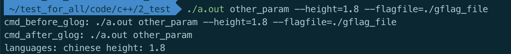

  输入参数优先级高于DEFINE_XXX，两个输入参数优先级后输入者高


## nodejs相关/node相关

node语法

```javascript
//对于对象的属性，可以访问1层未定义属性，不能访问2层未定义属性
const obj = {
  name: 'nordon',
  age: 18
};
console.log(obj.length);//可以读取已定义对象的一层未定义属性，即此处打印undefined
console.log(obj.length.num);//错误，不能读取未定义对象的未定义属性。（此处会报错：TypeError: Cannot read property 'num' of undefined）
console.log(JSON.stringify(obj));//打印json格式内容

```


nvm相关

```shell
#为linux所有用户安装nvm
0. 克隆nvm代码库(需要root权限)
git clone https://github.com/nvm-sh/nvm.git /opt/nvm

1. 创建nvm安装node目录（需要root权限）
mkdir -p /usr/local/nvm && chmod 777 /usr/local/nvm

2. vim /etc/profile.d/nvm.sh
export NVM_DIR=/usr/local/nvm # 导出NVM_DIR 环境变量，让nvm 安装node到该目录
source /opt/nvm/nvm.sh # 执行nvm 的命令, 激活nvm 到系统shell 中
#可选，设置默认node版本
nvm alias default 14

3. vim ~/.bashrc
[ -f /etc/profile.d/nvm.sh ] && source /etc/profile.d/nvm.sh

4. 将nvm导入执行命令中
source ~/.bashrc

5. 安装预期的node版本
nvm install v8.11.1

6. 设置默认node版本
nvm alias default v8.11.1

7. 如果跑shell脚本报错nvm not found，则需要脚本内source /opt/nvm/nvm.sh


#nvm安装node太慢/nvm换源
1.临时方案
NVM_NODEJS_ORG_MIRROR=https://npm.taobao.org/mirrors/node nvm install {node版本，如v8.11.1}
2.永久方案
在nvm.sh或者.bashrc里: export NVM_NODEJS_ORG_MIRROR=https://npm.taobao.org/mirrors/node
```


npm相关/yarn相关

```shell
#npm换源
1. npm永久换源
npm config get registry  // 查看npm当前镜像源
npm config set registry https://registry.npm.taobao.org/  // 设置npm镜像源为淘宝镜像
2. npm临时换源
npm install -g --registry=https://registry.npm.taobao.org/

#yarn换源
yarn config get registry  // 查看yarn当前镜像源
yarn config set registry https://registry.npm.taobao.org/  // 设置yarn镜像源为淘宝镜像
```


- 导出模块module.exports

  ```javascript
  //app.js
  //引入同一目录下的name.js
  var name = require('./name');
   
  //使用name.js中的变量
  console.log(name.name1);
  //调用name.js中的函数
  name.getName();
  ```

  ```javascript
  //变量
  var name1 = "Jack";
  //函数
  function getName() {
      console.log("Mary");
  }
  
  //如果require该文件，则会打印
  console.log("Running name.js");
  
  //分别导出变量和函数第一种方式，注意这两种互斥
  module.exports.name1 = name1;
  module.exports.getName = getName;
  
  
  //第二种方式
  module.exports = {
      name1: name1,
      getName: getName
  };
  ```

  

- 起一个http服务

  ```javascript
  var http = require("http");
  var url = require("url");
  
  function start(route) {
    function onRequest(request, response) {
      var pathname = url.parse(request.url).pathname;
      console.log("Request for " + pathname + " received.");
  
      route(pathname);//根据不同的path处理不同的东西,如http://127.0.0.1:8888/get_hello/
  
      response.writeHead(200, {"Content-Type": "text/plain"});
      response.write("Hello World");
      response.end();
    }
  
    http.createServer(onRequest).listen(8888);
    console.log("Server has started.");
  }
  
  function route(pathname) {
    console.log("About to route a request for " + pathname);
  }
  
  start(route);
  ```

  

- 检查文件是否存在：fs.existsSync(file_path);

- 当前目录下packge.json描述了node的依赖，通过npm install可以在当前目录生成node_modules并安装依赖在其中，如果要新增依赖并放入packge.json，则可以npm install --save classnames

- 可以通过nvm管理node版本 nvm相关

  - 设置默认node版本：nvm alias default v10.14.2


## redis相关

**redis基础知识**

Redis支持五种数据类型：string（字符串），hash（哈希），list（列表），set（集合）及zset(sorted set：有序集合)。

1. String

   redis 的 string 可以包含任何数据。比如jpg图片或者序列化的对象。其为最基础存储类型，最大存储512M。

   ```shell
   127.0.0.1:6379> SET food_name "peach"
   OK
   127.0.0.1:6379> GET food_name
   "peach"
   127.0.0.1:6379> SET food_name xigua
   OK
   127.0.0.1:6379> GET food_name  #从这里看出，单个单词加不加引号没区别
   "xigua"
   127.0.0.1:6379> DEL food_name
   (integer) 1
   ```

2. Hash

   顾名思义key与value的映射，key和value都是String类型。注意，redis里边的hash的不同处在于上层还有个类似namespace的key（cpp视角），即key field value这3个元素组成为一个hash。其中key即namespace，一个key下边可以有很多个键值对，field为大众意义的key，也就是"键"，value没啥好讲的，值。每个 hash 可以存储 232 -1 键值对（40多亿）

   ```shell
   127.0.0.1:6379> HSET lihua age 18 #设置单个hash
   (integer) 1
   127.0.0.1:6379> HGET lihua age
   "18"
   127.0.0.1:6379> HMSET class class_1 good_class class_2 normal_class #一次设置多个键值对可用HMSET
   OK
   127.0.0.1:6379> HGET class class_1
   "good_class"
   127.0.0.1:6379> HGET class class_2
   "normal_class"
   ```

3. List

   Redis 列表是简单的String列表，按照插入顺序排序。实现原理为链表(双向链表)。你可以添加一个元素到列表的头部（左边）或者尾部（右边）。列表最多可存储 232 - 1 元素 (4294967295, 每个列表可存储40多亿)

   ```shell
   127.0.0.1:6379> LPUSH num 1 2 3 4
   (integer) 4
   127.0.0.1:6379> LPUSH num invalid_abc invalid_def
   (integer) 6
   127.0.0.1:6379> LRANGE num 0 5
   1) "invalid_def"
   2) "invalid_abc"
   3) "4"
   4) "3"
   5) "2"
   6) "1"
   ```

4. Set

   Redis 的 Set 是 String 类型的无序集合。集合是通过哈希表实现的，所以添加，删除，查找的复杂度都是 O(1)。集合中最大的成员数为 232 - 1

   ```shell
   127.0.0.1:6379> SADD num 1 2 3 4
   (integer) 4
   127.0.0.1:6379> SADD num invalid_abc invalid_def
   (integer) 2
   127.0.0.1:6379> SADD num invalid_abc invalid_def  #注意这里做了重复添加，但是鉴于set的唯一性，二次插入被忽略
   (integer) 0
   127.0.0.1:6379> SMEMBERS num
   1) "4"
   2) "1"
   3) "3"
   4) "2"
   5) "invalid_def"
   6) "invalid_abc"
   ```

5. ZSET

   Redis zset 和 set 一样也是String类型元素的集合,且不允许重复的成员（这里的成员指的是ZADD score member中的member），不同的是每个元素都会关联一个double类型的分数。redis正是通过分数来为集合中的成员进行从小到大的排序。

   ```shell
   127.0.0.1:6379> ZADD good_people 50 abc 60 def 70 ghi
   (integer) 3
   127.0.0.1:6379> ZRANGEBYSCORE good_people 60 70
   1) "def"
   2) "ghi"
   ```


## 端口相关

- 测试端口连接性：telnet ip port

  如果卡住，则1）ctl+] 切换; 2）输入quit退出

## curl相关

<a name=curl禁止缓存参数>curl禁止缓存参数</a>：-H 'Cache-Control: no-cache'

额外材料：[tornado防止返回304](#防止返回304)


## sql相关/mysql相关

- 数据库规范： [数据库设计规范.md](数据库设计规范.md) 

- mysql下载安装：https://downloads.mysql.com/archives/community/?version=5.6.23

- mysql启动

  - centos mysql启动

    ```shell
    #启动服务端
    sudo systemctl start mysqld
    
    #启动客户端
    
    ```

  - <a name=mac_mysql启动锚点>mac mysql启动</a>

    ```shell
    #通过brew安装&启动
    brew install mysql
    brew services start mysql: 启动 MySQL 服务器，并设置为自启动。
    brew services stop mysql: 停止 MySQL 服务器，并设置为不自启动。
    brew services run mysql: 只启动 MySQL 服务器。
    mysql.server start: 启动 MySQL 服务器。
    mysql.server stop: 停止 MySQL 服务器。
    ```

- mysql客户端连接服务端

  - linux与mac连接：mysql -hlocalhost -P3306 -uroot -pxxx

- 对于sql的查询，SELECT XXX from...里的XXX，不仅是作为结果返回，也是作为处理数据以及在where里筛选数据的位置。示例如下,request_date既做了查询的返回，又做了where的条件查询

  ```sql
  SELECT
      toDate(request_time) as request_date, *
  from
      api_cost_table
  where
      request_date between '2024-04-21'
      and '2024-04-27'
  ORDER BY
      request_time DESC
  LIMIT
      10
  ```

  

  

**sql使用小知识**

1. cast函数

   CAST()函数，把一个字段转成另一个字段。其语法为：Cast(字段名 as 转换的类型 )，其中类型可以为：

   CHAR[(N)] 字符型 
   DATE  日期型
   DATETIME  日期和时间型
   DECIMAL  float型
   SIGNED  int （如果是double转，是四舍五入）
   TIME  时间型

   实例：SELECT cast(1.6 AS signed) as value

1. 常用函数

   ```sql
   FROM_UNIXTIME()  UNIX时间戳转换为日期(类似2022-04-30 09:54:47)用函数
   UNIX_TIMESTAMP()  日期转换为UNIX时间戳用函数
   ```

1. 语法

   ```sql
   --删除数据
   DELETE FROM {table_name} [WHERE Clause]
   
   --更新数据
   UPDATE {table_name} SET `status` = '9' [WHERE Clause]
   
   对于clickhouse：ALTER TABLE [db.]table UPDATE column1 = expr1 [, ...] WHERE filter_expr
   clickhouse对这个功能的说明：https://clickhouse.com/docs/zh/sql-reference/statements/alter/update
   
   --新增列
   ALTER TABLE table_name ADD [COLUMN] column_name data_type [constraint];
   如：
   ALTER TABLE `test_table` ADD `test_column` TINYINT(4) NOT NULL DEFAULT '0' COMMENT '-1 左边 0 默认 1 右边' AFTER `left_column`;
   
   --新增索引
   ALTER TABLE table_name ADD INDEX index_name(column_name)
   如：
   ALTER TABLE `test_table` ADD INDEX idx_id(id);
   
   --查询相关
   1）模糊查询：name LIKE "%福贵%"
   
   -- 条件判断
   SELECT COUNT(IF(status=500,1,NULL)) as status_500_requests from {table_name}
   
   SELECT COUNT(DISTINCT CASE WHEN customer_id = '1' THEN order_id END) as target_customer_order_num, COUNT(DISTINCT(order_id)) as total_order_num from orders;
   +---------------------------+-----------------+
   | target_customer_order_num | total_order_num |
   +---------------------------+-----------------+
   |                         1 |               3 |
   +---------------------------+-----------------+
   ```

1. 实战：查询status=500的case数量

   ```sql
   SELECT COUNT(IF(status=500,1,NULL)) as status_500_requests from {table_name}
   ```


5. [查看clickhouse99分位的数据](#查看clickhouse99分位的数据)

6. 将查询中间结果临时定义一张表来查询/WITH语句

   ```sql
   WITH daily_counts AS (
       SELECT record_date, COUNT(*) AS record_count
       FROM records_table
       WHERE record_date >= '2024-04-01'
         AND record_date < '2024-05-01'
         AND category IN ('category1', 'category2')
       GROUP BY record_date
       ORDER BY record_date
   )
   SELECT AVG(record_count) AS average_daily_count
   FROM daily_counts;
   ```

7. 查看表结构：https://blog.csdn.net/yageeart/article/details/7973381

8. 外键：可以理解为外人的关键角色，如a表有个字段，是索引到b的主键上，对于a表来说这个key就是外人（b表的），同时是外人的关键字段。外部某张表的主键

### clickhouse相关

**clickhouse小知识**

- <a name=查看clickhouse99分位的数据>查看clickhouse 99分位的数据</a>

  ```sql
  select
      toDate(request_time) as request_date,
      round(avg(cost_time)) as avgMS,
      round(quantile(0.99)(cost_time), 1) as p99Ms,
      round(quantile(0.999)(cost_time), 1) as p999Ms,
      round(max(cost_time), 1) as maxMs
  from
      api_cost_table
  where
      request_date between '2024-04-21'
      and '2024-04-27'
  GROUP BY
      request_date
  ORDER BY
      request_date;
  ```

  

## php相关

- php语法

  ```php
  #输出到请求接口上：
  var_dump($a);
  
  #输出到文件上：
  file_put_contents('/home/work/1.txt',var_export($this->_params, true), FILE_APPEND);
  
  #判断元素是否在某个数组中
  $my_array = ['a', 'b', 'c'];
  $element = 'a';
  if (in_array($element, $my_array)) {
    continue;
  }
  ```


## 工伤处理流程

1. 工伤认定申请
2. 劳动能力鉴定


## 疑难杂症/问题排查相关/杂记

首先确定是偶现还是稳定复现问题。注意有时候，仅仅是在你的某个环境偶现，在其他环境复现不出来，因此需要多试几次、多试几个环境来确定

- 如果是浏览器页面问题，可以先开个无痕窗口确认下是否有这个问题，如果没有，则很有可能跟cookie等本地存储有关


### 记一次linux官方更新python-pip导致安装的protobuf反序列化变慢问题

**问题描述**

  用同样的dockerfile和几乎相同的业务代码，打出的2个镜像，一个打镜像时间为2.28号，一个为3.1号，他们的业务接口处理速度不一样，前者仅需2s，后者需要14s。这其中核心处理为读取文件、python反序列化protobuf

**排查流程**

1. 怀疑是镜像的文件系统或者存储介质定义不同

通过docker inspect {container_id} 来做2个镜像属性的对比，发现几乎无不同

通过python读取一个测试文件，发现读取速度几乎一致：

```python
# -*- coding: UTF-8 -*-
import time
start_ts = time.time()
with open('/path/to/test/read/file') as f:
    content = f.read()
print("read file cost: {}s".format(time.time() - start_ts))
```

因此排除该猜测

2. 文件打开之后就是pb反序列化，经过代码打印耗时，发现区别为反序列化pb耗时，即ParseFromString函数

3. 请教大佬发现耗时区别为，protobuf在python的protobuf反序列化分别有python实现和cpp实现，cpp实现即封装了cpp的一个so文件，速度上确实可以快很多。通过执行下方命令，确实印证是因为2个镜像，前者使用了cpp实现，后者使用了python实现：

```bash
python -c "from google.protobuf.internal import api_implementation; print(\"default implement: {}, acl implement: {}\".format(api_implementation._default_implementation_type, api_implementation.Type()))"

#2-28镜像输出为：default implement: python, acl implement: python
#3-1镜像输出为：default implement: cpp, acl implement: cpp
```

4. 怀疑跟pip源有关，在3-1镜像（即慢镜像）中反复卸载重装protobuf 3.17.3，使用了不同的源如清华、中科大等，但是得到的都是protobuf python实现，而在2-28镜像（即快镜像）中仍然安装带有cpp实现的protobuf，怀疑不对

```bash
#尝试用清华源安装protobuf 3.17.3
pip uninstall -y protobuf && pip install protobuf==3.17.3 -i \
  http://pypi.tuna.tsinghua.edu.cn/simple/ --trusted-host \
  pypi.tuna.tsinghua.edu.cn -v -v -v --force-reinstall --no-cache-dir
```

5. 通过上方带-v的安装命令，打印的pip安装日志发现2者安装的tgz文件不同，阅读pip源码发现他们的/usr/lib/python2.7/dist-packages/pip/wheel.py 中正则表达式不同。也就是说，他们的python-pip是不同版本的（但其实最早我就用pip --version 打印确认他们版本都为：「pip 9.0.1 from /usr/lib/python2.7/dist-packages (python 2.7)」）

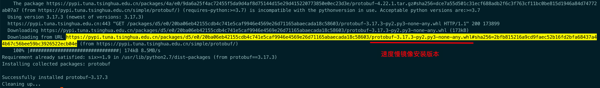

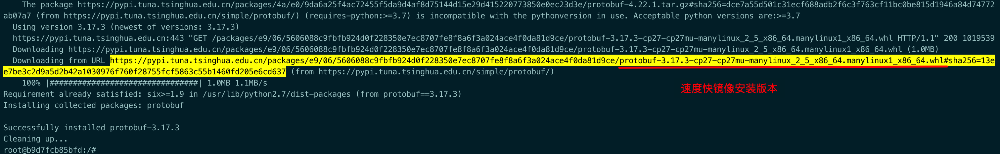

6. 通过apt读取pip更新日志，发现了这行更新：

```bash
$ apt-get changelog python-pip
python-pip (9.0.1-2.3~ubuntu1.18.04.7) bionic-security; urgency=medium

  * SECURITY UPDATE: ReDOS in wheel.py
    - debian/patches/CVE-2022-40898.patch: Fix potential DoS attack
      via wheel_file_re by restricting matching dash and dot characters
      in pip/wheel.py.
    - CVE-2022-40898

 -- David Fernandez Gonzalez <david.fernandezgonzalez@canonical.com>  Tue, 28 Feb 2023 10:48:00 +0100
```

也就是说，刚好在2.28号，Linux对python-pip做了一次更新，用于修复CVE-2022-40898，这导致默认安装的protobuf 3.17.3不带有cpp实现版本。通过将2-28镜像（即速度快镜像）更新apt并重装pip，再重装protobuf，发现也变为了默认为python实现protobuf，印证这个问题

```shell
#更新apt并重装pip
$ apt-get update && apt-get -y remove python-pip && apt-get install -y python-pip

#用清华源安装protobuf 3.17.3
$ pip uninstall -y protobuf && pip install protobuf==3.17.3 -i \
  http://pypi.tuna.tsinghua.edu.cn/simple/ --trusted-host \
  pypi.tuna.tsinghua.edu.cn -v -v -v --force-reinstall --no-cache-dir
  
#打印protobuf实现，此次输出变为了：default implement: python, acl implement: python
python -c "from google.protobuf.internal import api_implementation; print(\"default implement: {}, acl implement: {}\".format(api_implementation._default_implementation_type, api_implementation.Type()))"
```

7. 写邮件给更新者说明这个问题

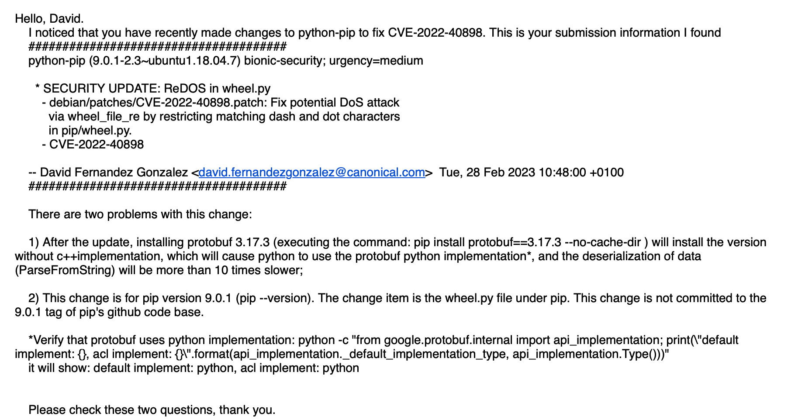

8. 获得其回信确认和后续更新，修复bug


**其他经验总结**

​	protobuf存储地址：/usr/local/lib/python2.7/dist-packages/google/protobuf/

​	指定python用cpp实现protobuf：export PROTOCOL_BUFFERS_PYTHON_IMPLEMENTATION=cpp


## 读书笔记

### 理解「[Why does one NGINX worker take all the load](https://blog.cloudflare.com/the-sad-state-of-linux-socket-balancing/#fnref1)」/理解套接字相关/socket相关

- 对于单个机器上，接收处理网络请求，总共有以下3种模型：

  - a、流量 - 单个accept queue - 单个worker

    

  - b、流量 - 单个accept queue - 多个worker

    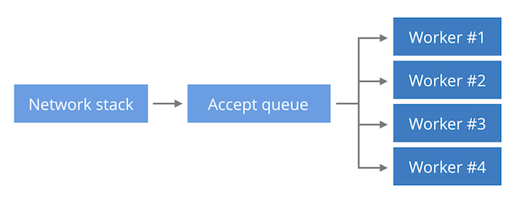

  - c、流量 - 多个accept queue - 多个worker

    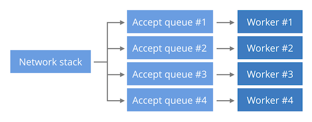

    其中Linux的epollo默认是用的b模型，但是在将Accept queue分配到worker时用的是LIFO策略，而非FIFO策略。这会导致worker间的工作分配不均。

  可以通过SO_REUSEPORT进行解决，这样就会切换到c模型，但是这会存在新的隐患：在大流量而某个worker有异常的情况下，epollo在b模型会表现更好，对流量的处理更平均。因为在c模型下异常worker存储在Accept queue的流量是一样多的（跟其他worker一样），这样异常worker就会在处理上拖后腿，导致长尾问题。

  最好的方式是：将b模型中的分配由LIFO改为FIFO，目前已有人提案。


## dbeaver相关

**快捷键**

1. 新增sql script查询：ctrl + ]
2. 打开现有sql script：ctrl + option + shift + o
3. 执行查询：cmd + enter


## Draw.io相关/drawio相关

- 快捷键
  - option + 鼠标左键拖动  可以选择划定范围内的内容，而不会拖动到鼠标所在的图/框


## 开车/停车相关

停车诀窍

- 旋转法： [driving.drawio](etc/driving.drawio) 

  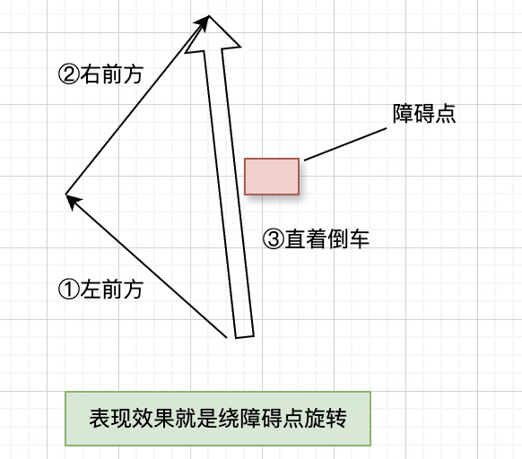


## IO多路复用/epoll相关/poll相关/select相关

- 阻塞IO：即socket设置为阻塞模式，直到内核数据ready并拷贝到用户空间再返回该调用
- 非阻塞IO：内核未数据ready时，调用立即返回；数据ready时，会阻塞直到内核数据拷贝到用户程序中
- 同步IO：有任一阻塞的即是同步IO。按照这种定义，非阻塞IO也是同步IO
- 异步IO：不存在阻塞则是异步IO


## dbeaver相关

**快捷键**

1. 新增sql script查询：ctrl + ]
2. 打开现有sql script：ctrl + option + shift + o
3. 执行查询：cmd + enter


## Draw.io相关/drawio相关

- 快捷键
  - option + 鼠标左键拖动  可以选择划定范围内的内容，而不会拖动到鼠标所在的图/框


## 视频相关/播放器相关/视频播放器相关
<a name=视频相关/播放器相关/视频播放器相关>不同系统不一样</a>

- windows: Potplayer
- macos: IINA
- 2个系统都兼容: vlc
