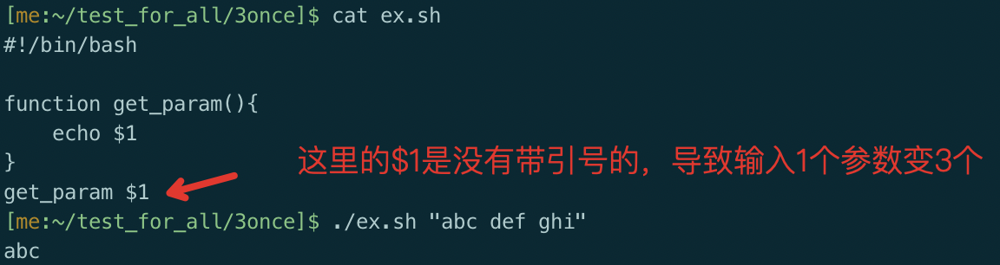
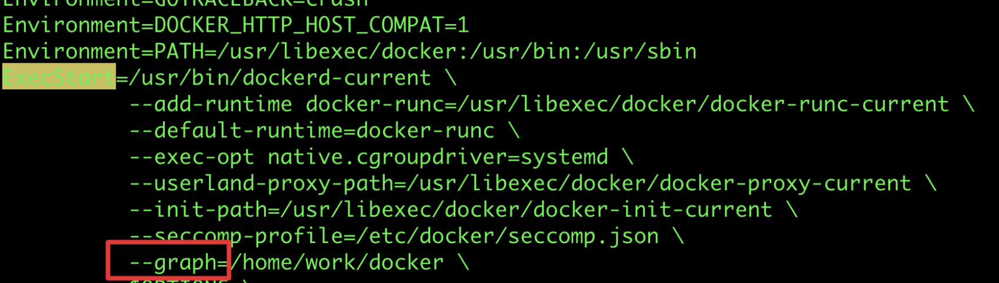
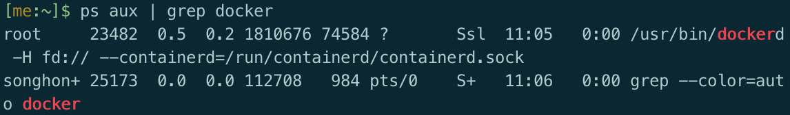

## 笔记规范

- 要求易懂且简洁
- 标题：一级用##，二级用黑点，三级用数字+英文点，四级用数字+中文反括号，五级用二级黑点
- 可选参数用英文中括号（[]）括起来，必要参数用大括号（{}）括起来。如果括号是真正需要显示的，则在里面再加一个`{}`，在该大括号中添加描述性语言。如: `[{外面的中括号意义是可选的}]`
- 在一大段论述或者一个一级标题内容结束后有个回车
- 同一行内容间隔4空格
- 有疑问的地方用todo标记


## 常用规范

- 在linux体系机器，临时文件放/test_for_all，里边分3个文件夹：1-3once，3代表最不重要；提示文件放~/README

- 代码注释

  维护代码时，在原来代码上基于新需求增加或修改代码，要备注来自第几个新需求，备注方法为`//{新需求的顺序id}`，如第一个需求注释为`//demand01`，如果是很重要的地方`//重要`


## typora相关

- 页内跳转
  1. 如果想调到指定标题名去，可用[任意内容]\(#标题名，注意带左边的#号\)
  2. 如果想跳到任意文本处：1）要先在该文本处加上”锚点“，\<a name=锚点名>指定文本（也可以空白）\</a>    2）[任意内容]\(#锚点名，注意带左边的#号\)
  
- 关闭首字母大写

  选择“编辑”-“拼写和语法检查”-“自动纠正拼写”

##  git相关及github相关

**概念**

注意所有的版本控制系统，只能跟踪文本文件的改动

首先用`git init `来在当前文件夹创建git的数据库，记录版本相关的东西

将整个git分为4个仓库，在数据同步后可以理解为四个相同的文件夹：

- 工作区：主机上看见的文件夹

- 暂存区：提交一个版本是个严肃的事，先放暂存区，确认了再提交到更上层

- git本地仓库：也就是打游戏的各个存档
- git远程仓库：远程版``git本地仓库``，为了方便联网和多人操作

而多一个分支，表明多了一份`git本地仓库`，不会影响工作区和暂存区。举个例子：在当前分支工作区有未到暂存区的文件a，暂存区有未到git本地仓库的文件b，新建分支并切换到新分支，用`git status`查看与在老分支结果一样


一些初始操作：

``` shell
git init    //在当前文件夹建设git数据库，之后对当前文件夹及其子文件夹提交到比工作区更上层的仓库后，再变化工作区相关文件，就能够知道其变化
//添加远程仓库有以下两种方式，添加后，远程库的名字就是origin，这是Git默认的叫法，也可以改成别的，但是origin这个名字一看就知道是远程库
git remote add orinin https://github.com/wanggaolang/test.git		//https方式添加远程仓库
git remote add orinin git@{server_name,如“github.com”}:wanggaolang/test.git  //ssh方式添加远程仓库
git remote set-url orinin {以上两种方式的远程仓库}    //以覆盖的放式添加远程仓库orinin，也就是说若orinin有则被覆盖
git remote rm origin    //删掉远程仓库

git push -u origin master    //在远程仓库创建master分支，并将当前分支git本地仓库上传上去
git push -f    //强制让远程关联分支的git远程仓库被本地覆盖
ssh -T git@github.com    //测试与github联通性
```


**各个仓库的常规流动**

- 查看前三个仓库间的未提交状况:`git status`

- pull操作

1. 将远程指定分支拉取到本地指定分支上    `git pull origin {远程分支名}[:{本地分支名}，如果不要就是拉取到本地当前分支]`

2. 将与本地当前分支同名的远程分支 拉取到 本地当前分支上(需先关联远程分支，方法见文章末尾)    `git pull`

- push操作
  1、将指定分支推送到远程指定分支    ``git push origin {本地分支名}:{远程分支名}``

  2、将指定本地分支推送到同名远程分支    ``git push origin {本地分支名}``

  3、将本地当前分支 推送到 与远程同名分支上(需先关联远程分支，方法见文章末尾)    ``git push``

同样的，推荐使用第2种方式，git push origin <远程同名分支名>

``cat .git/config``看到本地与远程分支的关联关系

---

**仓库间之间和仓库内部版本的回滚**

- 从`git本地仓库`回滚某次提交（commit）到`暂存区`和`工作区`

  `git reset --hard {某次commit}`    该命令使工作区回滚到指定的一次commit，这个参数可以是sha值（不用写全），

  也可以是:`HEAD~{数字}`，表示回到相对当前版本之前上多少个版本

  git log将显示git仓库中各个版本，就像查看游戏中的所有存档，HEAD指向当前版本

  在回退后再查看git log发现退回来后的已看不到先进版本，好比从21世纪坐时光机来到了19世纪，想再回去已经回不去了

  `git reflog`能够解决这个问题，显示所有的版本

- 从`git本地仓库`回滚某次提交（commit）到`暂存区`（即对git add的撤销）：git reset

  git reset HEAD XXX可以将git仓库当前版本某个文件回滚到暂存区。举例，有一个bug版本已经在本地写好并提交到暂存区，就可以先git reset HEAD bug.file将本地仓库数据回流到暂存区，再用git checkout -- XXX将暂存区数据回流到工作区，让这个bug.file回到最开始的状态。（git reset --hard更合适，这只是举例子）

- 暂存区回滚到工作区:    `git checkout -- {文件名，用.表示所有。注意文件名前有空格} `

---

- git rm XXX 删掉暂存区中的文件，如果本地（工作区）文件未删除也会一并被删掉

- 如何查看`git status`的提示

『Changes to be committed』change需要提交的，也就是改变记录存在暂存区中的

『Changes not staged for commit』更改没有步入（staged）提交（准备）的，也就是改变记录存在工作区的stage形容了从工作区步入暂存区

- git clone git@server-name:path/repo-name.git克隆到本地，会将所有文件保存在仓库名文件夹中，也就是不用自己创建一个文件夹在clone，在主目录clone就行了。这种clone会把git数据库克隆过来，所以会让本地有所有远程分支

git fetch todo

- 在使用git提交代码的时，`git commit -m "内容"` 如果内容编写错误：

  使用`git commit --amend` 对上次提交的内容进行修改

**分支相关**

分支的作用：1）多人同时操作同一仓库，为了防止混乱，要让每个人有自己的`git本地仓库`，而多一个分支就多一个`git本地仓库`。    2）当有一个新需求需要更改代码，而更改过程中可能要回到没改变之前的样子用于调试修复其他功能模块。这时候可以将新功能commit到新分支，再切换回来修复其他功能模块。当新需求完成后在master分支merge该分支，处理冲突并commit就行了。这时在master分支只会多出一个merge的log版本。

如果在XXX分支中进行了改变并commit，切回主分支，不做任何改动就merge，虽然两者内容冲突，但时间线上XXX更新，所以会将XXX的改变改过来，也就是master指针指向XXX

如果在XXX改了后切到master分支又改东西，即使两者都是添加新东西，在merge时，也会产生冲突，因为产生了两个时间线


- 创建分支``git branch {新分支名}``    新分支复刻当前分支，并且HEAD指针，也就是当前工作区指向的分支仍为原来分支

- 切换分支``git checkout {分支名}``

- 创建并切入新分支``git checkout -b {分支名}``

- 创建分支并与远程分支关联``git checkout -b {新建分支} origin/{远程分支}``    这时新建分支内容就是关联分支内容

​	新建分支并与当前分支某个commit关联`git checkout -b {新分支名} {commit_id}`

- 删除分支``git branch -d {要删分支}``

- 查看所以分支``git branch -a``    不加``- a``为显示本地分支

- 添加远程分支：git push origin {本地分支}:{远程分支}

- 删除远程分支：git push origin {空格}:{远程分支}		or		 git push origin --delete {远程分支}

- 在当前分支合并（并入）指定分支：git merge {指定分支名}   如果有冲突需要解决冲突再add，commit。若无冲突会自动commit

- 将另一分支某次提交合并到本分支：git cherry-pick {commitHash}，注意这只会合并这次提交的相关改变，如某个值和本分支不一样，但是并非这次提交才不一样，合并不会让本分支冲突。

- 可以用``git log --graph``看到分支合并图

---

**杂项**

- `git diff [多个参数]`    

  ​	概念：git diff a b意味着以a为基准，相较于b来说，a增加了啥，减少了啥

  ​	git diff b等效于git diff {当前状态} b 

  ​	只显示不同文件名：--name-only

  ​	比较工作区与暂存区区别:git diff

  ​	比较本暂存区和本地仓库区别：git diff --cached

  ​	比较俩commit区别:`git diff {第1个commit的sha值} {第2个commit的sha值}`

  ​	比较本地git仓库和远端区别:`git diff origin`
  
  ​	解决`git diff`中文文件名乱码问题：

```shell
$ git config --global core.quotepath false          # 显示 status 编码
$ git config --global gui.encoding utf-8            # 图形界面编码
$ git config --global i18n.commit.encoding utf-8    # 提交信息编码
$ git config --global i18n.logoutputencoding utf-8  # 输出 log 编码
```

- 暂存git stash

  常规：git stash push -m "my_stash"

  将包括未追踪文件一同暂存进栈：git stash push -u

  To apply a stash and remove it from the stash stack, type:git stash pop stash@{n}

  To apply a stash and keep it in the stash stack, type：git stash apply stash@{n}

  删除：git stash drop stash@{1}

  如果git stash push后不小心drop掉了，恢复方法：

  1）git fsck --unreachable    尽量看commit的sha

  2）git show sha    看那个是被删的那个

  3）git stash apply sha

- 正在新分支写feature发现主线有bug：

  1）git stash push保存；2）切换到主线并新建分支；3）修复bug并commit；4）在主线和新分支分别git cherry-pick {commit}，如果没有冲突自动commit了；5）git stash apply恢复写到一半的feature；6）删除bug分支

- 忽略当前git仓库下某些文件夹：在git仓库根目录的`.gitignore`文件写入这些文件夹名字，注意是以git仓库根目录作为基础目录的相对路径，如ABC就是./ABC

- 修改当前仓库用户和邮箱：

  vim .git/config    修改为形如：

```
[user]
    name = songhongshan
    email = songhongshan@xx.com
```

git commit --amend --reset-author

- 解决工作区相对暂存区有更改情况下git stash apply失败问题：

  1）git add -u .    2）git stash apply s    3)git reset

## 内存操作的小技巧 

*(int *)ptr的意思是从ptr这个地址开始向上（因为是小端存储）取四个字节出来看成int，注意编译器优化会使两个相邻变量上下字节间发生变化，可以加上```volatile```。大部分机器都是小端存储，变量的首地址是最低的一个字节的地址，取变量时向上取，存储时向低地址存（因为是栈）。


## 重载<<运算符示例

 ```c++
   ostream & operator<<( ostream & os,const Vector2D & c) //二维向量
   {
       os << "x: "<<c.x <<" y: "<<c.y;
       return os;
   }
 ```


## new和malloc的区别

   1. new可以自动计算所需要大小；malloc则必须要由我们计算字节数。

   2. new操作符内存分配成功时，返回的是对象类型的指针；malloc内存分配成功则是返回void * ，需要通过强制类型转换将void*指针转换成我们需要的类型。

   3. new内存分配失败时，会抛出bac_alloc异常；malloc分配内存失败时返回NULL。

   4. malloc与free是C++/C语言的标准库函数，new/delete是C++的运算符。

   5. 使用new操作符来分配对象内存时会经历三个步骤：

      - 第一步：调用operator new 函数（对于数组是operator new[]）分配一块足够大的，原始的，未命名的内存空间以便存储特定类型的对象。
      - 第二步：编译器运行相应的构造函数以构造对象，并为其传入初值。
      - 第三部：对象构造完成后，返回一个指向该对象的指针。

      使用delete操作符来释放对象内存时会经历两个步骤：

      - 第一步：调用对象的析构函数。
      - 第二步：编译器调用operator delete(或operator delete[])函数释放内存空间。

      总之来说，new/delete会调用对象的构造函数/析构函数以完成对象的构造/析构；而malloc 只管分配内存，并不能对所得的内存进行初始化

      6.使用malloc分配的内存后，如果在使用过程中发现内存不足，可以使用realloc函数进行内存重新分配实现内存的扩充。

      ```c
      void *realloc(void *ptr, size_t size)
          realloc先判断当前的指针所指内存是否有足够的连续空间，如果有，原地扩大可分配的内存地址，并且返回原来的地址指针；如果空间不够，先按照新指定的大小分配空间，将原有数据从头到尾拷贝到新分配的内存区域，而后释放原来的内存区域。
          --ptr   指针指向一个要重新分配内存的内存块，该内存块之前是通过调用 malloc、calloc 或 realloc 进行分配内存的。如果为空指针，则会分配一个新的内存块，且函数返回一个指向它的指针。
      	--size  内存块的新的大小，以字节为单位。如果大小为 0，且 ptr 指向一个已存在的内存块，则 ptr 所指向的内存块会被释放，并返回一个空指针。
      	void *calloc(size_t nitems, size_t size)
          也是申请内存，nitems为元素个数，size为元素大小。与malloc的区别是这个会初始化为0。
      ```


## 常见c语言函数

```c
	void *memcpy(void *dest, const void *src, size_t n)
从 src 的0下标复制 n 个字符到以0下标开始的 dest，不会先清空dest。
	void *memset(void *str, int c, size_t n)
复制字符 c（一个无符号字符）到参数 str 所指向的字符串的前 n 个字符。
	char *strcat(char *dest, const char *src)
把 src 所指向的字符串追加到 dest 所指向的字符串的结尾。
	char *strcpy(char *dest, const char *src)
把 src 所指向的字符串复制到 dest，会先清空dest。
	
	取绝对值：abs(obj)和fabs(obj),前者是整数，后者是浮点数。都需要导入<math.h>
    a的b次方：pow(a, b)
```


## 红黑树和AVL树

红黑树不追求"完全平衡"，即不像AVL那样要求节点的 `|balFact| <= 1`，它只要求部分达到平衡，但是提出了为节点增加颜色，红黑是用非严格的平衡来换取增删节点时候旋转次数的降低，任何不平衡都会在三次旋转之内解决，而AVL是严格平衡树，因此在增加或者删除节点的时候，根据不同情况，旋转的次数比红黑树要多。

就插入节点导致树失衡的情况，RB-Tree最多两次树旋转来实现复衡rebalance，旋转的量级是O(1)
 ，而AVL的插入和删除节点导致失衡，AVL需要维护从被删除/插入节点到根节点root这条路径上所有节点的平衡，旋转的量级为O(logN)，而RB-Tree最多只需要旋转3次实现复衡，只需O(1)，所以说RB-Tree删除节点的rebalance的效率更高，开销更小！在查找时候AVL更快，但快的有限。


## 同步异步套接字


使用套接字进行数据处理有两种基本模式：同步和异步。　　

**同步模式**：同步模式的特点是在通过Socket进行连接、接收、发送数据时，客户机和服务器在接收到对方响应前会出于阻塞状态，即一直等到收到对方请求进才继续执行下面的语句。可见，同步模式只适用于数据处理不太多的场合。当程序执行的任务很多时，长时间的等待可能会让用户无法忍受。
　　

**异步模式**：异步模式的特点是在通过Socket进行连接、接收、发送操作时，客户机或服务器不会处于阻塞方式，而是利用callback机制进行连接、接收、发送处理，这样就可以在调用发送或接收的方法后直接返回，并继续执行下面的程序。可见，异步套接字特别适用于进行大量数据处理的场合。
　　

使用同步套接字进行编程比较简单，而异步套接字编程则比较复杂


##  GMP库

用于大数运算的c/c++库，在linux下完美支持，windows需要用mingw和msys进行编译，或者用gmp的windows版本mpir，原生支持vs上编译


## clion快捷键设置

Setting	--	Keymap

光标到上一个光标：搜索back 

光标到下一个光标：搜索forward	

## vscode相关

**快捷键**

快捷键设置：`ctrl+k+s`

查找文件名：command + p

在打开的文件夹中查找一个函数：左侧那个放大镜

回到上一个光标：mac：`command + -`    windows：`alt + ←`

批量向左、向右缩进：``ctrl + [``   、 ``ctrl + ]``

批量保存文件：（改了键位的）windows：`ctrl + alt + s`    mac：`command + option + s`

打开终端:    `control + ~`    或者 查看-终端

到大括号的尾端/首部:    `Ctrl + Shift+\`

删除光标行：`ctrl+shift+k`

统计总代码行数：

- 3个配置文件：见etc/vscode_conf

- 编译：mac快捷键 command + shift + b
- 解决ubuntu中vscode字体间距过大问题：安装适配`firacode`字体
  1. 更新可用软件包列表: `sudo apt update`;
  2. 通过安装/升级软件来更新系统: `sudo apt upgrade`;
  3. 安装字体管理器: `sudo apt install font-manage`;
  4. 安装`firacode`字体: `sudo apt install fonts-firacode`;
  5. 在首选项-设置-字体中将`Fira Code`放最前边，重启vscode;

- 解决 \#ifdef 的地方可能变灰问题：文件-首选项-设置-搜索dimInactiveRegions    取消勾选

- 代码配色：.vscode/settings.json    >>    "workbench.colorTheme": "Default Dark+"

- C/C++代码跳转：1）安装c/c++插件；2）在.vscode/c_cpp_properties.json中的includePath里加入查找路径，形如：

```json
"includePath": [
                "${workspaceFolder}/**",
                "/home/"
            ],
```

- 代码增加80和120字基准线：settings.json--增加一行："editor.rulers": [80,120]

- 插件

  ```
  能够编译运行单个文件：
  	1. 安装Code Runner
  	2. 设置-> code-runner:Run in Terminal
  	3. 重启后编译运行，press F1 and then select/type Run Code
  	
  复制文件名：
  	Copy file name
  	
  c++的插件
  选择C/C++微软开发的版本和C++ Intellisenseaustin的版本安装两个扩展.
  ```

- 解决include出错报错问题：设置-搜索includePath-在setting_json中配置，加入C_Cpp.default.includePath路径


## 进程，线程，协程

进程：计算机程序运行的实体。每个进程都有自己的独立内存空间，上下文切换开销比较大（栈，寄存器，虚拟内存，文件句柄等），相对稳定安全

线程：进程的一个实体，是cpu调度和分派的基本单位。线程只拥有一点在运行中必不可少的资源(如程序计数器,一组寄存器和栈),但是它可与同属一个进程的其他的线程共享进程所拥有的全部资源。线程间通信主要通过共享内存，上下文切换很快，资源开销较少，但相比进程不够稳定容易丢失数据。

协程：

## c++相关

1. 在有派生类时各构造函数和析构函数调用顺序

   构造函数顺序：基类构造函数、对象成员构造函数、派生类本身的构造函数 

   析构函数顺序：派生类本身的析构函数、对象成员析构函数、基类析构函数（与构造顺序正好相反）
   
2. lambda表达式

   - [{捕获列表}]\({参数列表})->{返回值}{{函数体}}    举例: `auto add_1 = [](int a)->int {return a+1;};`
   
   - 该表达式一般定义在函数内部，也就是函数中定义函数
   - 捕获列表用于传入lambda所在函数的非static变量，对于除上述以外变量或者函数，只要lambda所在函数能调用它便能使用。捕获列表默认为const值传递而非地址传递。如[v_1, v_2]在内部改变他们值并不会改变lambda所在函数里他们的值。地址传递需要在其前面加上&，如[&v_1, &v_2]。如果传入值很多可以隐式传递，编译器会根据函数体内部的调用情况推断传入了哪些值。[=]为值传递，[&]为地址传递，如果两者皆有，则第一个参数必须为&或=，表示默认传递方式，在其后面跟上另外的参数，如[=, &v_2, &v_3]
   
   - 可以省略掉参数列表和返回值，如: `auto get_1 = []{return 1;};`

3. 格式化：#include <iomanip>  std::fixed << std::setprecision(8) << _double    前者表示以非科学计数法打印，后者表示显示８位小数

4. 类模板的成员函数在类外定义以及类模板的函数特例化

   ```c++
   //类模板，但是在类外定义成员函数的时候，需要使用函数模板 
   #include <iostream>  
   using namespace std ;  
   template <class T>  
   class Base  
   {  
   public :
       T a ;
       Base(T b)    {  a = b ;    }
       T getA(){ return a ;} //类内定义
       void setA(T c);
   };
   
   template <class T>   void  Base<T>::setA(T c)//模板成员函数在类外的定义
   {
       a = c ;
   }
   
   template<> void Base<int>::setA(int value)//模板成员函数的特例化
   {
       a = value*2;
   }
   ```

5. vector产生二维数组： vector<vector<int> > newOne(r, vector<int>(c, 0));


## 设计模式

1. 观察者模式

   ​	场景为有一个通知者和多个观察者，在通知者发生或发现某种变化时，挨个通知每个观察者。实现上说白了就是在通知者内部保存一个可调用对象的list，设置一个通知函数来依次调用每个可调用对象，该list可以动态增加减少。当然在通知者内部也可以是一个对象队列，通知函数为调用每个对象的update函数。反正核心就是有可调用对象的队列在通知者里面。由于计算机语言的限制，大部分语言实现上该可调用对象list的每一个都是有同样的参数列表和返回值，不然无法将一堆不同的可调用对象放在同一个list里面。

   ​	注意在多线程中如果一个线程往list添加可调用对象，一个线程负责在发生事件调用通知函数（也许这个事件只发生一次，所以希望在调用通知程序前所有可调用对象已加入），就可能涉及竞争问题。好的做法是把增加操作和调用通知程序放在同一个线程中


## 小知识（一）

2. 类外定义成员函数不能加上默认参数，如：``Test fun(int a = 1)``会报错，同样static声明的成员在外部定义时候，必须省去static。同时，static成员变量只有跟了const才可以在类里面的初始化列表中进行初始化，其余的都要在类的外部初始化

3. string.find()和map.find()以及set.find()如果找不到目标，则结果为x.end()

4. volatile关键词影响编译器编译的结果，用volatile声明的变量表示该变量随时可能发生变化，与该变量有关的运算，不再编译优化，以免出错

5. 在linux中，默认c++的include位置为`/usr/include`

6. `LD_LIBRARY_PATH`是Linux环境变量名，该环境变量主要用于指定查找共享库（动态链接库）时除了默认路径之外的其他路径

   一般的用法为`export LD_LIBRARY_PATH={新添加地址}:$LD_LIBRARY_PATH`，放冒号左边表示先搜索。这是临时性的，退出shell再进就没了
   
   动态链接库默认导入路径在linux中查看配置`/etc/ld.so.conf`，可以将路径写入配置，再用`ldconfig`载入，永久生效。
   
7. scp 从本地复制到远程    `scp [-r] {本地文件/夹} {remote_username@remote_ip:文件/夹} `

8. 在同一文件夹下多个文件中查找某个关键字：

   1）通过`cat ./* | grep {查找内容}`确认文件中是否有这个关键字

   2）find {文件夹，如果是当前文件夹可以省略} -type f -name "*.c" | xargs grep {查找的关键字}

   - type f 意思是只找文件

   - name "\*.c"  表示只找C语言写的代码，从而避免去查binary；也可以不写，表示找所有文件
   
9. 查看linux发行版本：`cat /etc/issue`
   
10. linux命令行`2>&1`    标准错误重定向到标准输出

11. 罗技鼠标驱动软件：官网－下载－Logitech G HUB

12. 查看当前目录下，每个文件夹大小：du -h --max-depth=1   mac下：du -hd1

13. 用md5sum计算文件的消息摘要

    

    


## chrome相关

- 插件：

  ```
  书签搜索插件：Holmes
  广告过滤插件：adblock
  ```

- chrome快捷键

  1. 历史记录    ``ctrl + y`

## c++ string的实习

```c++
#include <cstddef>
#include <iosfwd>
#include <iostream>
#include <string.h>
using namespace std;
class String {
private:
    /* data */
    char *data;    //字符串
    size_t length; //长度

public:
    String(const char *str = nullptr); //默认构造函数
    String(const String &str);         //拷贝构造函数
    friend istream &operator>>(istream &is, String &str);
    friend ostream &operator<<(ostream &os, String &str);

    String operator+(const String &str) const; //重载+
    String &operator=(const String &str);      //重载=
    String &operator+=(const String &str);     //重载+=
    bool operator==(const String &str) const;  //重载==
    char &operator[](int n) const;             //重载[]

    size_t size() const;       //获取长度
    const char *c_str() const; //获取C字符串

    ~String();
};

String::String(const char *str) { //通用构造函数
    if (!str) {
        length = 0;
        data = new char[1];
        *data = '\0';
    } else {
        length = strlen(str);
        data = new char[length + 1];
        strcpy(data, str);
    }
}
String::String(const String &str) { //拷贝构造函数
    length = str.size();
    data = new char[length + 1];
    const char *temp = str.c_str();
    strcpy(data, temp);
}

String::~String() {
    delete[] data;
    length = 0;
}

String String::operator+(const String &str) const //重载+
{
    String newString;
    newString.length = length + str.size();
    newString.data = new char[newString.length + 1];
    strcpy(newString.data, data);
    strcat(newString.data, str.data);
    return newString;
}

String &String::operator=(const String &str) //重载+
{
    if (this == &str) {
        return *this;
    }
    delete[] data;
    length = str.size();
    data = new char[length];
    strcpy(data, str.c_str());
    return *this;
}

String &String::operator+=(const String &str) //重载+
{
    length += str.size();
    char *newData = new char[length + 1];
    strcpy(newData, data);
    strcat(newData, str.c_str());
    delete[] data;
    data = newData;
    return *this;
}
inline bool String::operator==(const String &str) const //重载==
{
    if (length != str.size())
        return false;
    return strcmp(data, str.data) ? false : true;
}

inline char &String::operator[](int n) const //重载[]
{
    if (n >= length) {
        return data[length - 1]; //错误处理
    }
    return data[n];
}

inline size_t String::size() const //获取长度
{
    return length;
}
inline auto String::c_str( ) const ->const char * //获取C字符串
{
    return data;
}

istream &operator>>(istream &is, String &str) //输入
{
    char tem[1000]; //简单的申请一块内存
    is >> tem;
    str.length = strlen(tem);
    str.data = new char[str.length + 1];
    strcpy(str.data, tem);
    return is;
}

ostream &operator<<(ostream &os, String &str) //输出
{
    os << str.data;
    return os;
}
int main()
{
    String test("abc");
    cout<<test<<endl;
}
```

## 面向对象三大特性：封装、继承和多态


## socket

假如b进程是异常终止的，发送FIN包是OS代劳的，b进程已经不复存在，**当机器再次收到该socket的消息时，会回应RST（因为拥有该socket的进程已经终止）**。a进程对收到RST的socket调用write时，操作系统会给a进程发送SIGPIPE，默认处理动作是终止进程。即：

> It is okay to write to a socket that has received a FIN, but it is an error to write to a socket that has received an RST

## 浮点数大小	//todo

float：32位	1位符号位，8位指数位，23位尾数

double：64位	1位符号位，11位指数位，52位尾数


## TCP长连接

长连接：client向server发起连接，server接受client连接，双方建立连接。Client与server完成一次读写之后，它们之间的连接并不会主动关闭，后续的读写操作会继续使用这个连接。

首先说一下TCP/IP详解上讲到的TCP保活功能，保活功能主要为服务器应用提供，服务器应用希望知道客户主机是否崩溃，从而可以代表客户使用资源。如果客户已经消失，使得服务器上保留一个半开放的连接，而服务器又在等待来自客户端的数据，则服务器将应远等待客户端的数据，保活功能就是试图在服务器端检测到这种半开放的连接。

如果一个给定的连接在**两小时**内没有任何的动作，则服务器就向客户发一个探测报文段，客户主机必须处于以下4个状态之一：

1. 客户主机依然正常运行，并从服务器可达。客户的TCP响应正常，而服务器也知道对方是正常的，服务器在两小时后将保活定时器复位。
2. 客户主机已经崩溃，并且关闭或者正在重新启动。在任何一种情况下，客户的TCP都没有响应。服务端将不能收到对探测的响应，并在**75秒**后超时。服务器总共发送**10个**这样的探测 ，每个间隔**75秒**。如果服务器没有收到一个响应，它就认为客户主机已经关闭并终止连接。
3. 客户主机崩溃并已经重新启动。服务器将收到一个对其保活探测的响应，这个响应是一个复位，使得服务器终止这个连接。
4. 客户机正常运行，但是服务器不可达，这种情况与2类似，TCP能发现的就是没有收到探查的响应。

从上面可以看出，TCP保活功能主要为探测长连接的存活状况，不过这里存在一个问题，存活功能的探测周期太长，还有就是它只是探测TCP连接的存活，属于比较斯文的做法，遇到恶意的连接时，保活功能就不够使了。

在长连接的应用场景下，client端一般不会主动关闭它们之间的连接，Client与server之间的连接如果一直不关闭的话，会存在一个问题，随着客户端连接越来越多，server早晚有扛不住的时候，这时候server端需要采取一些策略，如关闭一些长时间没有读写事件发生的连接，这样可以避免一些恶意连接导致server端服务受损；如果条件再允许就可以以客户端机器为颗粒度，限制每个客户端的最大长连接数，这样可以完全避免某个蛋疼的客户端连累后端服务。

在应用层则可以用**心跳包**来进行保持长连接


**1、在函数内定义一个字符数组，用**gets**函数输入字符串的时候，如果输入越界，为什么程序会崩溃？**

答：因为gets无法截断数组越界部分，会将所有输入都写入内存，这样越界部分就可能覆盖其他内容，造成程序崩溃。

 

**2、C++中引用与指针的区别**

答：联系：引用是变量的别名，可以将引用看做操作受限的指针；

区别：

1） 指针是一个实体，而引用仅是个别名；

2）引用只能在定义时必须初始化，指针可以不初始化为空；

3）引用初始化之后其地址就不可改变（即始终作该变量的别名直至销毁，即从一而终。注意：并不表示引用的值不可变，因为只要所指向的变量值改变。引用的值也就改变了），但指针所指地址是不可变的；如下：

int m=23,n=13;

int& a=m;

a=12; //合法，相当于修改m=12

a=n;//合法，相当于修改m=13

**3、C/C++程序的内存分区**

答：其实C和C++的内存分区还是有一定区别的，但此处不作区分：

1）、栈区（stack）— 由编译器自动分配释放 ，存放函数的参数值，局部变量的值等。其 
 操作方式类似于数据结构中的栈。 
 2）、堆区（heap） — 一般由程序员分配释放， 若程序员不释放，程序结束时可能由OS回 
 收 。注意它与数据结构中的堆是两回事，分配方式倒是类似于链表。 
 3）、全局区（静态区）（static）—，全局变量和静态变量的存储是放在一块的，初始化的 
 全局变量和静态变量在一块区域， 未初始化的全局变量和未初始化的静态变量在相邻的另 
 一块区域。 - 程序结束后由系统释放。 
 4）、文字常量区 —常量字符串就是放在这里的。 程序结束后由系统释放 
 5）、程序代码区—存放函数体的二进制代码。 

**栈区与堆区的区别：**

1）堆和栈中的存储内容：栈存局部变量、函数参数等。堆存储使用new、malloc申请的变量等；

2）申请方式：栈内存由系统分配，堆内存由自己申请；

3）申请后系统的响应：栈——只要栈的剩余空间大于所申请空间，系统将为程序提供内存，否则将报异常提示栈溢出。
 堆——首先应该知道操作系统有一个记录空闲内存地址的链表，当系统收到程序的申请时，会遍历该链表，寻找第一个空间大于所申请空间的堆结点，然后将该结点从空闲结点链表 中删除，并将该结点的空间分配给程序；

4）申请大小的限制：Windows下栈的大小一般是2M，堆的容量较大；

5）申请效率的比较：栈由系统自动分配，速度较快。堆使用new、malloc等分配，较慢；

总结：栈区优势在处理效率，堆区优势在于灵活；

**内存模型：自由区、静态区、动态区；**

根据c/c++对象生命周期不同，c/c++的内存模型有三种不同的内存区域，即：自由存储区，动态区、静态区。

自由存储区：局部非静态变量的存储区域，即平常所说的栈；

动态区： 用new ，malloc分配的内存，即平常所说的堆；

静态区：全局变量，静态变量，字符串常量存在的位置；

注：代码虽然占内存，但不属于c/c++内存模型的一部分；


## 虚拟机相关

### 虚拟机网络模式

**NAT**：母机作为一个路由器进行转发，一般可DHCP自动分配IP，注意母机的IP和宿主机可处于不同网段

**桥接模式**：虚拟机的IP与母机同级，相当于让母机产生一个兄弟机


## 网络编程

### 主机字节序和网络字节序的转换问题

**IP的转换**

```
#include <arpa/inet.h>
in_addr_t inet_addr(const char *string);

#include <netdb.h>
#include <sys/socket.h>
hostent *gethostbyname (const char *__name);

inet_ntoa()
inet_
```

## 显示当前时间

```c
void show_now_time()
{
    char nowtime[20];
    time_t rawtime;
    struct tm* ltime;
    time(&rawtime);
    ltime = localtime(&rawtime);
    strftime(nowtime, 20, "%Y-%m-%d %H:%M:%S", ltime);
    cout<<"["<<nowtime<<"] ";
    return;
}
```

## readn和read的区别

read会立即返回，而readn如果当前读取数据非0且小于目标数量，则会继续读取，有可能产生**阻塞**

## wordpress备案信息登记

更详细内容见知乎的技术收藏夹

外观-->主题编辑器-->fotter.php-->末尾加上:

```php
<a href="http://www.beian.miit.gov.cn">渝ICP备18016041号-1 </a>
```


## linux相关/终端相关/terminal相关

- Ubuntu启动终端：`Ctrl + Alt + T`

- 终端和shell的区别：类似编辑器和编译器，编辑器展示给程序员看，编译器用来真正的编译

- 配置终端  

  **terminator**

  1. sudo apt-get install terminator
  
  2. 启动terminator，在里边`vim .config/terminator/config`
  
     ```shell
     [global_config]
       title_font = Ubuntu Mono 11[keybindings]
     [layouts]
       [[default]]
         [[[child1]]]
           parent = window0
           type = Terminal
         [[[window0]]]
           parent = ""
           type = Window
     [plugins]
     [profiles]
       [[default]]
         background_color = "#002b36"
         background_darkness = 0.91
         background_image = None
         background_type = transparent
         font = Ubuntu Mono 11
         foreground_color = "#e0f0f1"
         use_system_font = False
         show_titlebar = False
     ```
  
3. 通过dconfig-editor将terminator设置为默认终端（自己搜）
4. 修改`.bashrc`：https://blog.csdn.net/zhangkzz/article/details/90524066

  


- 快捷键

  新建终端		在当前窗口为终端情况下：ctrl + shift + n 

  回到桌面		ctrl + win + d
  
- 命令

  创建多级目录/文件夹    ``mkdir -p {路径}``
  
  查找文件``find / -name {文件名，可配合通配符} 2>/dev/null``
  
  find只查找当前文件夹一层   find ./ -maxdepth 1 -type d
  
- 权限

  chmod只是改变文件的读写、执行权限，更底层的属性控制是由chattr来改变的todo lsattr

  让文件不可删除`chattr +i {file/folder}`  

- 命令别名

  将一个长命令起一个别名，变为短命令    `alias {新命令}="{老命令}"`

  查看有哪些起了别名的命令    `alias`

- 一些疑难问题

  1. Ubuntu下`alt + tab`出现两个窗口

     原因：系统启动了两个不同的程序切换程序

     办法：安装Compiz，然后关掉“应用程序切换条”

     ```shell
     sudo apt-get install compiz-plugins
     sudo apt-get install compizconfig-settings-manager
     ```

- 定时任务：crtontab命令，详见https://blog.csdn.net/rf_wu/article/details/1215094

  ​	注意每隔6小时执行某个命令的时间应该这么写：1 */6 * * *   第一个不能用*，不然意味着每隔6小时的每分钟干一次

​	查看/启动crtontab服务：service crond status/start    （有的是service cron status/start）

- 对cp命令的细节探讨

  假设现在有个/tmp和/other文件夹，我们在/tmp内部，则cp ./ /other复制的是当前文件夹内部所有内容，不包括/tmp文件夹。

  如果cp的第二个参数是文件夹，则就是放到该文件夹内部。如果是文件或者是某个路径且最后一个/后的名字不存在，就是对第一个参数的复制并重命名

- 防止Linux连接终端超时自动断开连接

  ```
  # 用以下命令判断是否是否设置了该参数
  echo $TMOUT
  # 如果输出空或0表示不超时，大于0的数字n表示n秒没有收入则超时
  # 修改方法
  vi /etc/profile
  # ----------------------------
  export TMOUT=900
  # ----------------------------
  # 将以上900修改为0就是设置不超时
  source /etc/profile
  # 让配置立即生效
  ```

- shell相关小知识

  1. top解决程序名被截断问题：top -c
  
  2. wc可以计算文件的Byte数(-c)、字数(-w)、或是列数(-l)
  
  3. 处理行级别字符串适合awk
  
     ```shell
     1）在后边跟两个单引号，里边是筛选条件
     2）操作内容要包含在大括号里，可以理解大括号类似c++的作用域。示例：
     	awk 'BEGIN {FS=":"} $3 < 50 {print $1 "\t " $3}'
     	BEGIN会提前设置FS，否则第一行仍然以空格分割字段，没有括号的部分是条件筛选
     	awk 'NR>=2 {total=$1 + $2 + $3
     	printf "%10d%10d%10d%10.2f\n" $1,$2,$3,total}'
     	大括号有多个语句时，用回车或分号间隔，功能：对于第二行之后（NR最小为1），显示每行累加
     ```
     
  4. 光标
  
    隐藏光标 ：  echo -e "\033[?25l"  
  
    显示光标 ：  echo -e "\033[?25h"
  
  5. ls -l的时间是修改时间，ls -ul时间是访问时间
  
- 设置光标在shell逐word移动：iterm2-设置-Profiles-Keys-修改option+←和option+→的映射，选择Action为“Send Escape Sequence”，然后输入“b”和“f”即可

## mac相关

**Homebrew**：是Mac OS 不可或缺的套件管理器。可以通过它安装软件，比如wget

   进入其目录    `cd "$(brew --repo)"`

   换源（最好自己搜Homebrew换源，清华的不错）:

  ```shell
     //设置homebrew本身源：
     cd "$(brew --repo)" && git remote set-url origin git://mirrors.ustc.edu.cn/brew.git
     
     //设置并更新formula源
     cd "$(brew --repo)/Library/Taps/homebrew/homebrew-core" && git remote set-url origin git://mirrors.ustc.edu.cn/homebrew-core.git
  
     //使用中科大的bottles源：
     echo 'export HOMEBREW_BOTTLE_DOMAIN=https://mirrors.ustc.edu.cn/homebrew-bottles' >> ~/.bash_profile
  ```

     homebrew会将下载的软件统一安装在/usr/local/Cellar目录中


**Iterm2相关 **

- 安装iterm2：brew install iterm2    卸载：brew uninstall iterm2

- 需要配置的东西：

  ```
  1.Iterm2 + oh-my-zsh + Meslo 字体
  2.配置iterm2的配色为Solarized Dark Higher Contrast，在./etc下有一个版本可以用，最好在https://iterm2colorschemes.com/弄最新的
  3.通过历史记录自动补全：pip install powerline-status
  4.插件配置（位于~/.zshrc）：`plugins=(git zsh-autosuggestions extract zsh-syntax-highlighting z)`
  ```

  

- 为了让多用户都使用同样的配置，要将`~/.zshrc`复制到每个用户下

- Iterm2快捷键：

  ```bash
  command + shift + h 查看剪贴板历史
  command + ，设置
  command + enter 进入与返回全屏模式
  command + t 新建标签
  command + w 关闭标签
  command + 数字    command + 左右方向键    切换标签
  command + f 查找
  command + d 水平分屏
  command + shift + d 垂直分屏
  command + option + 方向键 command + [ 或 command + ]    切换屏幕
  command + ; 查看历史命令
  ctrl + u    清除当前行
  ctrl + l    清屏
  ctrl + a    到行首
  ctrl + e    到行尾
  ctrl + f/b  前进后退
  ctrl + p    上一条命令
  ctrl + r    搜索命令历史
  最大化Tab中的pane，隐藏本Tab中的其他pane：⌘+ shift +enter , 再次还原
  ```
  
- 设置iterm2保留行数：设置(command+,)--Profiles--terminal--Scrollback Buffer

- 设置vim中光标能上下滑动：
  iTerm2 > Preferences > Advanced
  Mouse > Scroll wheel sends arrow keys in alternate screen mode.
  
  注意这可能导致一个问题：偶现在terminal triggers the command history。解决办法为vim某个东西再退出
  
- 撤销关闭某个tab：command + z

- 设置光标在shell逐word移动：设置-Profiles-Keys-修改option+←和option+→的映射，选择Action为“Send Escape Sequence”，然后输入“b”和“f”即可

**mac相关小知识**

- 在finder根目录中`command + shift + .`显示隐藏文件

- 录屏：QuickTime player

- 设置默认打开方式

  ```shell
  只改变指定文件的默认打开方式:
  	1.在Finder中右键点击要改变的文件，调出菜单
  	2.按住”Option”键，你会发现菜单中”打开方式”(Open With)选项变成了”总是以此方式打开”
  	3.点其中的”其他”(Other)选项，这时你可以从所有应用程序里选择你要找的默认程序，记得要把界面上的”总是以此方式打开”(Always Open With)选项钩上
  
  改变某一类型文件的默认打开方式
  	1.在Finder中右键点击一个该类型的文件，调出菜单
  	2.在菜单中选择”显示简介”(Get Info)选项
  	3.在弹出的对话框中，展开”打开方式”(Open With)选项
  	4.选择你要改变的默认打开程序，并点击下方的”全部更改…“(Change All)
  ```

  


## word技巧

  ```
1.一行装英文+网址装不下，会将网址放下一行，英文稀疏占满一行，将网址分开
选中-->段落-->中文版式-->允许西文在单词中换行
  ```

## excel技巧 

excel中打回车 alet + 回车

 ## 命名空间

  ::a表示全局变量a，用于区分局部变量a


## 函数相关

access函数

测试文件是否存在以及文件权限

  

## 操作系统相关

- 程序内存分布

  | 内存分区                 | 说明                                                         |
  | ------------------------ | ------------------------------------------------------------ |
  | 内核空间                 |                                                              |
  | 栈区 (stack)             | 存放函数的参数值、局部变量的值等，其操作方式类似于数据结构中的栈。 |
  | 动态链接库               | 用于在程序运行期间加载和卸载动态链接库。                     |
  | 堆区 (heap)              | 一般由程序员分配和释放，若程序员不释放，程序运行结束时由操作系统回收。[malloc()](http://c.biancheng.net/cpp/html/137.html)、[calloc()](http://c.biancheng.net/cpp/html/134.html)、[free()](http://c.biancheng.net/cpp/html/135.html) 等函数操作的就是这块内存，这也是本章要讲解的重点。  注意：这里所说的堆区与数据结构中的堆不是一个概念，堆区的分配方式倒是类似于链表。 |
  | 全局数据区 (global data) | 存放全局变量、静态变量等。这块内存有读写权限，因此它们的值在程序运行期间可以任意改变。 |
  | 常量区 (constant)        | 存放一般的常量、字符串常量等。这块内存只有读取权限，没有写入权限，因此它们的值在程序运行期间不能改变。如：char *a = "abc"； |
  | 程序代码区 (code)        | 存放函数体的二进制代码。一个C语言程序由多个函数构成，C语言程序的执行就是函数之间的相互调用。 |


## 对于map

find函数通过查找key返回迭代器，没有查找value返回迭代器的函数，因为可能有多个key对应一个value。


## bind和function

bind里面的\_1、\_2、等\_n指的是合成的新函数的第一、第二、第n个参数放入原函数中的位置

```C++
auto g = bind(f, a, b, _2, c, _1);//意味着新函数的第一个参数放最右边上，第二个参数放_2那儿
g(X, Y);	//等价于f(a, b, Y, c, X);


std::bind绑定一个成员函数
struct Foo {
    void print_sum(int n1, int n2)
    {
        std::cout << n1+n2 << '\n';
    }
    int data = 10;
};
int main() 
{
    Foo foo;
    auto f = std::bind(&Foo::print_sum, &foo, 95, std::placeholders::_1);
    f(5); // 100
}
bind绑定类成员函数时，第一个参数表示对象的成员函数的指针，第二个参数表示对象的地址。
必须显示的指定&Foo::print_sum，因为编译器不会将对象的成员函数隐式转换成函数指针，所以必须在Foo::print_sum前添加&；
使用对象成员函数的指针时，必须要知道该指针属于哪个对象，因此第二个参数为对象的地址 &foo；
```

function在没有auto时可以声明一种类型，或者是一个模板类型

```c++
#include<functional>
function <T> f;  //T是一个可调用对象，可以是函数指针，函数对象或者lambda

作用
在auto不在时，可以和bind联合使用：
int add_3_num(int a, int b, int c){return a + b + c;}
function<int(int, int> add_2_num = bind(add_3_num, _1, _2, 0);
             
也可以做一些有意思的东西，如下面这个TODO c++ primer p512
```


## 终端shell相关

ctrl + u 剪切一行命令，放入”命令行剪切板“

ctrl + y 粘贴”命令行剪切板“

查看当前文件夹文件数量（子文件夹算1文件）    `ls | wc -w`

查看文件大小：du -ah [--max-depth=n，默认深度为1]

`| awk '{print $1}'`    （注意是单引号）将每一行中以空格为分割符的第一个字段打印出来

`| xargs`    将多行合并到一行，以空格分割

查看某个端口的tcp状态：`netstat -antop | grep {portID}`

改变当前用户默认shell：`chsh`

shell配色：PS1

\[\e[F;Bm\] （F表示字体颜色，B表示背景颜色，具体如下）

| 字体代码 |       背景代码 |       颜色/作用        |
| -------- | -------------: | :--------------------: |
| 30       |             40 |          黑色          |
| 31       |             41 |          红色          |
| 32       |             42 |          绿色          |
| 33       |             43 |          黄色          |
| 34       |             44 |          蓝色          |
| 35       |             45 |         紫红色         |
| 36       |             46 |         青蓝色         |
| 37       |             47 |          白色          |
|          |              1 |          高亮          |
|          |              2 |          低亮          |
|          |              3 |          斜体          |
|          |              4 |         下划线         |
|          |              5 |          闪烁          |
|          |              7 | 和字体颜色一样的背景色 |
|          | 与字体代码相同 |       默认背景？       |

注意最后要用\[\e[0m\\]结尾，如这种（用typora源码模式看）：PS1="\[\e[32;32m\][\[\e[33;33m\]cp_3_05\[\e[32;32m\]:\w]\$ \[\e[0m\]"


自动补全相关：

1. 忽略大小写：在~/.inputrc文件键入set completion-ignore-case on    重新打开终端生效

2. 键入命令首部分字符之后，用方向键Up，Down来搜索以该串字符开头的历史命令，需在~/.bashrc中输入以下两行：

   ```shell
   bind '"\e[A": history-search-backward' 
   bind '"\e[B": history-search-forward'
   ```


例如我想求当前目录下以-开头的普通文件，而且该文件后缀为.a   可以用这种写法：`ls -l | grep '^-.*a$'`

^-表示以-开头

.表示任意字符

.*表示任意多个字符

a$表示以a结尾

**注意不能写成**    **ls -l | grep '^-\*a$'**

**这样写表示**    **-与a之间有多个-字符**

**例如\**：'ac\*d' 匹配a后接零个或多个前面的字符，将匹配：ad, acd, accd, acccd …等\****

- 特殊变量列表

  | 变量 | 含义                                                         |
  | ---- | ------------------------------------------------------------ |
  | $0   | 当前脚本的文件名                                             |
  | $n   | 传递给脚本或函数的参数。n 是一个数字，表示第几个参数。例如，第一个参数是$1，第二个参数是$2。 |
  | $#   | 传递给脚本或函数的参数个数。                                 |
  | $*   | 传递给脚本或函数的所有参数。                                 |
  | $@   | 传递给脚本或函数的所有参数。被双引号(" ")包含时，与 $* 稍有不同，下面将会讲到。 |
  | $?   | 上个命令的退出状态，或函数的返回值。                         |
  | $$   | 当前Shell进程ID。对于 Shell 脚本，就是这些脚本所在的进程ID。 |


## shell编程/shell脚本编程

1. $0 是shell脚本本身名字，$1是shell脚本第一个参数，以此类推。注意c语言的int main(int argc, char *argv[])与此类似，argv[0]是程序本身名字，然后就是参数，argc是包含程序本身名的参数数量(>=1)，但是$#不包含程序本身名的参数个数

   

- 走入当前脚本所在文件夹的上层文件夹、当前文件路径

   ```shell
   # path of this file
   if [[ -L "$0" ]];then
       FILE=$(readlink -f "$0")
   else
       FILE=$0
   fi
    
   #当前文件的上层文件夹
   BASE_DIR=$(cd $(dirname ${FILE})/..; pwd)
   ```

- 获取当前时间：time=$(date "+%Y-%m-%d %H:%M:%S")

- 检查程序是否存在：

   ```shell
   function check(){
         echo "\$1: $1"
         ps aux |grep "$1" |grep -v "grep" |grep -v $0
         echo $str
         count=`ps aux |grep "$1" |grep -v "grep" |grep -v $0 |wc -l`
         #echo $count
         if [ 0 == $count ];then
             echo "process not exist"
         else
             echo "process id: $count"
         fi
       }
   check "$1"
   ```
   
- 注意：对于类似$1等可能带有空格的参数，作实参需要加上引号。错误示例：
  
  
  
  
  
  


## vim相关

- vim的3种模式

  1. 正常(Normal)模式，也就是vim file进去时的模式
2. 编辑模式，可以输入文本到文件
  3. 命令行模式，输入【:/?】，光标移动到最下面一行的模式

- 正常(Normal)模式

  全选:    `ggVG`    一行行选择`V`，一个个光标单位选择`v`

  将选择的复制`y`，粘贴`p`

  - 光标移动
    1. 到行尾:`$`    到下一行行尾:`2$`    到从当前行算起第n行行尾:`n$`
    
    2. 到行首:`0`
    
  - 撤销：命令模式下按u    撤销的撤销：ctrl + r

  - 查看关键字出现次数：%s/{关键字}//gn  

  - 插入列
    	插入操作的话知识稍有区别。例如我们在每一行前都插入"() "：
    	1.光标定位到要操作的地方。
    	2.CTRL+v 进入“可视 块”模式，选取这一列操作多少行。
    	3.SHIFT+i(I) 输入要插入的内容。
    	4.ESC 按两次，会在每行的选定的区域出现插入的内容。
  
- 翻页：向下：ctrl+f    向上：ctrl+b

- 设置鼠标能上下滑动：

  ```
  方法一：
  1. vi ~/.vimrc
  2. set mouse=a
  3. source  ~/.vimrc
  
  方法二（在mac iterm2中）
  iTerm2 > Preferences > Advanced
  Mouse > Scroll wheel sends arrow keys in alternate screen mode.
  注意这可能导致一个问题：偶现在terminal triggers the command history。解决办法为vim某个东西再退出
  ```

- vim退出后终端是否显示部分vim的文本：

  - User1使用TERM = **xterm**，在这种情况下，当您退出vim时，它将清除终端。
  
  - User2使用TERM = **vt100**，在这种情况下，退出vim不会清除终端。
  
- 展开所有折叠：一般命令行模式直接使用zi就可以展开和折叠了

- 分屏

  横向分屏：:sp    纵向分屏：:vsp

  光标移动：ctrl+w+【hjkl任一】但是ctrl+w经常会关闭窗口，所以一般做个快捷键映射，在vimrc中写入：

  ```shell
  nmap <C-h> <C-w>h
  nmap <C-j> <C-w>j
  nmap <C-k> <C-w>k
  nmap <C-l> <C-w>l
  ```

  


## ssh rsa key

通过`ssh-keygen -t rsa`生成rsa密钥对

在Linux体系存储位置为`~/.ssh`

windows 一般在 /c/Users/{用户名}/.ssh


## markdown(md)一些用法

1. \`将正常的代码放这四个符号间会被凸显，以代码形式显示\`，左右两个这种引号也行
2. *\*在这中间的字会加粗\*\*
3. 在typora中数字+英文点+空格会让后续自动增加序号，如果要将两段序号（如123、12）合为一个（12345），进入typora编辑模式，将中间的空格之类的清除就行
4. []右边放()会产生隐藏链接，点击中括号内容便转到链接


## 锁

boost::recursive_mutex::scoped_lock guard_lock(_service_map_mutex);


## docker相关

 **docker概念**

镜像就是模板类；容器是对应模板的具象化（对象）


- 查看镜像    ``docker image ls``或者`docker images`

- 启动某个容器    ``doeker start {containerID}``

- 通过镜像起新容器：docker run --name {容器名} -it --privileged=true --entrypoint /bin/bash {镜像名或id}

  注意 --entrypoint /bin/bash是一起的

- 进入某个容器中    ``docker exec -it {containerID} /bin/bash``

- 主机和容器间文件的拷贝

  主机拷贝文件到容器    `docker cp {主机路径} {容器hash，如96f7f14e99ab}:{容器路径，末尾有/}`
  
  将容器文件拷贝到主机，如:    `docker cp 96f7f14e99ab:/www /tmp/`
  
- 删除容器：`docker rm {containerID}`

- 删除镜像： `docker rmi` 命令，或者`docker images rm`，后边跟镜像名/镜像id

- 复制容器（将容器或镜像转换为文件包）

  - 保存镜像：docker save ID > xxx.tar

  - 导入镜像：docker load < xxx.tar

  - 保存容器：docker export ID >xxx.tar

  - 导入容器：docker import xxx.tar containr:v1（containr:v1应该就是这个容器的名字了）

    然后再docker run -it containr:v1 bash

- 将容器转为镜像：docker commit {container_id} {image_name}

- 将镜像转为容器：

- 端口映射： -p {主机端口}:{容器端口}

- 让容器内支持中文输入：docker exec -it cdee10f86126 env LANG=en_US.utf8 /bin/bash

- 指定网络类型：--net host

//不确定

网上有些文章说，要让docker 的容器自动在开机启动，是写脚本，比如在 rc.local 中写。

其实完全没必要这么麻烦，docker 有相关指令，docker run 指令中加入 --restart=always 就行。

sudo docker run --restart=always .....


如果创建时未指定 --restart=always ,可通过update 命令设置

docker update --restart=always xxx

//不确定

- 更改docker存储位置（centos7）：

  查看存储位置：docker info | grep Root

  修改：vim /lib/systemd/system/docker.service    （或者是/usr/lib/systemd/system/docker.service，反正我改了前者后者也立刻自动同步了）

  

  重启：
  
  ​	systemctl  daemon-reload
  
  ​	systemctl restart docker 
  
  然后查看是否启动成功，主要是后边参数是否改变：
  
  


## photoshop相关/PS相关

- ctrl+alt复制图片时总是卡住，解决办法：

  方法1：控制面板-键盘-速度-调到最低（不打管用）

  方法2：任务管理器--关闭ps进程下的一些怀疑对象，卡住画面恢复

- 合并多个图层：ctrl+鼠标左键选中多个图层，ctrl+e合并
- 新建透明图层：ctrl+shift+N
- 将背景改为透明：1）选中背景，再反向选择；2）编辑-剪切；3）新建透明图层（ctrl+shift+N）；4）编辑-粘贴；5）删除原始图层；6）保存为png格式

## protobuf相关/pb相关

- 限定修饰符包含 required\optional\repeated 

  Required: 表示是一个必须字段，必须相对于发送方，在发送消息之前必须设置该字段的值，对于接收方，必须能够识别该字段的意思。发送之前没有设置required字段或者无法识别required字段都会引发编解码异常，导致消息被丢弃。

  Optional：表示是一个可选字段，可选对于发送方，在发送消息时，可以有选择性的设置或者不设置该字段的值。对于接收方，如果能够识别可选字段就进行相应的处理，如果无法识别，则忽略该字段，消息中的其它字段正常处理。---因为optional字段的特性，很多接口在升级版本中都把后来添加的字段都统一的设置为optional字段，这样老的版本无需升级程序也可以正常的与新的软件进行通信，只不过新的字段无法识别而已，因为并不是每个节点都需要新的功能，因此可以做到按需升级和平滑过渡。

  Repeated：表示该字段可以包含0~N个元素。其特性和optional一样，但是每一次可以包含多个值。可以看作是在传递一个数组的值。N 表示打包的字节并不是固定。而是根据数据的大小或者长度。对于结构体的repeated字段，会生成

  ``{结构体对象名}.{repeated对象名}_size()``，函数返回int。如果想取出某个index对应的单位:   

   `{结构体对象名}.{repeated对象名}({index})`

- 可以将message理解为一个结构体，每个结构体有一定的 required\optional\repeated，对于某结构体的可选字段（Optional），会生成`{结构体对象名}.has_{Optional成员名字}`，函数返回bool；

  对于Required和Optional成员，如果存在，可以通过{message，对象承接的名字}.{成员名字}()来获取

  而对于Repeated成员，需要通过{message，对象承接的名字}.{成员名字}(index，int类型)获取
  
- 通用常识

  1. 输出到文件：SerializeToOstream    输出到终端：
  2. 赋值：a=b;    或者下方的CopyFrom函数
  3. 


- Standard Message Methods

  Each message class also contains a number of other methods that let you check or manipulate the entire message, including:

  - `bool IsInitialized() const;`: checks if all the required fields have been set.
  - `string DebugString() const;`: returns a human-readable representation of the message, particularly useful for debugging.
  -  `void PrintDebugString() const;`: Convenience function useful in GDB.  Prints DebugString() to stdout.
  - `void CopyFrom(const Person& from);`: overwrites the message with the given message's values.
  - `void Clear();`: clears all the elements back to the empty state.

- Parsing and Serialization

  1. `bool SerializeToString(string* output) const;`: serializes the message and stores the bytes in the given string. Note that the bytes are binary, not text; we only use the `string` class as a convenient container.

  2. `bool ParseFromString(const string& data);`: parses a message from the given string.

  3. `bool SerializeToOstream(ostream* output) const;`: writes the message to the given C++ `ostream`.

  4. `bool ParseFromIstream(istream* input);`: parses a message from the given C++ `istream`.
  
- pb对象的可视化和json接入

  一般用DebugString或PrintDebugString查看，不过输出不是严格意义的json。如果要合法数据，有以下方式

  ```c++
  //转严格合法json字符串
  #include <google/protobuf/text_format.h>
  if (std::string s; google::protobuf::TextFormat::PrintToString(msg, &s)) {
    std::cout << "Your message: " << s;
  } else {
    std::cerr << "Message not valid (partial content: "
              << msg.ShortDebugString() << ")\n";
  }
  
  //第二种方法
  #include <google/protobuf/util/json_util.h>
  static std::string ProtoToJson(const google::protobuf::Message& proto)
  {
    std::string json;
    //主要就是下方这行函数
    google::protobuf::util::MessageToJsonString(proto, &json);
    return json;
  }
  ```

  

## tar相关/压缩/解压文件

```shell
tar
-c: 建立压缩档案
-x：解压
-t：查看内容
-r：向压缩归档文件末尾追加文件
-u：更新原压缩包中的文件


这五个是独立的命令，压缩解压都要用到其中一个，可以和别的命令连用但只能用其中一个。下面的参数是根据需要在压缩或解压档案时可选的。

-z：有gzip属性的
-j：有bz2属性的
-Z：有compress属性的
-v：显示所有过程
-O：将文件解开到标准输出

下面的参数-f是必须的

-f: 使用档案名字，切记，这个参数是最后一个参数，后面只能接档案名。

# tar -cf all.tar *.jpg
这条命令是将所有.jpg的文件打成一个名为all.tar的包。-c是表示产生新的包，-f指定包的文件名。

# tar -rf all.tar *.gif
这条命令是将所有.gif的文件增加到all.tar的包里面去。-r是表示增加文件的意思。

# tar -uf all.tar logo.gif
这条命令是更新原来tar包all.tar中logo.gif文件，-u是表示更新文件的意思。

# tar -tf all.tar
这条命令是列出all.tar包中所有文件，-t是列出文件的意思

# tar -xf all.tar
这条命令是解出all.tar包中所有文件，-x是解开的意思

压缩
tar –cvf jpg.tar *.jpg //将目录里所有jpg文件打包成tar.jpg
tar zcf jpg.tar.gz *.jpg   //将所有jpg后缀文件压缩为一个gz压缩包
tar zcf cg.tgz ./*    //将所有文件压缩为tgz文件（参数可以记为“政策房”，将零散的村落打包压缩在一起）
tar –cjf jpg.tar.bz2 *.jpg //将目录里所有jpg文件打包成jpg.tar后，并且将其用bzip2压缩，生成一个bzip2压缩过的包，命名为jpg.tar.bz2
tar –cZf jpg.tar.Z *.jpg   //将目录里所有jpg文件打包成jpg.tar后，并且将其用compress压缩，生成一个umcompress压缩过的包，命名为jpg.tar.Z
rar a jpg.rar *.jpg //rar格式的压缩，需要先下载rar for linux
zip jpg.zip *.jpg //zip格式的压缩，需要先下载zip for linux

解压
tar –xvf file.tar //解压 tar包
tar -xzvf file.tar.gz -C ~/test_for_all //将tar.gz或者tar.tgz解压到指定目录
tar -xjvf file.tar.bz2   //解压 tar.bz2
tar –xZvf file.tar.Z   //解压tar.Z
unrar e file.rar //解压rar
unzip file.zip //解压zip

总结
加压解压都可以加v参数看中间过程
1、*.tar 用 tar –xvf 解压
2、*.gz 用 gzip -d或者gunzip 解压
3、*.tar.gz和*.tgz 用 tar –xzf 解压（参数几位“香樟房”，散开的叶子这么多，也就是解压缩）
4、*.bz2 用 bzip2 -d或者用bunzip2 解压
5、*.tar.bz2用tar –xjf 解压
6、*.Z 用 uncompress 解压
7、*.tar.Z 用tar –xZf 解压
8、*.rar 用 unrar e解压
9、*.zip 用 unzip 解压
```


## python相关

- 常规

  1. 教程看的

  2. python中所有都可看做对象，如变量，函数，类，类的对象

  3. 一句话起http服务    ``python2 -m SimpleHTTPServer [端口，默认8000]``    or

     `python3 -m http.server [端口，默认8000]`
     
     如果需要带有上传服务的http服务，运行`python ./SimpleHTTPServerWithUpload.py 1234`，SimpleHTTPServerWithUpload.py见./etc里


  4. 在同时安装了python2和python3时使用pip安装第三方库会产生歧义，要指定具体哪个python的pip安装可以用一下方法`{python版本:python2或python3} -m pip install {第三方库名}`
  5. 在Python的string前面加上‘r’， 是为了告诉编译器这个string是个raw string，不要转意backslash '\' 。 例如，\n 在raw string中，是两个字符，\和n， 而不会转意为换行符。由于正则表达式和 \ 会有冲突，因此，当一个字符串使用了正则表达式后，最好在前面加上'r'


- **语法**

  1. 单引号和双引号效果一样，三引号里可以放前两者，让他们显示出来

  2. 格式化

     ```python
     age = 20
     name = 'Swaroop'
     print('{0} was {1} years old when he wrote this book'.format(name, age))
     
     # 对于浮点数 '0.333' 保留小数点(.)后三位
      print('{0:.3f}'.format(1.0/3))
     # 使用下划线填充文本，并保持文字处于中间位置
     # 使用 (^) 定义 '___hello___'字符串长度为 11
     print('{0:_^11}'.format('hello'))
     # 基于关键词输出 'Swaroop wrote A Byte of Python'  并去除最后的换行
     print('{name} wrote {book}'.format(name='Swaroop', book='A Byte of Python'), end = '')
     
     ```


  3. 转义字符，与c类似，核心的有：``\t``    ``\n``    ``\"``    注意单纯的\会将上下两行代码拼接

  4. 整除`//`    且`and`    或`or`    非`not`

  5. 可以在while后面接else

  6. **imoport 模块**

     将模块理解为一个.py的文件，每次导入该文件都是原地执行了一次该文件

     可以通过`__name__ == '__main__'`的值判断对当前文件的执行是真正的运行这个文件还是被当模块导入时顺带执行

     通过`from {模块名} import {变量名}`语句可以在当前文件直接使用变量，而不用使用`{模块名}.{变量名}`

  7. dir({模块/对象名})

     返回该模块/对象内部的对象，也就是变量，函数，类，类的对象等等

  8. del {对象名}

     可理解为调用了该对象析构函数，后续不能使用该对象

  9. 类

     @classmethod和@staticmethod一个是类方法，一个叫静态方法。其实都可以理解为c++的类静态函数。这两者的区别是前者第一个参数声明为cls，意为类本身，实际调用不需要带上它。

     从c++的角度来看，直接声明和定义在类里面的成员变量是static变量（也叫类变量），声明和定义在`__init__(self[,其余可选参数])`内部的形如`self.{成员变量名}`是对象变量

     - 静态变量（类变量）和成员变量

       直接在类里面声明的是静态变量，注意每次调用都用`{类名}.{成员名}`来指定调用，而对象成员

  


​     

- 多线程

  1. 多线程相关todo

  2. 线程池

     [不错的讲解](http://c.biancheng.net/view/2627.html)

- conf处理库：configparser

## expect脚本

if {$value eq "abc"} {XXX}    注意大括号的左括号左边要有空格，右括号右边要有空格

中途退出    `exit`

spawn

echo  todo

expect脚本自动ssh登陆，当终端窗口发生变化时，默认expect不会将终端窗口大小改变的信号传送到远程的服务器上，因此在使用上会出现很不方便的地方，比如vim打开文件时出现串行，要是含有中文的文件可能根本无法编辑。解决办法是在脚本中添加: 

```shell
#!/usr/bin/env expect 
#trap sigwinch spawned
trap {
 set rows [stty rows]
 set cols [stty columns]
 stty rows $rows columns $cols < $spawn_out(slave,name)
} WINCH
```

`set timeout 1`设置超时时间，目前知道的作用是来计时`expect`的

`expect "*bash-xxxx-ssl*" {send "ssh $host \r"}` 如果匹配到对应字符，则发送ssh数据。在timeout时间后还没匹配到这些字符，自动跳过


## 厨房/厨艺

**油焖大虾**

- 准备
    葱姜蒜
    汁：酱油，糖，料酒，胡椒粉，配至半碗
    虾去虾线，减掉腿、触须以及嘴角，并在背部切一刀
- 实操
    放油放虾，多炒下炸酥脆炒出虾油，放入葱姜蒜，翻炒下放入汁，再大火收汁


**大盘鸡**

- 准备

  卤料包相关材料    胖子鱼佐料    葱姜蒜    干辣椒    花椒    料酒

  鸡肉宰成块，放入料酒

  土豆，青椒

- 实操

  放油炒鸡肉，多炒下把油炒干，然后放入花椒、辣椒、鱼佐料、姜翻炒下，放入卤料材料翻炒加水

  然后加入生抽老抽，盐。在鸡肉好的差不多的时候加入土豆，注意水淹没土豆，煮好就行

**火锅**

- 准备

  火锅底料，卤料包（很重要），火锅香油

  各类菜（如黄瓜、莴笋、土豆、藕片、


**海鲜蘸料**

- 准备

  醋(总酸3.5)，酱油，老姜

- 实操

  老姜切碎泡在醋里1小时，吃的时候再放入酱油

## json相关

jsoncpp是cpp处理json的库，可以直接在github上拉取，然后找到amalgamate.py文件，执行`python amalgamate.py`命令，会在`dist`目录下生成两个头文件和一个源文件`json-forwards.h` 、`json.h`和`jsoncpp.cpp`。之后就直接`include "jsoncpp.cpp"`便可以使用了。

因为每次使用json会先声明一个json对象，如果不考虑重复使用对象，则每一个大括号就是一个对象，而`”key“:{XXX}`这种值为一个大括号的又是一个新的对象，可以用`json["key"] = obj`来复制；而`”key“:[{XXX}]`也是一个对象，对于这种，可以用json["key"].append(obj)来插值。也就是说对于json的对象，在有key时其value是对象还是数组，取决于用等号还是append函数。

- 清空Json对象中的数组    `root["array"].resize(0);`
- 删除Json对象    `root.removeMember("key");`
- 产生value为null的对象：` root["abc"];`    //root["abc"] = null
- 判断json对象是否为空：`bool Json::Value::isNull () const`

## 时间戳相关

在cpp上返回返回1970年01月01日00时00分00秒起至现在的总秒数。

可以通过函数返回值或者传入指针获取时间戳：`extern time_t time(time_t *__timer)`

```c++
#include <iostream>
#include <time.h>
using namespace std;

int main()
{
    time_t myt=time(NULL);
    cout<<"sizeof(time_t) is: "<<sizeof(time_t)<<endl;
    cout<<"myt is :"<<myt<<endl;

    time_t t;
    time(&t);
    cout<<"t is:"<<t<<endl;
}
```

获取当前时间

```c++
#include <time.h>
#include <stdio.h>
int main(){
    char *wday[] = {"Sun", "Mon", "Tue", "Wed", "Thu", "Fri", "Sat"};
    time_t timep;
    struct tm *p;
    time(&timep);
    p = localtime(&timep); //取得当地时间
    printf ("%d/%d/%d ", (1900+p->tm_year), (1+p->tm_mon), p->tm_mday);
    printf("%s %d:%d:%d\n", wday[p->tm_wday], p->tm_hour, p->tm_min, p->tm_sec);
}

//其中localtime把time_t转换为了下方的结构体
struct tm {
   int tm_sec;         /* 秒，范围从 0 到 59*/
   int tm_min;         /* 分，范围从 0 到 59*/
   int tm_hour;        /* 小时，范围从 0 到 23*/
   int tm_mday;        /* 一月中的第几天，范围从 1 到 31*/
   int tm_mon;         /* 月份，范围从 0 到 11*/
   int tm_year;        /* 自 1900 起的年数 */
   int tm_wday;        /* 一周中的第几天，范围从 0 到 6*/
   int tm_yday;        /* 一年中的第几天，范围从 0 到 365*/
   int tm_isdst;       /* 夏令时*/    
};
```


## 文件操作相关

cpp中的fstream

```c++
	#include<fstream>
	std::ofstream fout;
    fout.open("./test", std::ios::out | std::ios::ate);
    if (fout.is_open()) {
        fout << "json.toStyledString();";
        fout.close();
    }

ios::in	为输入(读)而打开文件
ios::out	为输出(写)而打开文件
ios::ate	初始位置：文件尾
ios::app	所有输出附加在文件末尾
ios::trunc	如果文件已存在则先删除该文件
ios::binary	二进制方式

只可以对 ofstream 或 fstream 对象设定 out 模式
只可以对 ifstream 或 fstream 对象设定 in 模式
只有当 out 也被设定时才可以设定 trunc 模式
只要 trunc 没被设定，就可以设定 app 模式。在 app 模式下，即使没有显式指定 out 模式，文件也总是以输出方式被打开
默认情况下，即使我们没有指定 trunc，以 out 模式打开的文件也会被截断(指 out 默认情况下都是重写文件，而不是追加)。为了保留以 out 模式打开的文件的内容，我们必须同时指定 app 模式，这样只会将数据追加写道文件末尾；或者同时指定 in 模式，即打开文件同时进行读写操作。(之后将会介绍对同一文件即输入又输出的方法)
ate 和 binary 模式可用于任何类型的文件流对象，且可以与其他任何文件模式组合使用
每个文件流类型都定义了默认的文件模式，当未指定文件模式时，便使用默认模式。如与 ifstream 关联的文件默认以 in 模式打开；与 ofstream 关联的文件默认以 out 模式打开；与 fstream 关联的文件默认以 in 和 out 模式打开。
```


## gcc相关
- gdb相关

1. 开始    gdb {程序名}

2. 输入参数    set args {参数}

3. 下断点     b {断点，如launch_service.cpp:127}

4. 打印参数    p {参数}

5. 下边列出了GDB一些常用的操作。

   - 启动程序：run

   - 设置断点：b 行号|函数名

   - 删除断点：delete 断点编号

   - 禁用断点：disable 断点编号

   - 启用断点：enable 断点编号

   - 单步跟踪：next (简写 n)

   - 单步跟踪：step (简写 s)

   - 打印变量：print 变量名字 （简写p）

   - 设置变量：set var=value

   - 查看变量类型：ptype var

   - 顺序执行到结束：cont

   - 顺序执行到某一行： util lineno

   - 打印堆栈信息：bt

6. gdb调试core文件：

   1）设置core文件位置，如echo "/corefile/core-%e-%p-%t" > /proc/sys/kernel/core_pattern，

   ​	则core文件会生成在/corefile文件夹下

   2）gdb {程序路径} {core文件路径}

   3）bt


- gcc参数：编译时引入/usr/local/lib文件夹下的so：-L/usr/local/lib，某个头文件在/home/other：-I/home/other

```bash
// 在gcc中可以通过-L参数指定库文件搜索路径，通过-l参数指定库文件，如下方表示在指定的文件夹下找libboost_system.so文件
gcc -o hello hello.cpp -L/home/test -lboost_system
```

- 查看依赖的so文件是否都有：ldd {程序名或so文件}

- 系统so存放经典位置：/lib/x86_64-linux-gnu/    /usr/lib/x86_64-linux-gnu

- 如果某个动态链接，如/test/libboost_filesystem.so.1.65.1没在某个程序的链接路径里，可以在上方说的文件夹创造一个软链：ln -s /test/libboost_filesystem.so.1.65.1，这样只要该程序查找路径包含该文件夹就ok了

- g++等同于gcc -xc++ -lstdc++ -shared-libgcc：

  | gcc/g++指令选项         | 功 能                                                        |
  | ----------------------- | ------------------------------------------------------------ |
  | -x                      | 手动指定文件类型，后边加如c++、c等                           |
  | -E（大写）              | 预处理指定的源文件，不进行编译。                             |
  | -S（大写）              | 编译指定的源文件，但是不进行汇编。                           |
  | -c                      | 编译、汇编指定的源文件，但是不进行链接。                     |
  | -o                      | 指定生成文件的文件名。                                       |
  | -llibrary（-I library） | 其中 library 表示要搜索的库文件的名称。该选项用于手动指定链接环节中程序可以调用的库文件。建议 -l 和库文件名之间不使用空格，比如 -lstdc++。 |
  | -ansi                   | 对于 C 语言程序来说，其等价于 -std=c90；对于 C++ 程序来说，其等价于 -std=c++98。 |
  | -std=                   | 手动指令编程语言所遵循的标准，例如 c89、c90、c++98、c++11 等。 |

- 标准库的大部分函数通常放在文件 libc.a 中（文件名后缀.a代表“achieve”，译为“获取”），或者放在用于共享的动态链接文件 libc.so 中（文件名后缀.so代表“share object”，译为“共享对象”）。这些链接库一般位于 /lib/ 或 /usr/lib/，或者位于 GCC 默认搜索的其他目录

- LD_RUN_PATH是RPATH对应的环境变量，用于指定程序启动时动态库的加载路径，既可以在编译阶段指定，也可以在运行阶段指定。编译时指定rpath：gcc -Wl,-rpath=/home    查看程序默认RPATH, bin 替换为真实的应用程序：readelf -d bin | grep RPATH

- 生成动态库

  ```
  gcc -fPIC -c first.cpp second.cpp
  # 生产动态库与应用程序的编译命令之间的主要区别是-fPIC，-shared两个参数，-shared是告诉连接器要生成动态库，参数-fPIC作用是生产位置无关代码，方便后续在运行阶段动态加载
  gcc -shared first.o second.o -o libxx.so
  
  假设对test.cpp制作了个libtest.so的静态库，则链接静态库：
  g++ main.cpp -L/home/test -ltest
  ```

- 静态库：多个目标文件(.o)集合，把这些目标文件压缩在一起，对其进行编号和索引，以便查找和检索，方便使用，这便形成了libxx.a

  ```
  生成静态库：ar rcs libxx.a first.o second.o
  假设对test.cpp制作了个libtest.a的静态库，则链接静态库：
  g++ main.cpp -L/home/test -ltest
  
  会发现静态和动态库的链接命令都一样的，链接器优先链接动态库，指定方法：
  gcc会对-Bstatic后面的库使用静态链接。对-Bdynamic后面跟的库使用动态链接
  如 g++ main.cpp -Bstatic -L/home/test -ltest -Bdynamic -ltest2
  ```

  

## 正则表达式相关

- 符号：

  ```
  *表示任意个任意字符。
  .表示任意一个字符
  .*表示任意个任意字符
  ^后跟字符表示以这些字符开头
  字符串后跟$表示以某字符串结束
  ```

  

## Makefile相关

- 规则

  targets : prerequisites
    command

  - targets：规则的目标，可以是 Object File（一般称它为中间文件），也可以是可执行文件，还可以是一个标签；
  - prerequisites：是我们的依赖文件，要生成 targets 需要的文件或者是目标。可以是多个，也可以是没有；
  - command：make 需要执行的命令（任意的 shell 命令）。可以有多条命令，每一条命令占一行。

  ```makefile
  main:main.o test1.o test2.o
  gcc main.o test1.o test2.o -o main
  main.o:main.c test.h
  gcc -c main.c -o main.o
  test1.o:test1.c test.h
  gcc -c test1.c -o test1.o
  test2.o:test2.c test.h
  gcc -c test2.c -o test2.o
  ```

- make clean

  ```makefile
  .PHONY:clean
  clean:
      rm -rf *.o test
  ```

  

| 自动化变量 | 说明                                                         |
| ---------- | ------------------------------------------------------------ |
| $@         | 表示规则的目标文件名。如果目标是一个文档文件（Linux 中，一般成 .a 文件为文档文件，也成为静态的库文件）， 那么它代表这个文档的文件名。在多目标模式规则中，它代表的是触发规则被执行的文件名。 |
| $%         | 当目标文件是一个静态库文件时，代表静态库的一个成员名。       |
| $<         | 规则的第一个依赖的文件名。如果是一个目标文件使用隐含的规则来重建，则它代表由隐含规则加入的第一个依赖文件。 |
| $?         | 所有比目标文件更新的依赖文件列表，空格分隔。如果目标文件时静态库文件，代表的是库文件（.o 文件）。 |
| $^         | 代表的是所有依赖文件列表，使用空格分隔。如果目标是静态库文件，它所代表的只能是所有的库成员（.o 文件）名。 一个文件可重复的出现在目标的依赖中，变量“$^”只记录它的第一次引用的情况。就是说变量“$^”会去掉重复的依赖文件。 |
| $+         | 类似“$^”，但是它保留了依赖文件中重复出现的文件。主要用在程序链接时库的交叉引用场合。 |
| $*         | 在模式规则和静态模式规则中，代表“茎”。“茎”是目标模式中“%”所代表的部分（当文件名中存在目录时， “茎”也包含目录部分）。 |