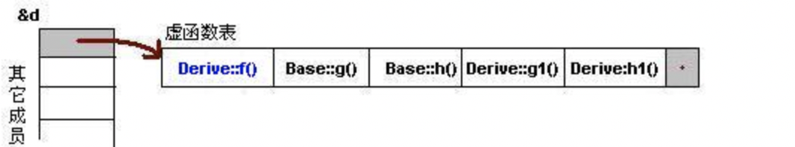
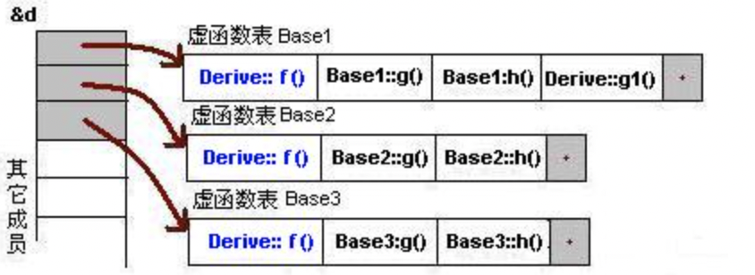

## c++小知识

1. 不能在函数内声明/定义函数，但可以用lambda表达式来解决。可以类里声明定义类。

2. vector里push_back()和emplace_back()区别：push_back() 向容器尾部添加元素时，首先会创建临时元素，然后再将这个元素拷贝或者移动到容器中（优先移动，如果是拷贝的话，事后会自行销毁先前创建的这个元素）；而 emplace_back() 在实现时，则是直接在容器尾部创建这个元素，省去了【拷贝和析构】或移动元素的过程，所以优先用emplace_back；

3. STL 就位于各个 C++ 的头文件中，即它并非以二进制代码的形式提供，而是以源代码的形式提供。

4. 泛型，实质上就是不使用具体数据类型（例如 int、double、float 等），而是使用一种通用类型来进行程序设计的方法。一般会在需要放置类型的位置放个T做占位符，如果硬要给 T 这种类型占位符也叫做一种数据类型，提供这种想法的发明者称它为泛型（generic type）。

5. Map 和 Multimap 将(key/value) 一组当做元素，它们可以根据 key 的排序准则自动将元素排序。Multimap允许重复元素，map不允许重复

6. *(int *)ptr的意思是从ptr这个地址开始向上（因为是小端存储）取四个字节出来看成int，注意编译器优化会使两个相邻变量上下字节间发生变化，可以加上```volatile```。大部分机器都是小端存储，变量的首地址是最低的一个字节的地址，取变量时向上取，存储时向低地址存（因为是栈）。看的时候忽略中间的类型，直接理解为从ptr这个地址里取值，取多少字节呢？这时就看中间类型来取多少格（字节）。

7. 虚函数与虚函数表：

	  从对象的地址开始4字节（取决于机器）装的是一个地址，这就是虚函数表的开始地址，虚函数表保存了虚函数指针集合。在成员虚函数被调用时，会进虚函数表里找该函数，所以多态的实现机制，就是真正的不同类的对象，有着不同的虚函数表（如下图），不过同时子类自己的虚函数地址也会加入其中。测试方法见下方代码区。

   

   ```c++
   typedef void(*Fun)(void);
   pFun = (Fun)*((int*)*(int*)(&obj)+1);//第2个虚函数
   pFun();
   ```

    可以理解为是具体对象在维护这虚函数表， 对于子类的虚函数表，会替换掉重载父类的部分，新增的也会放上去。这也导致两个漏洞：1）能够通过地址方式在父类指针中访问到子类自己独有的虚函数。2）能访问父类或子类的private或protected的虚函数。

​          多重继承的虚函数表如图所示：   

8. 对虚函数的拓展

   ```c++
   Base base_obj = derived_obj;//情形1：这会调用父类的虚函数
   Base *base_obj = &derived_obj;//情形2：这会调用子类的虚函数
   
   base_obj->vir_fun();
   ```

     见上方代码，为什么会出现这种现象呢？调用虚函数时会由对象的首地址对应虚函数表进行查找，对上方情形1，这是拷贝构造，base_obj的真面目就是父类，所以虚函数里是父类的虚函数指针；对情形2，base_obj的首地址保存的地址为子类的虚函数表，自然会调用子类的虚函数。虚函数表是由类维护着，也就是说一个类的多个对象的虚函数表是一样的，当程序在编译期间，编译器会为构造函数中增加给虚函数表指针（vptr）赋值的代码(这是编译器的行为)，当程序在运行时，遇到创建对象的代码，执行对象的构造函数，那么这个构造函数里有为这个对象的vptr赋值的语句。

     虚函数表创建时机是在编译期间。编译期间编译器就为每个类确定好了对应的虚函数表里的内容。所以在程序运行时，编译器会把虚函数表的首地址赋值给虚函数表指针，所以，这个虚函数表指针就有值了。

     所以再解释一次上方代码，也就是情形1是因为base_obj真正的类就是父类，所以虚函数表里是父类的虚函数；情形2真正对应的类是子类，所以虚函数表里是子类的虚函数。

     所以这也是为什么构造函数不能为虚函数。因为在创建对象时会调用构造函数，构造函数在这时初始化对象的虚表指针。如果构造函数是虚函数，那么意味着对象必须要通过虚表指针去调用构造函数，但是在调用构造函数之前，虚表指针还没被赋值，这就出现了矛盾。
   
9. 右值引用

   右值引用只能接收右值，告诉别人这是即将消失的对象的引用。右值在完成赋值后就变成一个左值了，

- const相关：

  1. const只有无法左结合时才向右结合

  2. const函数指const修饰this形参指针的成员函数，作用有两个：1）阻止修改对象的数据成员（注意函数体内不能调用非const函数了）；2）给const对象提供该函数，否则const对象在调用函数时会编译报错：

     ```c++
     #include<iostream>
     using namespace std;
     
     struct A{
     void hello() {
             cout << "hello" << endl;
     }
     };
     int main() {
             const A a_obj;
             a_obj.hello();
     }
     ```

- c++11新特性

  - array 容器是 [C++](http://c.biancheng.net/cplus/) 11 标准中新增的序列容器，简单地理解，它就是在 C++ 普通数组的基础上，添加了一些成员函数和全局函数。在使用上，它比普通数组更安全，且效率并没有因此变差。

    array初始化：

    ```c++
    //将所有的元素初始化为 0 或者和默认元素类型等效的值：
    std::array<double, 10> values {};//使用该语句，容器中所有的元素都会被初始化为 0.0
    
    //在创建 array 容器的实例时，也可以像创建常规数组那样对元素进行初始化：
    std::array<double, 10> values {0.5,1.0,1.5,,2.0};//只初始化了前 4 个元素，剩余的元素都会被初始化为 0.0
    
    //也可以使用fill函数
    array<double, 5> array_test;
    array_test.fill(8);//把所有元素填充为8
    ```

    

- 重写、覆盖、重载

  override->重写(=覆盖)、overload->重载

  override是重写（覆盖）了一个方法，一般用于子类覆盖父类的方法，以实现相同功能的不同类的适配。

  overload是在一个类或文件中的多个函数，有相同函数名，不同参数列表（即不同的参数类型，不同的参数个数，不同的参数顺序（参数类型必须不一样））。在调用时用实参列表匹配形参列表，调用不同的函数。

- 类方法的private和static：不能直接调用private和protected的static函数，可以调用pbulic的static函数，而方法内部可以调用private和protected类型的static函数
